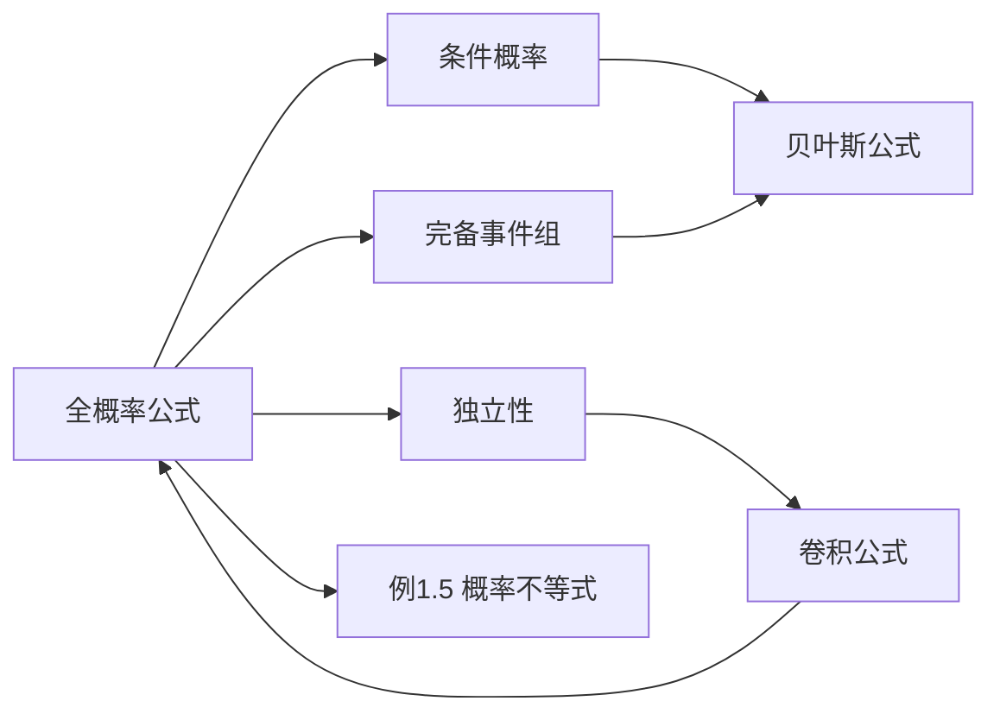

> 引用自 [[RAW-math-概率论-P021-concept]]

# 全概率公式

# 全概率公式

## 元数据

| 属性 | 内容 |
|------|------|
| 章节 | 2026 张宇概率论 9讲(OCR) |
| 难度 | ★★☆☆☆ |
| 关键词 | 全概率公式、条件概率、完备事件组 |

## 一、概念定义

全概率公式是**将复杂事件的概率分解为若干互斥简单事件概率加权和**的重要工具。

> **核心思想**：把事件 $B$ 放在完备事件组 $\{A_1, A_2, \ldots, A_n\}$ 上进行"分块"处理。

**完备事件组需满足的条件：**
1. $A_i A_j = \varnothing$（两两互不相容）
2. $\bigcup_{i=1}^{n} A_i = \Omega$（构成整个样本空间）

## 二、核心公式

### 全概率公式

$$
P(B) = \sum_{i=1}^{n} P(A_i) \cdot P(B \mid A_i)
$$

### 常见形式

**两事件形式：**
$$
P(B) = P(A)P(B \mid A) + P(\bar{A})P(B \mid \bar{A})
$$

**连续指标形式（可数无穷）：**
$$
P(B) = \int_{-\infty}^{+\infty} P(B \mid X = x) f_X(x) \, dx
$$

## 三、典型例题

### 例题：离散-连续混合型随机变量

> **题目**  
> 随机变量 $X$ 与 $Y$ 相互独立，$X \sim \text{离散型}$，$Y \sim \text{参数为1的指数分布}$。求：
> 1. $P(U = 0)$，其中 $U = \mathbb{I}\{X < Y\}$
> 2. $P(V = 0)$，其中 $V = \mathbb{I}\{X < 2Y\}$

**解答**

由于 $X$ 是离散型，$Y$ 是连续型，且相互独立，**对 $X$ 的取值用全概率公式**：

**（1）求 $P(U = 0) = P(X < Y)$**

$$
\begin{aligned}
P(U=0) &= P(X < Y) \\
       &= P(X < Y, X=0) + P(X < Y, X=1) \\
       &= P(Y > 0, X=0) + P(Y > 1, X=1) \\
       &= P(X=0)P(Y > 0) + P(X=1)P(Y > 1) \quad \text{（独立性）} \\
       &= \frac{1}{4} + \frac{3}{4} \cdot e^{-1} \\
       &= \frac{1}{4} + \frac{3}{4e}
\end{aligned}
$$

**（2）求 $P(V = 0) = P(X < 2Y)$**

$$
\begin{aligned}
P(V=0) &= P(X < 2Y) \\
       &= P(X < 2Y, X=0) + P(X < 2Y, X=1) \\
       &= P(Y > 0, X=0) + P\left(Y > \frac{1}{2}, X=1\right) \\
       &= P(X=0)P(Y > 0) + P(X=1)P\left(Y > \frac{1}{2}\right) \\
       &= \frac{1}{4} + \frac{3}{4} \cdot e^{-\frac{1}{2}} \\
       &= \frac{1}{4} + \frac{3}{4\sqrt{e}}
\end{aligned}
$$

## 四、常见错误

| 错误类型 | 正确做法 |
|----------|----------|
| 混淆条件概率符号 | $P(B \mid A_i)$ 是**条件概率**，不是 $P(B \cap A_i)$ |
| 遗漏完备性检验 | 使用前必须验证 $\sum P(A_i) = 1$ |
| 忽略独立性条件 | 在连续-离散混合时，勿忘检验独立性 |
| 积分范围错误 | 当 $X$ 为连续型时，积分下限为 $-\infty$，而非 $0$ |
| 误用全概率公式 | 若 $A_i$ 非完备，需先构造完备事件组 |

> **记忆口诀**："**分事件，算条件，乘起来，加起来**"

## 五、关联知识点

| 关联知识点 | 关联说明 |
|------------|----------|
| **条件概率** | $P(B \mid A) = \dfrac{P(AB)}{P(A)}$，全概率公式的基石 |
| **贝叶斯公式** | $P(A_i \mid B) = \dfrac{P(A_i)P(B \mid A_i)}{\sum P(A_j)P(B \mid A_j)}$，全概率公式的"逆形式" |
| **独立性** | $P(AB) = P(A)P(B)$，简化全概率公式的应用 |
| **卷积公式** | $P(X+Y \leq z)$ 的特殊全概率分解 |
| **概率不等式** | 例1.5 利用单调性：$P(AB) \leq \min\{P(A), P(B)\}$ |

## 六、补充：概率的单调性（例1.5延伸）

| 单调性 | 公式 |
|--------|------|
| 保序性 | 若 $A \subseteq B$，则 $P(A) \leq P(B)$ |
| 有界性 | $0 \leq P(A) \leq 1$ |
| 次可加性 | $P(A \cup B) \leq P(A) + P(B)$ |

**常用不等式链：**
$$
P(AB) \leq P(A) \leq P(A \cup B) \leq P(A) + P(B)
$$

*必考点 · 牢记*
