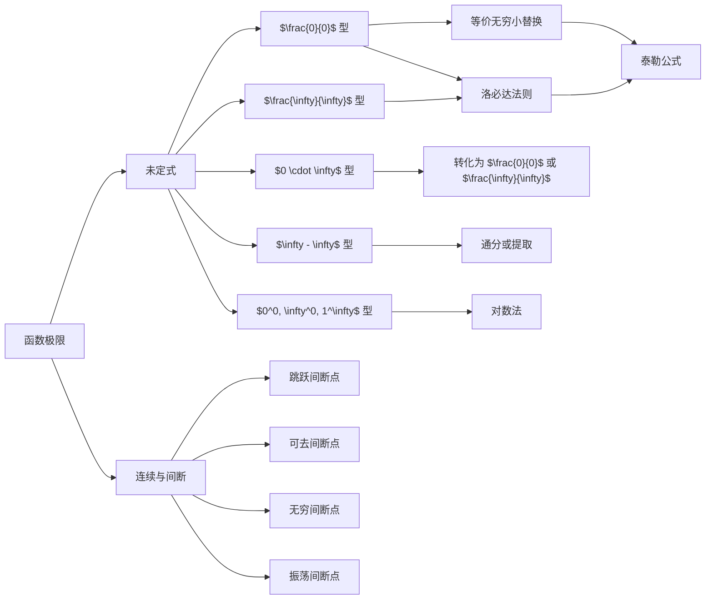

> 引用自 [[RAW-math-高数-P061-concept]]

# 函数极限的未定式整体判定

# 函数极限的未定式整体判定


## 概念定义

**未定式**是指在求极限时，分子分母或运算双方在趋向过程中均趋于 $0$、$\infty$ 或其他不确定状态，导致不能直接确定极限结果的表达式形式。

**整体判定**是指在计算极限前，首先**盯住目标**，确定极限的类型（属于哪种未定式），再选择对应的计算方法。

### 七种基本未定式类型

| 类型 | 表达式 | 特征 |
| $\frac{0}{0}$ 型 | $\dfrac{0}{0}$ | 分子分母同趋于 $0$ |
| $\frac{\infty}{\infty}$ 型 | $\dfrac{\infty}{\infty}$ | 分子分母同趋于 $\infty$ |
| $0 \cdot \infty$ 型 | $0 \cdot \infty$ | $0$ 与 $\infty$ 的乘积 |
| $\infty - \infty$ 型 | $\infty - \infty$ | 两无穷大量相减 |
| $0^0$ 型 | $0^0$ | 底数趋于 $0$，指数趋于 $0$ |
| $\infty^0$ 型 | $\infty^0$ | 底数趋于 $\infty$，指数趋于 $0$ |
| $1^\infty$ 型 | $1^\infty$ | 底数趋于 $1$，指数趋于 $\infty$ |


## 核心公式

### 1. $\frac{0}{0}$ 型化归

$$\lim_{x \to x_0} \frac{f(x)}{g(x)} = \lim_{x \to x_0} \frac{f'(x)}{g'(x)} \quad \text{（洛必达法则）}$$

前提：$f(x)$、$g(x)$ 在 $x_0$ 邻域内可导，且 $\lim \dfrac{f'(x)}{g'(x)}$ 存在。

### 2. $\frac{\infty}{\infty}$ 型化归

$$\lim_{x \to \infty} \frac{f(x)}{g(x)} = \lim_{x \to \infty} \frac{f'(x)}{g'(x)} \quad \text{（洛必达法则）}$$

### 3. $0 \cdot \infty$ 型转换

$$0 \cdot \infty = \frac{0}{\frac{1}{\infty}} = \frac{0}{0} \quad \text{或} \quad 0 \cdot \infty = \frac{\infty}{\frac{1}{0}} = \frac{\infty}{\infty}$$

$$\lim_{x \to x_0} f(x) \cdot g(x) = \lim_{x \to x_0} \frac{f(x)}{\frac{1}{g(x)}} = \frac{0}{0} \quad \text{或} \quad \lim_{x \to x_0} \frac{g(x)}{\frac{1}{f(x)}} = \frac{\infty}{\infty}$$

### 4. $\infty - \infty$ 型转换

**通分化简：**
$$\infty - \infty = \frac{1}{0} - \frac{1}{0} = \frac{0 - 0}{0 \cdot 0} = \frac{0}{0}$$

**提取无穷因子：**
$$\lim_{x \to \infty} (x - \sqrt{x^2 + a}) = \lim_{x \to \infty} \frac{a}{x + \sqrt{x^2 + a}} = 0$$

### 5. $0^0$、$\infty^0$、$1^\infty$ 型转换（对数法）

对于 $f(x)^{g(x)}$ 型：

$$f(x)^{g(x)} = e^{\ln f(x)^{g(x)}} = e^{g(x) \cdot \ln f(x)}$$

因此：
$$\lim f(x)^{g(x)} = e^{\lim g(x) \cdot \ln f(x)}$$

将幂指函数转化为 $0 \cdot \infty$ 型。

### 6. $1^\infty$ 型经典公式

$$\lim_{x \to 0} (1 + x)^{\frac{1}{x}} = e$$

$$\lim_{x \to \infty} \left(1 + \frac{1}{x}\right)^x = e$$

若 $\lim f(x) = 1$，$\lim g(x) = \infty$，则：
$$\lim f(x)^{g(x)} = e^{\lim g(x) \cdot [f(x) - 1]}$$


## 典型例题

### 例题：计算 $\displaystyle \lim_{x \to 0} \frac{\tan x - \sin x}{x^3}$

**解析：**

**第一步：整体判定未定式类型**

当 $x \to 0$ 时：
- $\tan x - \sin x \to 0 - 0 = 0$
- $x^3 \to 0$

$$\Rightarrow \text{类型：} \frac{0}{0} \text{ 型}$$

**第二步：化归经典形式**

利用三角公式化简：

$$\tan x - \sin x = \sin x \left(\frac{1}{\cos x} - 1\right) = \sin x \cdot \frac{1 - \cos x}{\cos x}$$

$$= \sin x \cdot \frac{2\sin^2\frac{x}{2}}{\cos x}$$

**第三步：计算极限**

$$\lim_{x \to 0} \frac{\tan x - \sin x}{x^3} = \lim_{x \to 0} \frac{\sin x \cdot (1 - \cos x)}{x^3 \cdot \cos x}$$

$$= \lim_{x \to 0} \frac{\sin x}{x} \cdot \lim_{x \to 0} \frac{1 - \cos x}{x^2} \cdot \lim_{x \to 0} \frac{1}{\cos x}$$

已知：
- $\displaystyle \lim_{x \to 0} \frac{\sin x}{x} = 1$
- $\displaystyle \lim_{x \to 0} \frac{1 - \cos x}{x^2} = \frac{1}{2}$
- $\displaystyle \lim_{x \to 0} \cos x = 1$

$$\Rightarrow \text{原式} = 1 \times \frac{1}{2} \times 1 = \boxed{\frac{1}{2}}$$

**答案：$\dfrac{1}{2}$**


## 常见错误

### ❌ 错误 1：滥用洛必达法则

> **错误做法：** 直接对 $\displaystyle \lim_{x \to \infty} \frac{x + \sin x}{x}$ 使用洛必达：

$$\frac{d}{dx}(x + \sin x) = 1 + \cos x, \quad \frac{d}{dx}(x) = 1$$

$$\Rightarrow \lim_{x \to \infty} \frac{1 + \cos x}{1} \quad \text{不存在}$$

> **正确做法：** 直接计算：

$$\lim_{x \to \infty} \frac{x + \sin x}{x} = \lim_{x \to \infty} \left(1 + \frac{\sin x}{x}\right) = 1 + 0 = 1$$

**⚠️ 注意：** 洛必达法则要求 $\lim \dfrac{f'(x)}{g'(x)}$ **存在**，且原极限存在时才可使用。


### ❌ 错误 2：$0^0$、$\infty^0$ 型直接下结论

> **错误做法：** 认为 $\displaystyle \lim_{x \to 0^+} x^x = 0$

> **正确做法：** 使用对数法：

$$\lim_{x \to 0^+} x^x = \lim_{x \to 0^+} e^{x \ln x} = e^{\lim_{x \to 0^+} x \ln x}$$

其中 $\lim_{x \to 0^+} x \ln x = \lim_{x \to 0^+} \frac{\ln x}{\frac{1}{x}} = \frac{-\infty}{+\infty} \stackrel{\text{L'H}}{=} \lim_{x \to 0^+} \frac{1/x}{-1/x^2} = \lim_{x \to 0^+} (-x) = 0$

$$\Rightarrow \text{原式} = e^0 = 1$$

**⚠️ 注意：** $0^0$ 型极限结果不一定是 $0$！


### ❌ 错误 3：$\infty - \infty$ 型直接相减

> **错误做法：** 认为 $\displaystyle \lim_{x \to \infty} (x - x) = 0$

> **正确做法：** 必须先化简或通分：

$$\lim_{x \to \infty} \left(\sqrt{x^2 + x} - x\right) = \lim_{x \to \infty} \frac{x}{\sqrt{x^2 + x} + x} = \frac{1}{2}$$

**⚠️ 注意：** 两个同阶无穷大相减，结果可能不为 $0$。


### ❌ 错误 4：忽略定义域限制

> **错误做法：** 对 $\displaystyle \lim_{x \to 0} (\cos x)^{\frac{1}{x^2}}$ 直接使用洛必达

> **正确做法：** 先判断类型为 $1^\infty$ 型，转化为：

$$= e^{\lim_{x \to 0} \frac{\ln(\cos x)}{x^2}} = e^{\lim_{x \to 0} \frac{-\tan x}{2x}} = e^{-\frac{1}{2}}$$


## 关联知识点



### 知识网络

| 关联知识点 | 说明 |
| **洛必达法则** | 计算 $\frac{0}{0}$、$\frac{\infty}{\infty}$ 型的核心工具 |
| **等价无穷小替换** | $\sin x \sim x$，$1 - \cos x \sim \frac{x^2}{2}$ 等 |
| **泰勒公式** | 将函数展开为多项式，便于比较阶数 |
| **函数的连续性** | 连续函数可直接代入 |
| **间断点分类** | 判断极限不存在时的间断点类型 |
| **无穷小的阶** | 高阶、同阶、低阶、等价的比较 |
| **极限的局部保号性** | 判断符号变化 |


## 三向解题法总结

```
┌─────────────────────────────────────────────────────────┐
│                    盯住目标                             │
│                   lim f(x)                              │
│                     x → x₀                              │
└─────────────────────────────────────────────────────────┘
                          │
          ┌───────────────┼───────────────┐
          ↓               ↓               ↓
    ┌───────────┐   ┌───────────┐   ┌───────────┐
    │ 盯住目标1 │   │ 盯住目标2 │   │ 盯住目标3 │
    │ 判定类型  │   │ 连续间断  │   │ 微观性态  │
    └───────────┘   └───────────┘   └───────────┘
          │               │               │
          ↓               ↓               ↓
    ┌───────────┐   ┌───────────┐   ┌───────────┐
    │未定式判定 │   │ 极限存在? │   │ 单调性    │
    │化归经典  │   │ lim f(x)  │   │ 有界性    │
    │形式      │   └───────────┘   └───────────┘
    └───────────┘
```


**章节：** 2026 张宇高数 18讲(OCR)  
**难度：** ★★☆☆☆  
**页码：** 第1讲 · 函数极限与连续 · 三向解题法