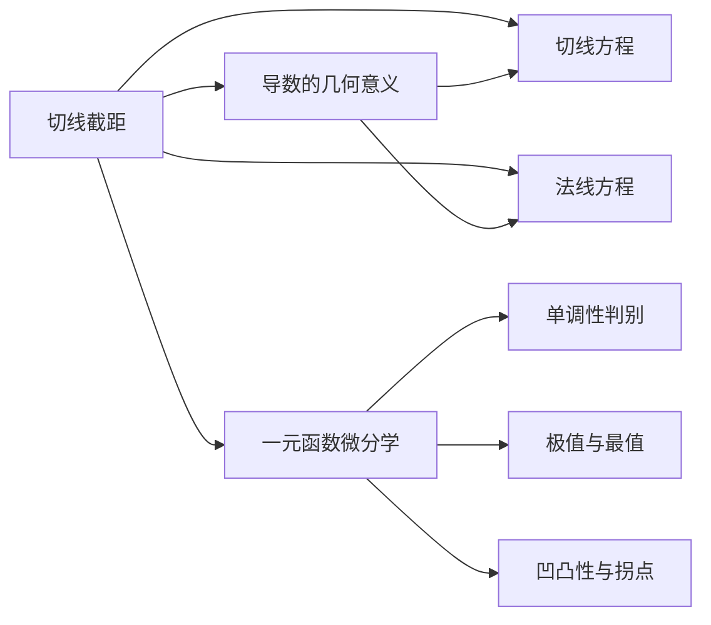

> 引用自 [[RAW-math-高数-P067-concept]]

# 切线在x轴上的截距

# 切线在坐标轴上的截距

**章节**：2026 张宇高数 18讲(OCR)  
**难度**：★★☆☆☆

## 1. 概念定义

### 切线在x轴上的截距

设曲线 $y = f(x)$ 在点 $(x, f(x))$ 处可导，则该点处**切线在x轴上的截距**指的是切线与x轴交点的横坐标。

### 相关概念

| 概念 | 定义 |
|------|------|
| 切线在x轴上的截距 | 切线与x轴交点的横坐标 |
| 切线在y轴上的截距 | 切线与y轴交点的纵坐标 |
| 法线在x轴上的截距 | 法线与x轴交点的横坐标 |
| 法线在y轴上的截距 | 法线与y轴交点的纵坐标 |

## 2. 核心公式

### 切线方程

已知曲线 $y = f(x)$，在点 $(x_0, f(x_0))$ 处的切线方程为：

$$\boxed{Y - f(x_0) = f'(x_0)(X - x_0)}$$

### 切线在x轴上的截距

令 $Y = 0$ 代入切线方程：

$$0 - f(x) = f'(x)(X - x)$$

$$X = x - \frac{f(x)}{f'(x)}$$

$$\boxed{u = x - \frac{f(x)}{f'(x)}}$$

其中 $u$ 表示切线在x轴上的截距。

### 法线方程

$$\boxed{Y - f(x_0) = -\frac{1}{f'(x_0)}(X - x_0)}$$

## 3. 典型例题

### 例5.1

> 设 $f(x)$ 有连续的一阶导数，且 $f(0) = 0$，$f'(0) = 1$。求极限 $\displaystyle \lim_{x \to 0} \frac{u}{x}$，其中 $u$ 是曲线 $y = f(x)$ 在点 $(x, f(x))$ 处的切线在 $x$ 轴上的截距。

**解：**

**第一步：写出切线方程**

曲线在点 $(x, f(x))$ 处的切线方程为：

$$Y - f(x) = f'(x)(X - x)$$

**第二步：令 $Y = 0$，求截距**

令 $Y = 0$：

$$-f(x) = f'(x)(X - x)$$

$$X = x - \frac{f(x)}{f'(x)}$$

即：

$$u = x - \frac{f(x)}{f'(x)}$$

**第三步：计算极限**

$$\frac{u}{x} = \frac{x - \dfrac{f(x)}{f'(x)}}{x} = 1 - \frac{f(x)}{x \cdot f'(x)}$$

当 $x \to 0$ 时，由已知条件 $f(0) = 0$，$f'(0) = 1$，利用导数定义：

$$f'(0) = \lim_{x \to 0} \frac{f(x) - f(0)}{x - 0} = \lim_{x \to 0} \frac{f(x)}{x} = 1$$

因此：

$$\lim_{x \to 0} \frac{u}{x} = 1 - \frac{1}{1} = \boxed{0}$$

## 4. 常见错误

| 错误类型 | 正确做法 |
|----------|----------|
| 符号错误：写成 $u = x + \dfrac{f(x)}{f'(x)}$ | 截距公式为 $u = x - \dfrac{f(x)}{f'(x)}$ |
| 混淆切线与法线 | 法线斜率为 $-\dfrac{1}{f'(x)}$ |
| 忘记 $f'(x) \neq 0$ 的条件 | 必须确保分母不为零 |
| 直接代入 $x = 0$ 计算 | 应先化简，再取极限 |

## 5. 关联知识点

### 知识要点

1. **导数的几何意义**：$f'(x_0)$ 表示曲线在点 $(x_0, f(x_0))$ 处切线的斜率

2. **切线方程的两种形式**：
   - 点斜式：$y - f(x_0) = f'(x_0)(x - x_0)$
   - 截距式：$\dfrac{X}{a} + \dfrac{Y}{b} = 1$

3. **单调性判别**：
   - $f'(x) > 0 \Rightarrow f(x)$ 严格单调递增
   - $f'(x) < 0 \Rightarrow f(x)$ 严格单调递减

4. **极值必要条件**：若 $f(x)$ 在 $x_0$ 处可导且取得极值，则 $f'(x_0) = 0$

## 📎 快速记忆

> **切线截距公式**：$$u = x - \frac{f(x)}{f'(x)}$$
> 
> **口诀**：横坐标减去"高度比斜率"
