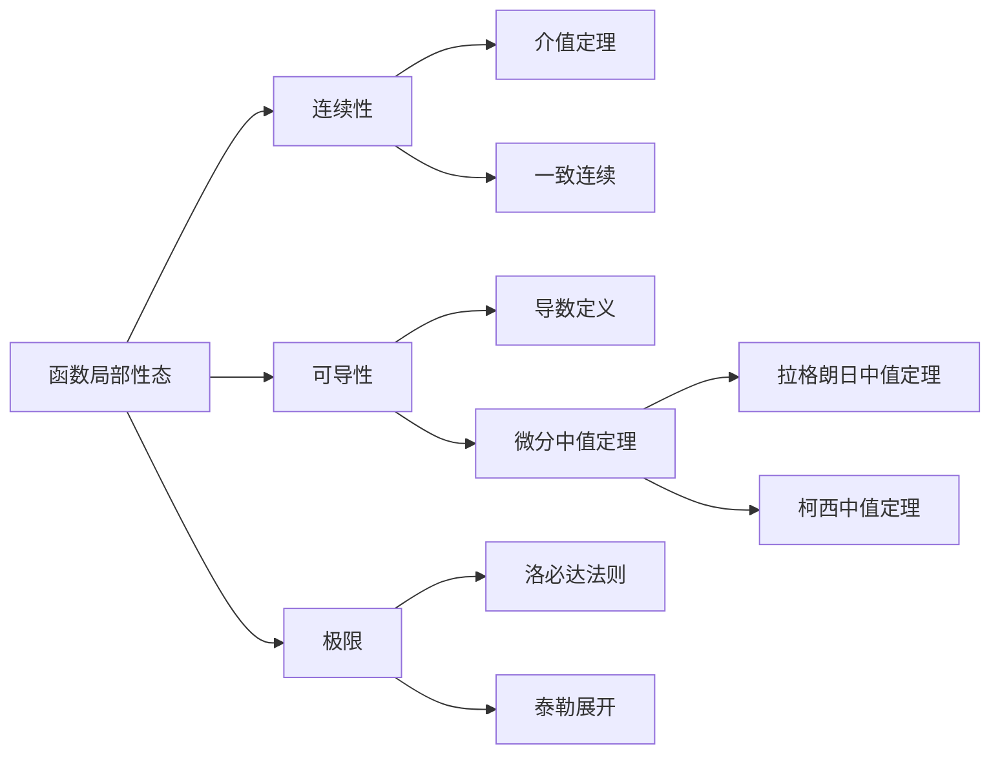

> 引用自 [[RAW-math-高数-P070-concept]]

# 利用极限和导数研究函数局部性态

# 利用极限和导数研究函数局部性态

> **元数据**
> - **章节**：2026 张宇高数 18讲(OCR)
> - **难度**：★★☆☆☆


## 一、概念定义

### 1. 基本定义

**函数局部性态**：指函数在**某一点附近**（邻域内）的行为特征，包括连续性、可导性、单调性等。

### 2. 核心思想

研究函数局部性态的**三问法**：

| 问题 | 内容 |
| ① 什么位置？ | 研究点在定义域中的位置 |
| ② 什么条件？ | 函数应满足的假设条件 |
| ③ 什么工具？ | 使用的数学工具（极限、导数等） |

### 3. 化归体系

证明含 $f^{(n)}(x)$ 的等式或不等式时，采用：

```
D₁(常规操作) → D₂(转换等价表述) → D₃(化归经典形式)
```


## 二、核心公式

### 1. 连续性与极限的关系

$$\lim_{x \to x_0} f(x) = A \iff f(x_0) = A$$

> **前提**：$f(x)$ 在 $x_0$ 的去心邻域内有定义

### 2. 可导性与极限的关系

$$f'(x_0) = \lim_{x \to x_0} \frac{f(x) - f(x_0)}{x - x_0} = \lim_{\Delta x \to 0} \frac{f(x_0 + \Delta x) - f(x_0)}{\Delta x}$$

### 3. 导数极限定理（若适用）

$$f'(x_0) = \lim_{x \to x_0} f'(x)$$

> **注意**：该公式成立需满足 $f'(x)$ 在 $x_0$ 邻域内存在且连续


## 三、典型例题

### 例6.9（考试重点）

**题目**：已知函数 $f(x)$ 在 $[x_0, x_0 + \delta)$ 上连续，在 $(x_0, x_0 + \delta)$ 内可导，$\delta > 0$。证明：若 $\lim \limits_{x \to x_0^+} f(x) = A$，则 $f(x_0) = A$。

**【证明】**（D₂：转换等价表述）

由于 $f(x)$ 在 $[x_0, x_0 + \delta)$ 上连续，考虑右连续性。

设 $x \in (x_0, x_0 + \delta)$，由拉格朗日中值定理：

$$f(x) - f(x_0) = f'(\xi)(x - x_0), \quad \xi \in (x_0, x)$$

当 $x \to x_0^+$ 时，有 $\xi \to x_0^+$，两端取极限：

$$\lim_{x \to x_0^+} [f(x) - f(x_0)] = \lim_{x \to x_0^+} f'(\xi) \cdot (x - x_0)$$

由于 $f'(\xi)$ 存在（有限），而 $(x - x_0) \to 0$，故：

$$A - f(x_0) = 0$$

即 $f(x_0) = A$。$\square$


## 四、常见错误

| 错误类型 | 具体表现 | 正确理解 |
| **混淆极限与导数** | 认为 $\lim \limits_{x \to x_0} f'(x) = f'(x_0)$ 总是成立 | 仅当 $f'(x)$ 连续时才成立 |
| **忽略定义域** | 对 $f(x) = \lvert x \rvert$ 讨论 $f'(0)$ 时出错 | 分段函数需分别讨论左右导数 |
| **跳步证明** | 直接由 $\lim f(x) = A$ 推出 $f(x_0) = A$ 而不说明连续性 | 必须先说明 $f$ 在 $x_0$ 处连续 |
| **符号混淆** | 将 $\lim \limits_{x \to x_0^+} f(x)$ 与 $\lim \limits_{x \to x_0} f(x)$ 混用 | 单侧极限需明确方向 |


## 五、关联知识点



### 拓展阅读

1. **拉格朗日中值定理**：本题证明的核心工具
2. **导数极限定理**：$\lim \limits_{x \to x_0} f'(x) = f'(x_0)$ 的适用条件
3. **函数的连续性与可导性关系**：可导 $\Rightarrow$ 连续，但连续 $\not\Rightarrow$ 可导


## 六、补充练习

**思考题**：设
$$f(x) = \begin{cases} x^3 \sin \dfrac{1}{x}, & x \neq 0 \\ 0, & x = 0 \end{cases}$$

讨论 $\lim \limits_{x \to 0} f'(x)$ 与 $f'(0)$ 的关系。

> **提示**：分别计算 $f'(0)$（用定义）和 $f'(x)$（当 $x \neq 0$ 时求导后取极限）。