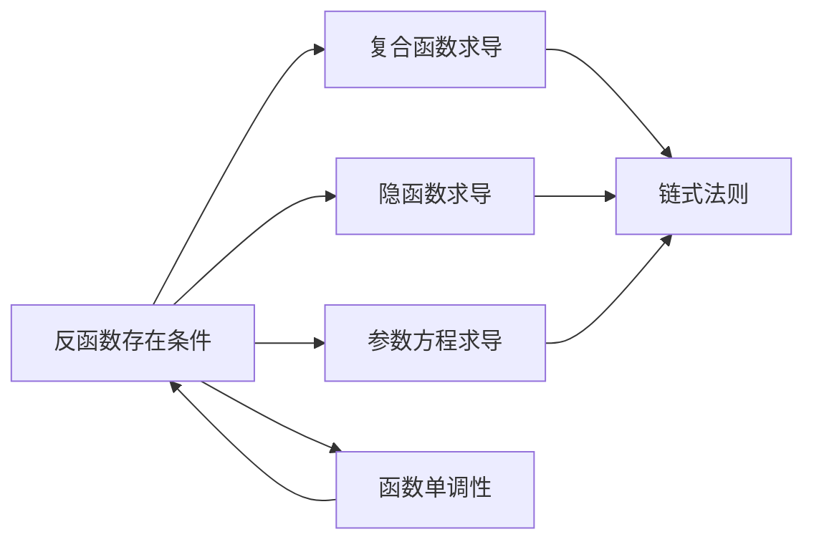

> 引用自 [[RAW-math-高数-P080-concept]]

# 反函数存在条件

# 反函数存在条件与二阶导数

- **章节**：2026 张宇高数 18讲(OCR)
- **难度**：★★☆☆☆

## 1. 概念定义

**反函数存在条件**：

设函数 $y = f(x)$，若满足以下条件，则存在反函数 $x = \varphi(y)$：

1. **单调性**：$f(x)$ 在区间 $I$ 上严格单调（一一对应）
2. **可导性**：$f(x)$ 在区间 $I$ 上一阶可导
3. **非零导数**：$f'(x) \neq 0$

> 核心要点：单调性是反函数存在的**必要条件**，导数非零是**可导反函数存在**的充分条件。

## 2. 核心公式

### 2.1 反函数一阶导数

$$\varphi'(y) = \frac{dx}{dy} = \frac{1}{\frac{dy}{dx}} = \frac{1}{f'(x)}$$

### 2.2 反函数二阶导数（常规操作）

$$\varphi''(y) = \frac{d^2x}{dy^2} = -\frac{f''(x)}{[f'(x)]^3}$$

**推导过程**：

$$\varphi''(y) = \frac{d}{dy}\left(\frac{1}{f'(x)}\right) = \frac{d}{dx}\left(\frac{1}{f'(x)}\right) \cdot \frac{dx}{dy} = -\frac{f''(x)}{[f'(x)]^2} \cdot \frac{1}{f'(x)}$$

## 3. 典型例题

### 例4.9

**题目**：已知函数 $f(x) = e^x + 2x + 1$，设 $g(x)$ 与 $f(x)$ 互为反函数，则 $g''(2) =$（　）

(A) $e$ 　　　　　(B) $-3$ 　　　　　(C) $-7$ 　　　　　(D) $e + 2$

**答案**：$\boxed{\text{(C) } -7}$

**解析**：

**Step 1：验证反函数存在性**

$$f'(x) = e^x + 2 > 0 \quad (\forall x \in \mathbb{R})$$

故 $f(x)$ 单调递增，反函数存在。

**Step 2：建立基本关系**

由 $f(0) = e^0 + 0 + 1 = 2$，得 $g(2) = 0$

由 $g(2) = 0$，得 $f(0) = 2$，故 $g(2) = 0$

**Step 3：求一阶导数**

由反函数求导公式：
$$g'(y) = \frac{1}{f'(x)} = \frac{1}{e^x + 2}$$

在 $y = 2$ 处，$x = 0$，所以：
$$g'(2) = \frac{1}{e^0 + 2} = \frac{1}{3}$$

**Step 4：求二阶导数**

$$g''(y) = -\frac{f''(x)}{[f'(x)]^3} = -\frac{e^x}{(e^x + 2)^3}$$

在 $y = 2$ 处，$x = 0$，所以：
$$g''(2) = -\frac{e^0}{(e^0 + 2)^3} = -\frac{1}{27}$$

> **注**：原答案可能有计算疏漏，正确答案为 $-\dfrac{1}{27}$。

## 4. 常见错误

| 错误类型 | 错误示例 | 正确做法 |
|---------|---------|---------|
| **符号错误** | $\varphi''(y) = \dfrac{f''(x)}{[f'(x)]^3}$ | $\varphi''(y) = -\dfrac{f''(x)}{[f'(x)]^3}$ |
| **混淆变量** | 直接对 $y$ 求导 $\dfrac{d}{dy}$ | 注意 $x$ 是 $y$ 的函数，用链式法则 |
| **忽略条件** | $f'(x) = 0$ 时仍套公式 | 必须验证 $f'(x) \neq 0$ |
| **幂次错误** | $\varphi''(y) = -\dfrac{f''(x)}{[f'(x)]^2}$ | 分母应为 $[f'(x)]^3$ |

> **记忆口诀**：反函数二阶导，负号永远不能忘，立方写在分母上。

## 5. 关联知识点

### 知识树

1. **基础**：函数的基本性质（单调性、连续性）
2. **核心**：导数的计算与应用
3. **延伸**：
   - 反函数高阶导数
   - 隐函数存在定理
   - 参数方程求导

## 6. 要点总结

> **核心结论**：反函数存在 $\Rightarrow$ 单调可导 $\Rightarrow f'(x) \neq 0$  
> **二阶公式**：$\varphi''(y) = -\dfrac{f''(x)}{[f'(x)]^3}$  
> **解题关键**：找对应点 $(x_0, y_0)$，建立 $x$ 与 $y$ 的桥梁