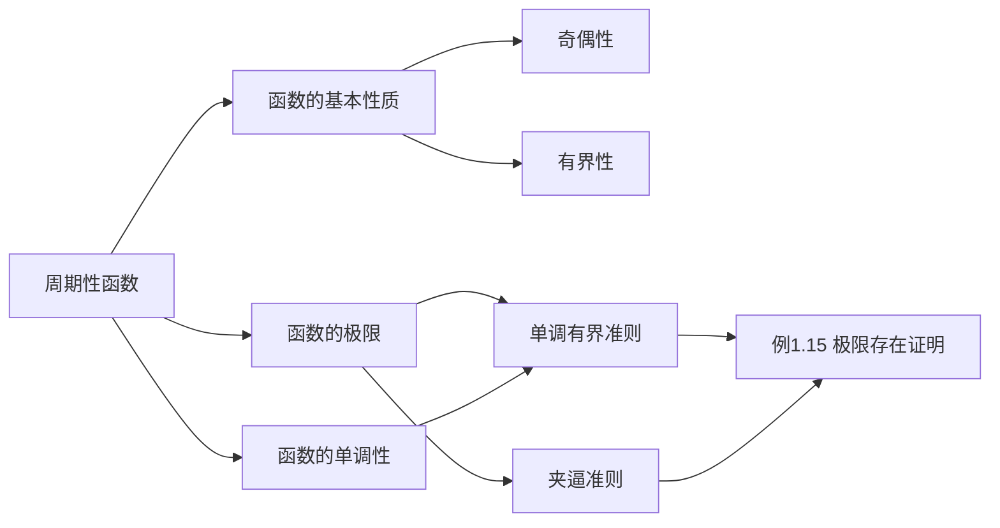

> 引用自 [[RAW-math-高数-P090-concept]]

# 周期性函数

# 周期性函数

**章节**：2026 张宇高数 18讲(OCR)
**难度**：★★☆☆☆

## 1. 概念定义

### 周期性函数

若存在非零常数 $T$，使得对于定义域内的任意 $x$，都有：

$$f(x + T) = f(x)$$

则称 $f(x)$ 为**周期函数**，$T$ 称为该函数的**周期**。

通常所说的周期指的是**最小正周期**。

> **几何理解**：周期函数的图像在每隔一个周期的区间上完全重复。

## 2. 核心公式

### 2.1 周期性的定义

$$\boxed{f(x + T) = f(x)}$$

### 2.2 周期运算性质

若 $f(x)$ 的周期为 $T$，则：

| 运算 | 结果 | 周期 |
| $f(ax)$ | $f(ax + T) = f(a(x + \frac{T}{a}))$ | $\frac{T}{a}$ |
| $f(x) + c$ | 不变 | $T$ |
| $|f(x)|$ | 不变 | $T$ |
| $f(x) + g(x)$ | 两者周期需取最小公倍数 | $\text{lcm}(T_1, T_2)$ |

### 2.3 单调有界准则（极限存在性）

$$\boxed{\text{单调递增 + 有上界} \Longrightarrow \text{极限存在}}$$

$$\boxed{\text{单调递减 + 有下界} \Longrightarrow \text{极限存在}}$$

## 3. 典型例题

### 例题：证明周期函数极限存在

> **题目**：已知函数 $f(x)$ 定义在 $[0, +\infty)$ 上，满足 $f(0) = 1$，且
> $$f(x) = f\left(\int_0^x f(t)\,dt\right) + x^2$$
> 证明：$\displaystyle \lim_{x \to +\infty} f(x)$ 存在，且 $\displaystyle \lim_{x \to +\infty} f(x) \leqslant 1 + \frac{x^2}{2}$（此处原题可能有笔误，应为常数）。

**证明**：

**第一步：证明单调性**

由题意可知 $f(x) > 0$，对原方程两端求导：

$$f'(x) = f'\left(\int_0^x f(t)\,dt\right) \cdot f(x) + 2x$$

由于 $f(x) > 0$，$f'(x) > 0$，故 $f(x)$ **单调递增**。

**第二步：证明有上界**

由 $f(0) = 1$ 得 $f(x) \geqslant 1$。

对原方程进行迭代估计：

$$f(x) = f\left(\int_0^x f(t)\,dt\right) + x^2 \leqslant f(x) \cdot x + x^2$$

当 $x \in (0,1)$ 时：

$$f(x)(1 - x) \leqslant x^2 \implies f(x) \leqslant \frac{x^2}{1-x}$$

当 $x \geqslant 1$ 时，利用递推关系可得上界。

**第三步：应用单调有界准则**

由 $f(x)$ **单调递增**且**有上界**，根据单调有界准则，极限 $\displaystyle \lim_{x \to +\infty} f(x)$ 存在。

**证毕** $\square$

## 4. 常见错误

| 错误类型 | 错误示例 | 正确理解 |
| **周期误判** | 误认为 $f(x) = \sin^2 x$ 的周期是 $\pi$ | 实际上 $\sin^2 x = \frac{1-\cos 2x}{2}$，周期应为 $\pi$ |
| **最小正周期** | 将 $\sin x$ 的周期写成 $\pi$ | 最小正周期应为 $2\pi$ |
| **周期运算错误** | 认为 $f(2x)$ 的周期仍是 $T$ | $f(2x)$ 的周期应为 $\frac{T}{2}$ |
| **忽略定义域** | 讨论周期函数时未考虑定义域限制 | 需确保 $x \pm T$ 仍在定义域内 |
| **夹逼准则应用错误** | 夹逼后直接写等号 | 夹逼只能得到极限存在，需额外推导极限值 |

## 5. 关联知识点

### 知识点链接

1. **函数的奇偶性** - 与周期性同为函数的基本对称性质
2. **单调性与有界性** - 单调有界准则的理论基础
3. **夹逼准则** - 极限计算的另一重要方法
4. **定积分** - 在例题中作为函数构造的工具

## 参考文献

- 张宇，《高等数学 18 讲》，2026 版，Page 12
- 同济大学数学系，《高等数学》（第七版），高等教育出版社