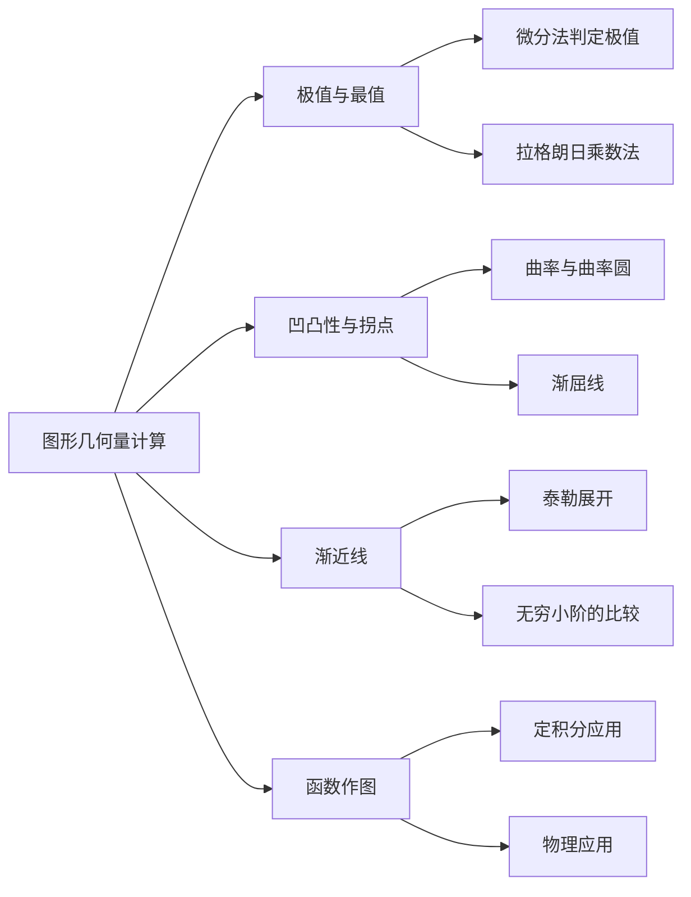

> 引用自 [[RAW-math-高数-P091-concept]]

# 图形几何量计算微分学

# 图形几何量计算（微分学）

**章节**：2026 张宇高数 18讲(OCR)

**难度**：★★☆☆☆

## 1. 概念定义

利用导数研究函数图像的几何性质，主要包括：

| 概念 | 定义 |
|------|------|
| **切线** | 函数曲线上某点处的瞬时变化率对应的直线 |
| **单调性** | $f'(x) > 0$ 单调递增；$f'(x) < 0$ 单调递减 |
| **极值** | 函数在某点的邻域内取得最大值（极大值）或最小值（极小值） |
| **凹凸性** | $f''(x) > 0$ 凹向上；$f''(x) < 0$ 凸向下 |
| **拐点** | 函数凹凸性发生改变的点 |
| **渐近线** | 曲线无限接近但永不相交的直线 |

## 2. 核心公式

### 2.1 切线与法线方程

$$\text{切线：} \quad y - f(x_0) = f'(x_0)(x - x_0)$$

$$\text{法线：} \quad y - f(x_0) = -\frac{1}{f'(x_0)}(x - x_0), \quad f'(x_0) \neq 0$$

### 2.2 极值判别法

**第一充分条件**：
$$f'(x_0) = 0,\quad f'(x) \text{ 在 } x_0 \text{ 左右异号} \Rightarrow \begin{cases} \text{左正右负} \Rightarrow \text{极大值} \\ \text{左负右正} \Rightarrow \text{极小值} \end{cases}$$

**第二充分条件**：
$$f'(x_0) = 0,\quad f''(x_0) \neq 0 \Rightarrow \begin{cases} f''(x_0) > 0 \Rightarrow \text{极小值} \\ f''(x_0) < 0 \Rightarrow \text{极大值} \end{cases}$$

### 2.3 凹凸性与拐点

$$\text{凹向上：} \quad f''(x) > 0 \Leftrightarrow f'(x) \text{ 单调递增}$$

$$\text{凸向下：} \quad f''(x) < 0 \Leftrightarrow f'(x) \text{ 单调递减}$$

$$\text{拐点：} \quad f''(x_0) = 0 \text{ 或不存在，且左右异号}$$

### 2.4 渐近线方程

**垂直渐近线**：
$$\lim_{x \to x_0^+} f(x) = \infty \text{ 或 } \lim_{x \to x_0^-} f(x) = \infty \Rightarrow x = x_0$$

**水平渐近线**：
$$\lim_{x \to \infty} f(x) = A \Rightarrow y = A$$

**斜渐近线**：
$$\lim_{x \to \infty} \frac{f(x)}{x} = k, \quad \lim_{x \to \infty} [f(x) - kx] = b \Rightarrow y = kx + b$$

## 3. 典型例题

> **题目**：设 $f(x) = x^3 - 3x^2 - 9x + 5$，求：
> (1) 函数的极值点和极值；
> (2) 函数的凹凸区间和拐点；
> (3) 函数的斜渐近线。

**解**：

**(1) 求极值**

$$f'(x) = 3x^2 - 6x - 9 = 3(x^2 - 2x - 3) = 3(x+1)(x-3)$$

令 $f'(x) = 0$，解得 $x = -1$ 或 $x = 3$。

| 区间 | $(-\infty, -1)$ | $(-1, 3)$ | $(3, +\infty)$ |
|------|-----------------|-----------|----------------|
| $f'(x)$ | $+$ | $-$ | $+$ |
| $f(x)$ | $\uparrow$ | $\downarrow$ | $\uparrow$ |

$$\therefore \text{极大值点：} x = -1,\quad f(-1) = (-1)^3 - 3(-1)^2 - 9(-1) + 5 = 10$$

$$\text{极小值点：} x = 3,\quad f(3) = 27 - 27 - 27 + 5 = -22$$

**(2) 求凹凸区间和拐点**

$$f''(x) = 6x - 6 = 6(x-1)$$

令 $f''(x) = 0$，解得 $x = 1$。

| 区间 | $(-\infty, 1)$ | $(1, +\infty)$ |
|------|----------------|----------------|
| $f''(x)$ | $-$ | $+$ |
| $f(x)$ | 凸向下 | 凹向上 |

$$\therefore \text{拐点：} (1, f(1)) = (1, -6)$$

**(3) 求斜渐近线**

$$k = \lim_{x \to \infty} \frac{f(x)}{x} = \lim_{x \to \infty} \frac{x^3 - 3x^2 - 9x + 5}{x} = \lim_{x \to \infty} (x^2 - 3x - 9 + \frac{5}{x}) = \infty$$

$$\text{或用等价无穷小：} k = \lim_{x \to \infty} \frac{x^3}{x} = \lim_{x \to \infty} x^2 = \infty$$

$$\boxed{\text{函数无斜渐近线，仅有水平渐近线 } y = \infty \text{（不存在）}}$$

## 4. 常见错误

| 错误类型 | 错误示例 | 正确做法 |
|----------|----------|----------|
| **极值点与拐点混淆** | 认为 $f'(x_0) = 0$ 的点一定是极值点 | 极值点看 $f'(x)$ 符号是否改变；拐点看 $f''(x)$ 符号是否改变 |
| **遗漏渐近线** | 只求垂直渐近线，忘记水平/斜渐近线 | $x \to \infty$ 时需分别检验水平、斜渐近线 |
| **二阶导数符号记反** | 误认为 $f''(x) > 0$ 为凸向下 | $f''(x) > 0$ **凹向上**（如 $\cup$ 形），$f''(x) < 0$ **凸向下**（如 $\cap$ 形） |
| **极值第二充分条件滥用** | 在 $f''(x_0) = 0$ 时使用第二充分条件 | 当 $f''(x_0) = 0$ 时，需返回第一充分条件或更高阶导数判定 |
| **切点坐标写错** | 用 $f'(x_0)$ 对应点的坐标代入切线方程 | 必须用题目所给点 $(x_0, f(x_0))$ 作为切点 |

## 5. 关联知识点

### 推荐关联阅读

1. **极值与最值问题** — 了解极值与最值的区别及求法
2. **定积分的几何应用** — 平面图形面积、旋转体体积
3. **函数作图** — 综合运用本章知识绘制函数图像
4. **微分中值定理** — 证明题中寻找辅助函数的理论基础

**参考章节**：`第3章 微分中值定理与导数应用`