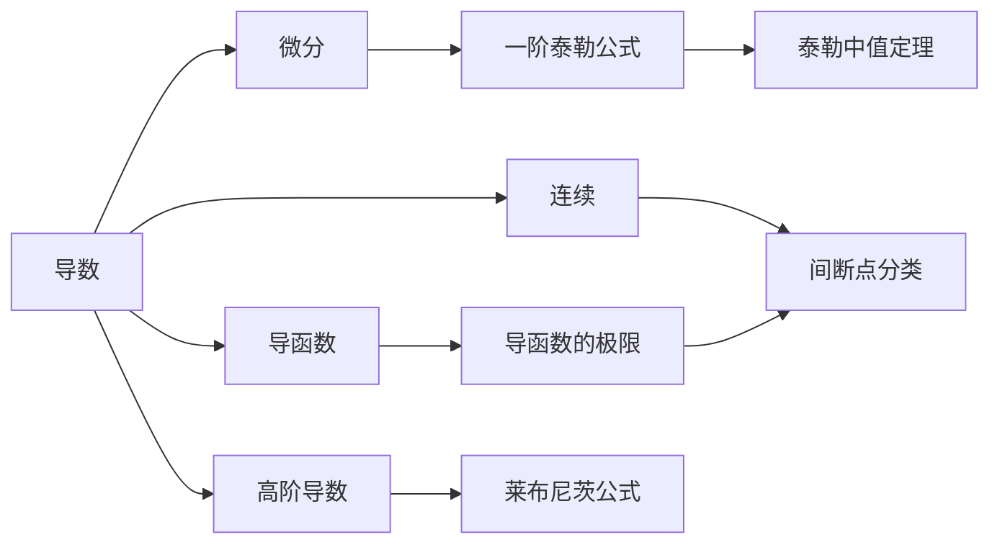

> 引用自 [[RAW-math-高数-P108-concept]]

# 导数

# 导数

**章节**：2026 张宇高数 18讲(OCR)  
**难度**：★★☆☆☆  
**内容**：第3讲 一元函数微分学的概念

## 一、概念定义

### 1. 导数的定义

设函数 $y = f(x)$ 在点 $x_0$ 的某邻域内有定义，若极限

$$\lim_{\Delta x \to 0} \frac{f(x_0 + \Delta x) - f(x_0)}{\Delta x}$$

存在，则称函数 $f(x)$ 在点 $x_0$ 处**可导**，该极限值称为函数 $f(x)$ 在点 $x_0$ 处的**导数**，记作：

$$f'(x_0) = \lim_{\Delta x \to 0} \frac{\Delta y}{\Delta x} = \lim_{x \to x_0} \frac{f(x) - f(x_0)}{x - x_0}$$

> **本质**：导数描述的是函数因变量差与自变量差的比值极限，即函数在该点的瞬时变化率。

### 2. 可导与连续的关系

$$\boxed{\text{可导} \Rightarrow \text{连续} \quad \text{（左推右成立，反之不真）}}$$

## 二、核心公式

### 1. 导数定义式

$$f'(x_0) = \lim_{\Delta x \to 0} \frac{f(x_0 + \Delta x) - f(x_0)}{\Delta x} = \lim_{x \to x_0} \frac{f(x) - f(x_0)}{x - x_0}$$

### 2. 一阶泰勒公式

$$f(x) - f(x_0) = f'(x_0)\Delta x + o(\Delta x) \quad (\Delta x \to 0)$$

或写作：

$$f(x) = f(x_0) + f'(x_0)(x - x_0) + o(x - x_0)$$

### 3. 绝对值函数的可导性判断

设 $f(x_0) = 0$，则 $|f(x)|$ 在 $x_0$ 处：

| 条件 | 可导性 |
| $f'(x_0) \neq 0$ | **不可导** |
| $f'(x_0) = 0$ 且 $f'(x_0) \neq 0$ 的解释需结合具体情形 | 需具体分析 |

**判断准则**：
$$|f(x)|'|_{x=x_0} = \begin{cases} f'(x_0), & f(x_0) > 0 \\ -f'(x_0), & f(x_0) < 0 \end{cases}$$

当 $f(x_0) = 0$ 时：
- 若 $f'(x_0) \neq 0$，则 $|f(x)|$ 在 $x_0$ 处**不可导**
- 若 $f'(x_0) = 0$，需具体分析

### 4. 导函数的性质

> **定理**：如果导函数 $f'(x)$ 在一点存在极限，则导函数在该点必连续。

**重要结论**：
1. 导函数在某点存在，则该点**不会是**导函数的第一类间断点
2. 可导函数的导函数可能连续，也可能含有振荡间断点

## 三、典型例题

### 例题：讨论 $|x|$ 在 $x = 0$ 处的可导性

**解**：

**方法一：按定义判断**

$$|x|'|_{x=0} = \lim_{x \to 0} \frac{|x| - |0|}{x - 0} = \lim_{x \to 0} \frac{|x|}{x}$$

分左右极限讨论：

$$\lim_{x \to 0^+} \frac{|x|}{x} = \lim_{x \to 0^+} \frac{x}{x} = 1$$

$$\lim_{x \to 0^-} \frac{|x|}{x} = \lim_{x \to 0^-} \frac{-x}{x} = -1$$

由于左、右极限不相等，故 $|x|$ 在 $x = 0$ 处**不可导**。

**方法二：利用绝对值可导性定理**

设 $f(x) = x$，则 $f(0) = 0$，$f'(0) = 1 \neq 0$。

根据绝对值函数可导性判断准则：当 $f(x_0) = 0$ 且 $f'(x_0) \neq 0$ 时，$|f(x)|$ 在 $x_0$ 处**不可导**。

故 $|x|$ 在 $x = 0$ 处**不可导**。

## 四、常见错误

| 错误类型 | 错误表述 | 正确理解 |
| **因果倒置** | "连续 $\Rightarrow$ 可导" | 连续只是可导的**必要条件**，**不是充分条件** |
| **忽略左右极限** | 直接计算 $\lim\limits_{x \to 0} \frac{|x|}{x}$ 而不分类讨论 | 必须分左右极限讨论 |
| **混淆导数与导函数** | 认为" $f(x)$ 可导 $\Rightarrow f'(x)$ 连续" | 导函数 $f'(x)$ 可能含有振荡间断点 |
| **绝对值判断错误** | 认为 $|x|$ 在 $x = 0$ 处可导 | $f'(0) \neq 0$ 时，$|f(x)|$ 在 $x_0$ 处**不可导** |
| **泰勒公式应用错误** | 写成 $f(x) - f(x_0) = f'(x_0)\Delta x$ | 缺少高阶无穷小 $o(\Delta x)$ 项 |

## 五、关联知识点

### 关联知识点列表

1. **微分**：$dy = f'(x_0)dx$，与导数关系密切
2. **连续**：可导的必要条件
3. **导函数**：导数的推广
4. **一阶泰勒公式**：导数应用的重要工具
5. **高阶导数**：导数的进一步延伸
6. **函数的极值与最值**：导数的几何应用
7. **微分中值定理**：罗尔、拉格朗日、柯西中值定理

## 六、三向解题法总结

> **盯住目标 → 常规操作 + 转换等价表述**

1. **分析目标**：判断可导性 → 求导数 → 应用导数性质
2. **常规操作**：定义法（$\lim$ 形式）、左右极限讨论
3. **转换表述**：可导 $\Leftrightarrow$ 左、右导数存在且相等

> **记忆口诀**：导数就是变化率，连续只是必要条；绝对值里藏陷阱，左右极限要分清。