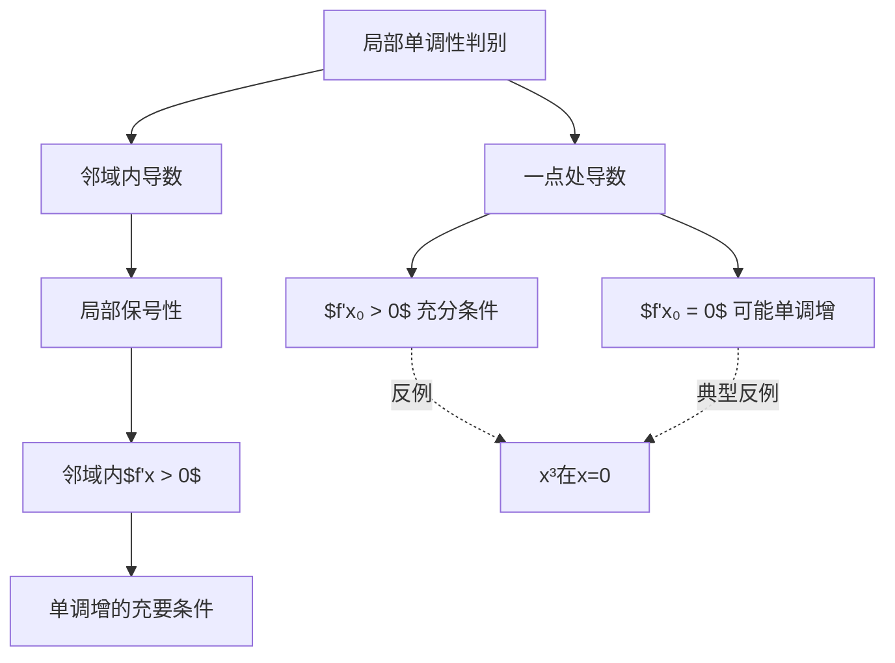

> 引用自 [[RAW-math-高数-P111-concept]]

# 导数正不是局部单调增的必要条件

# 导数正不是局部单调增的必要条件

## 元数据

| 属性 | 值 |
|------|-----|
| 章节 | 2026 张宇高数 18讲 - 第5讲 一元函数微分学的应用(一)——几何应用 |
| 难度 | ★★☆☆☆ |


## 一、概念定义

### 1.1 局部单调增的严格定义

> 设 $f(x)$ 在 $x_0$ 的某邻域 $U(x_0)$ 内有定义，若对任意 $x \in U(x_0)$，当 $x > x_0$ 时有 $f(x) > f(x_0)$，当 $x < x_0$ 时有 $f(x) < f(x_0)$，则称 $f(x)$ 在 $x_0$ 处**严格单调增加**。

### 1.2 核心结论

| 条件 | 结论 | 必要性 |
|------|------|--------|
| $f'(x_0) > 0$ | $f(x)$ 在 $x_0$ 的某邻域内单调增加 | ❌ 充分不必要 |
| $f'(x_0) = 0$ | $f(x)$ 仍可能在邻域内单调增加 | 可能成立 |
| $f''(x_0) > 0$ | 曲线在 $x_0$ 的某邻域内是凹的 | ❌ 充分不必要 |
| $f''(x_0) = 0$ | 曲线仍可能是凹的 | 可能成立 |

### 1.3 关键定理（局部保号性）

若 $\lim\limits_{x \to x_0} f'(x) = f'(x_0) > 0$，则存在 $\delta > 0$，使得当 $x \in U(x_0, \delta)$ 时，有 $f'(x) > 0$。

> **本质**：要判断局部单调性，需要的是邻域内导数符号为正，而非仅在一点处导数为正。


## 二、核心公式

### 2.1 局部单调增的充分条件

$$f'(x_0) > 0 \implies f(x) \text{ 在 } x_0 \text{ 的某邻域内单调增加}$$

### 2.2 局部凹的充分条件

$$f''(x_0) > 0 \implies \text{曲线 } y = f(x) \text{ 在 } x_0 \text{ 的某邻域内是凹的}$$

### 2.3 局部保号性（关键引理）

$$
$$

### 2.4 反例通式

| 场景 | 反例函数 | 性质 |
|------|----------|------|
| $f'(x_0) = 0$ 但邻域单调增 | $f(x) = x^3$ | $f'(0) = 0$，邻域内单调增 |
| $f''(x_0) = 0$ 但邻域凹 | $f(x) = x^3$ | $f''(0) = 0$，邻域内是凹的 |


## 三、典型例题

### 【例题】判断正误并说明理由

> **题目**：设 $f(x)$ 在 $x_0$ 处可导，则 $f'(x_0) > 0$ 是 $f(x)$ 在 $x_0$ 的某邻域内单调增加的**必要条件**。（判断对错）

**【解析】**

**答案：错误。**

**理由**：$f'(x_0) > 0$ 是局部单调增的**充分条件**，而非必要条件。

**反例**：取 $f(x) = x^3$，$x_0 = 0$

- 计算导数：$f'(x) = 3x^2$
- 在 $x_0 = 0$ 处：$f'(0) = 0 \not> 0$
- 但 $f(x) = x^3$ 在 $x = 0$ 的任意邻域内均严格单调增加

**正确表述**：

| 表述 | 正确性 |
|------|--------|
| $f'(x_0) > 0 \Rightarrow f(x)$ 在邻域内单调增 | ✅ 正确（充分条件） |
| $f(x)$ 在邻域内单调增 $\Rightarrow f'(x_0) > 0$ | ❌ 错误（不是必要条件） |

**【关键点】** 一点处的导数值无法完全反映该点附近函数的变化趋势，必须考察该点邻域内导数的符号。


## 四、常见错误

### ❌ 错误 1：混淆点邻域与点本身

| 错误理解 | 正确理解 |
|----------|----------|
| $f'(x_0) > 0$ ⇒ 函数在 $x_0$ 处单调增 | $f'(x_0) > 0$ ⇒ 函数在 $x_0$ 的**邻域内**单调增 |
| 只需要看 $x_0$ 一点 | 需要看 $x_0$ 的某个**去心邻域** |

### ❌ 错误 2：忽视导数连续性

> 题目条件中" $f(x)$ 在 $x_0$ 处**有二阶导数**"这一条件至关重要！

- **有二阶导数** ⇒ 推出一阶导数连续
- **一阶导数连续** + $f'(x_0) > 0$ ⇒ 由局部保号性 ⇒ 邻域内 $f'(x) > 0$

### ❌ 错误 3：反例识记不清

学生常忘记典型反例 $f(x) = x^3$，应牢记：

$$\boxed{f(x) = x^3 \text{ 是导数正非局部单调增必要条件的标准反例}}$$

### ❌ 错误 4：类比推理错误

将"导数正"与"单调增"的逻辑关系错误推广：

| 错误类比 | 问题 |
|----------|------|
| "既然 $f'(x_0) > 0$ 能推出单调增，那 $f''(x_0) > 0$ 也能推出凹凸性" | 两者都是充分条件，但题目常考"必要条件"的否定 |


## 五、关联知识点

### 5.1 纵向知识链

```
第3讲 导数与微分
    │
    ▼
第5讲 微分学几何应用
    │
    ├── ① 单调性判别（导数正）
    ├── ② 凹凸性判别（二阶导数）
    └── ③ 极值与拐点
    │
    ▼
第6讲 微分学经济应用（可能涉及边际分析）
```

### 5.2 横向关联

| 关联知识点 | 关联内容 |
|------------|----------|
| **局部保号性** | 本结论的理论基础 |
| **导数连续性** | 由二阶导数存在⇒一阶导数连续 |
| **单调性判别法** | $f'(x) > 0 \Leftrightarrow f(x)$ 单调增 |
| **凹凸性判别法** | $f''(x) > 0 \Leftrightarrow$ 曲线凹 |

### 5.3 逆命题与等价命题

| 命题 | 正确性 |
|------|--------|
| $f'(x_0) > 0$ 是局部单调增的充分条件 | ✅ |
| $f'(x_0) > 0$ 是局部单调增的必要条件 | ❌ |
| $f'(x) > 0$ 在邻域内恒成立是局部单调增的**充要条件** | ✅ |


## 六、思维导图




## 七、速记口诀

> **"导数正，邻域保，一点零邻域仍可增；三阶反例 $x^3$，二阶凹凸同理同。"**

**解读**：
- 导数正 → 用局部保号性保证邻域正
- 一点为零 → 邻域内仍可能单调增
- 标准反例 → $f(x) = x^3$
- 二阶导数同理 → $f''(0) = 0$ 但曲线仍凹

