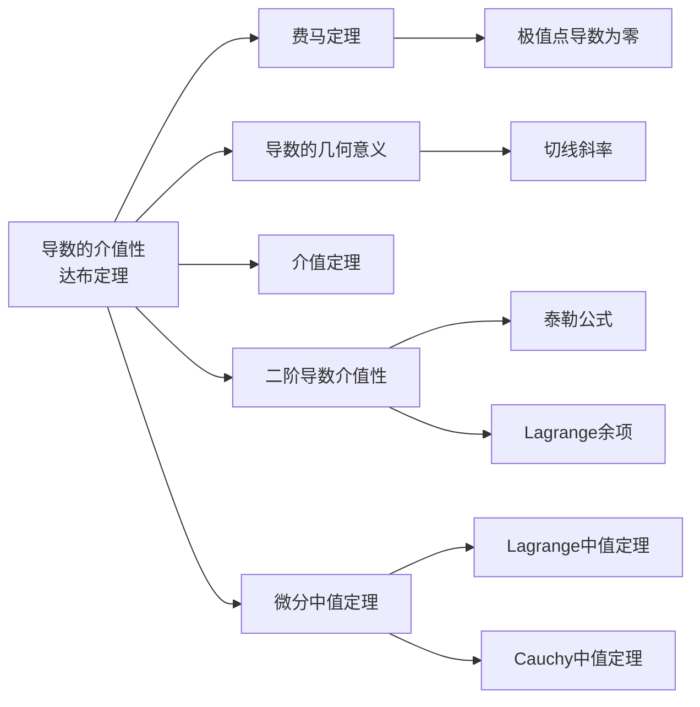

> 引用自 [[RAW-math-高数-P113-concept]]

# 导数的介值性达布定理

# 导数的介值性（达布定理）

## 概念定义

**达布定理（Darboux's Theorem）**：如果函数 $f(x)$ 在区间 $[a,b]$ 上可导，则其导函数 $f'(x)$ 具有**介值性**，即：

> 对于任意介于 $f'(a)$ 与 $f'(b)$ 之间的值 $\mu$，必存在 $\xi \in (a,b)$，使得 $f'(\xi) = \mu$。

**关键点**：
- 导函数不必连续，但必定满足**零点定理**和**介值定理**
- 导数的介值性是导函数特有的性质，不要求连续性
- 几何含义：导数值在区间上不能"跳跃"

## 核心公式

### 1. 达布定理（标准表述）

$$
$$

### 2. 证明辅助函数

$$
\boxed{F(x) = f(x) - \mu x}
$$

则 $F'(x) = f'(x) - \mu$，有 $F'(a)$ 与 $F'(b)$ 异号。

### 3. 费马定理（用于证明）

$$
\boxed{F(\xi) = \min_{[a,b]} F(x) \implies F'(\xi) = 0}
$$

### 4. 二阶导数介值性（泰勒形式）

$$
\boxed{f(0) + f(2) - 2f(1) = \frac{f''(\xi)}{2} \cdot [(0-1)^2 + (2-1)^2] = f''(\xi)}
$$

## 典型例题

### 【例题】设 $f(x)$ 在 $[0,2]$ 上具有二阶导数，证明：存在 $\xi \in (0,2)$，使得

$$
f(0) + f(2) - 2f(1) = f''(\xi)
$$

### 【证明】

**方法一：泰勒公式法**

在 $x_0 = 1$ 处展开：

$$
f(0) = f(1) + f'(1)(0-1) + \frac{f''(\xi_1)}{2}(0-1)^2 = f(1) - f'(1) + \frac{f''(\xi_1)}{2}
$$

$$
f(2) = f(1) + f'(1)(2-1) + \frac{f''(\xi_2)}{2}(2-1)^2 = f(1) + f'(1) + \frac{f''(\xi_2)}{2}
$$

其中 $\xi_1 \in (0,1)$，$\xi_2 \in (1,2)$。

两式相加得：

$$
f(0) + f(2) = 2f(1) + \frac{f''(\xi_1) + f''(\xi_2)}{2}
$$

即：

$$
f(0) + f(2) - 2f(1) = \frac{f''(\xi_1) + f''(\xi_2)}{2}
$$

由**达布定理**（二阶导数的介值性），存在 $\xi \in (0,2)$，使得

$$
f''(\xi) = \frac{f''(\xi_1) + f''(\xi_2)}{2}
$$

故原式得证。$\square$

## 常见错误

| 错误类型 | 具体表现 | 正确理解 |
|---------|---------|---------|
| **混淆定理条件** | 错误认为"导数连续才能用介值性" | 达布定理**不需要**导数连续，介值性是导数的固有性质 |
| **最小值点判断错误** | 认为最小值一定在端点取得 | 当 $F'(a) < 0$，$F'(b) > 0$ 时，**两端都不是最小值点** |
| **符号遗漏** | 构造 $F(x) = f(x) + \mu x$ | 应该是 $F(x) = f(x) - \mu x$，使 $F'(a)$ 与 $F'(b)$ 异号 |
| **直接套用 Rolle 定理** | 试图直接对 $f'(x)$ 用 Rolle 定理 | $f'(a) \neq f'(b)$ 时，Rolle 定理条件不满足 |
| **忽视费马定理前提** | 不验证极值点条件直接令导数为零 | 必须先说明 $\xi$ 是**极小值点**，才能用费马定理 |

## 关联知识点

### 层级关系

1. **上游基础**：连续函数的介值定理 → 费马定理 → 达布定理
2. **同层扩展**：Lagrange 中值定理（Cauchy 中值定理）
3. **下游应用**：二阶导数介值性、泰勒公式余项估计、极值问题

## 章节定位

> 📚 **2026 张宇高数 18讲(OCR)**
> 
> 第6讲 一元函数微分学的应用(二)——中值定理、微分等式与微分不等式
> 
> 难度：★★☆☆☆

**【注】** 达布定理的核心价值在于：即使导函数不连续，也具有"不走回头路"的特性。这与"连续函数必定有介值性"形成对比，揭示了导数作为"变化率"的内在连续性。