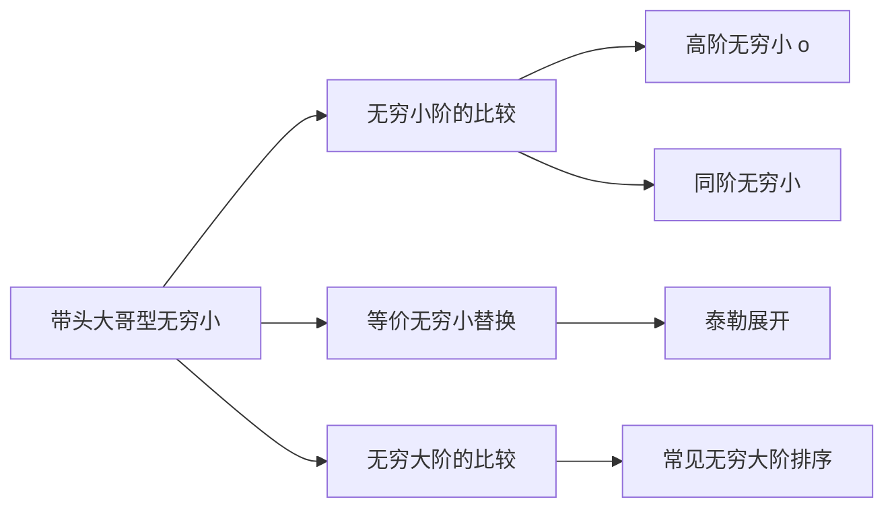

> 引用自 [[RAW-math-高数-P117-concept]]

# 带头大哥型无穷小量的定义

# 带头大哥型无穷小量

- **章节**：2026 张宇高数 18讲(OCR)
- **难度**：★★☆☆☆

## 1. 概念定义

**带头大哥型**无穷小量是指数个同趋势无穷小量的和，其中**阶数最高的项**（即增长最慢的项）称为**带头大哥**。

> **形式化定义**：对于 $\alpha + \beta$，若 $\alpha, \beta$ 都是同一自变量变化过程 $x \to \cdot$ 下的非零无穷小量，且 $\alpha = o(\beta)$，则称 $\beta$ 为**带头大哥**。

### 关键特征
- 带头大哥是**阶数最高**的无穷小量
- 整个和式的极限性质由带头大哥**唯一决定**

## 2. 核心公式

设当 $x \to x_0$ 时，$\alpha = o(\beta)$，则：

$$\boxed{\alpha + \beta \sim \beta \quad (x \to x_0)}$$

$$\boxed{\text{sgn}(\alpha + \beta) = \text{sgn}(\beta)}$$

$$\boxed{\alpha \cdot \beta = o(\beta^2)}$$

$$\boxed{\alpha - \beta = o(\beta)}$$

## 3. 典型例题

> **例 1.5**（张宇高数18讲）  
> 设函数 $f(x), g(x)$ 在 $x=0$ 的某去心邻域内有定义且恒不为 $0$，若当 $x \to 0$ 时，$f(x)$ 是 $g(x)$ 的高阶无穷小，则当 $x \to 0$ 时，有（ ）。  
> 
> (A) $f(x) + g(x) = o(g(x))$  
> (B) $f(x)g(x) = o(f^2(x))$  
> (C) $f(x) = o(e^{g(x)} - 1)$  
> (D) $f(x) = o(g^2(x))$

### 解

**正确答案：(C)**

**解析**：

由题意知 $f(x) = o(g(x))$，即 $g(x)$ 是**带头大哥**。

- **选项(A)**：由公式 $\alpha + \beta \sim \beta$，有 $f(x) + g(x) \sim g(x)$，故 $f(x) + g(x) \neq o(g(x))$，**(A)错误**

- **选项(B)**：由公式 $\alpha \cdot \beta = o(\beta^2)$，有 $f(x) \cdot g(x) = o(g^2(x))$，而不是 $o(f^2(x))$，**(B)错误**

- **选项(C)**：当 $x \to 0$ 时，$e^{g(x)} - 1 \sim g(x)$，故：
  $$f(x) = o(g(x)) = o(e^{g(x)} - 1)$$
  **(C)正确**

- **选项(D)**：由 $f(x) = o(g(x))$ 无法推出 $f(x) = o(g^2(x))$，**(D)错误**

## 4. 常见错误

| 错误类型 | 错误示例 | 正确理解 |
|---------|---------|---------|
| **混淆阶数关系** | 由 $f = o(g)$ 推出 $f = o(g^2)$ | $f$ 与 $g$ 同阶或高阶，不代表与 $g^2$ 同阶 |
| **符号判断错误** | 认为 $\alpha + \beta$ 与 $\alpha$ 同号 | 应与**带头大哥** $\beta$ 同号 |
| **忽略条件** | 忽略"非零无穷小"的限制条件 | 需满足 $\alpha, \beta \neq 0$ |
| **乘积阶数混淆** | 认为 $f \cdot g = o(f^2)$ | 正确应为 $f \cdot g = o(g^2)$ 或 $o(fg)$ |

## 5. 关联知识点

### 延伸公式

**常用无穷大阶的比较**（$x \to +\infty$）：

$$\lim_{x \to +\infty} \frac{\ln^a x}{x^b} = 0 \quad (a > 0, b > 0)$$

$$\lim_{x \to +\infty} \frac{x^a}{b^x} = 0 \quad (a > 0, b > 1)$$

## 📚 参考来源

- 张宇高等数学18讲 · 第一章 · 极限与连续
- 章节：2026 张宇高数 18讲(OCR)