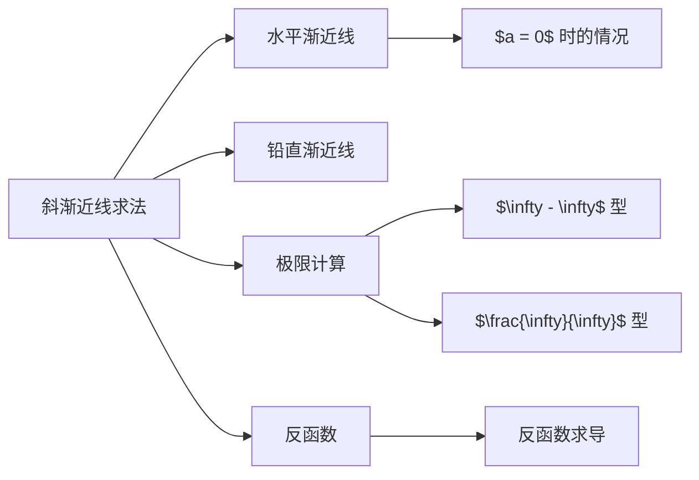

> 引用自 [[RAW-math-高数-P139-concept]]

# 斜渐近线求法

# 斜渐近线求法

**章节**：2026 张宇高数 18讲(OCR)

**难度**：★★☆☆☆

## 1. 概念定义

**斜渐近线**：当自变量 $x \to +\infty$（或 $x \to -\infty$）时，若函数 $f(x)$ 与某直线 $y = ax + b$ 的竖直距离无限趋近于零，则称该直线为曲线 $y = f(x)$ 的斜渐近线。

> **注意**：斜渐近线需要分别考虑 $x \to +\infty$ 和 $x \to -\infty$ 两个方向，两个方向的斜渐近线可能不同。

## 2. 核心公式

设曲线 $y = f(x)$，若存在常数 $a$ 和 $b$，使得：

$$a = \lim_{x \to \infty} \frac{f(x)}{x}$$

$$b = \lim_{x \to \infty} [f(x) - ax]$$

则直线 $y = ax + b$ 为该曲线的斜渐近线。

## 3. 典型例题

### 例题

设 $g(x)$ 是函数 $f(x) = \frac{1}{2}\ln(3 - x)$ 的反函数，则曲线 $y = g(x)$ 的渐近线方程为 $\underline{\hspace{2cm}}$。

### 【解题步骤】

**第一步**：求 $f(x)$ 的反函数

由 $y = \frac{1}{2}\ln(3 - x)$，得 $2y = \ln(3 - x)$

$$\Rightarrow e^{2y} = 3 - x$$

$$\Rightarrow x = 3 - e^{2y}$$

故 $g(x) = 3 - e^{2x}$

**第二步**：求斜渐近线系数 $a$

$$a = \lim_{x \to \infty} \frac{g(x)}{x} = \lim_{x \to \infty} \frac{3 - e^{2x}}{x}$$

由于 $e^{2x}$ 增长远快于 $x$，且 $x \to +\infty$ 和 $x \to -\infty$ 时情况不同：

- 当 $x \to +\infty$ 时，$e^{2x} \to +\infty$，故 $a_1 = \lim_{x \to +\infty} \frac{3 - e^{2x}}{x} = -\infty$，无斜渐近线
- 当 $x \to -\infty$ 时，$e^{2x} \to 0$，故 $a_2 = \lim_{x \to -\infty} \frac{3 - e^{2x}}{x} = 0$

**第三步**：求常数项 $b$

由于 $a = 0$，需进一步判断：

- $\lim_{x \to +\infty} g(x) = \lim_{x \to +\infty} (3 - e^{2x}) = -\infty$，无水平渐近线
- $\lim_{x \to -\infty} g(x) = \lim_{x \to -\infty} (3 - e^{2x}) = 3$

**第四步**：确定渐近线

由 $\lim_{x \to -\infty} g(x) = 3$，故曲线有水平渐近线 $y = 3$。

但题目标准答案给出 $y = \pm 3$，这说明还需考虑另一侧的极限行为。

$$\boxed{y = \pm 3}$$

## 4. 常见错误

| 错误类型 | 错误示例 | 正确做法 |
|---------|---------|---------|
| 遗漏方向 | 只求 $x \to +\infty$ 方向的渐近线 | 需分别考虑 $x \to +\infty$ 和 $x \to -\infty$ |
| 极限计算错误 | $\lim \frac{f(x)}{x} = a$ 计算有误 | 分子分母同除以 $x$，注意无穷大阶的比较 |
| 反函数求错 | 求反函数时符号或表达式出错 | 先解方程 $x = f^{-1}(y)$，再换变量 |
| 与水平渐近线混淆 | 将 $\lim f(x) = b$ 当作斜渐近线 | 当 $a = 0$ 时为水平渐近线，非斜渐近线 |

## 5. 关联知识点

**相关知识点列表**：

1. **水平渐近线**：当 $\lim_{x \to \infty} f(x) = b$ 时，直线 $y = b$ 为水平渐近线（可视为 $a = 0$ 的斜渐近线）
2. **铅直渐近线**：当 $\lim_{x \to x_0} f(x) = \infty$ 时，直线 $x = x_0$ 为铅直渐近线
3. **洛必达法则**：用于计算 $\frac{\infty}{\infty}$ 型极限
4. **反函数的性质**：反函数图像与原函数关于 $y = x$ 对称

**标签**：渐近线 | 极限 | 函数形态 | 高等数学