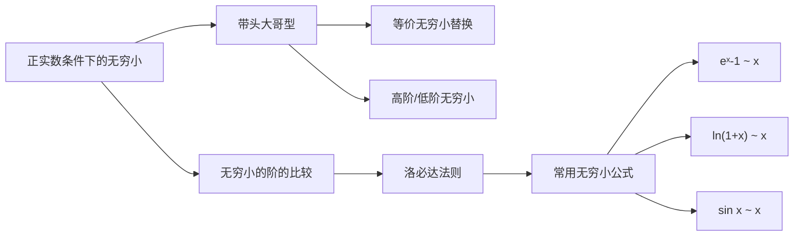

> 引用自 [[RAW-math-高数-P153-concept]]

# 正实数条件下x0的无穷小命题

# 正实数条件下 x→0⁺ 的无穷小命题

## 元数据

| 属性 | 值 |
|------|-----|
| 章节 | 2026 张宇高数 18讲 (OCR) |
| 难度 | ★★☆☆☆ |

## 1. 概念定义

### 1.1 正实数条件下的无穷小阶

当 $m, n$ 为**正实数**时，涉及幂函数 $x^m$ 与 $x^n$ 的无穷小阶比较，需要限定 $x \to 0^+$ 的趋近方式。

### 1.2 带头大哥型无穷小

在 $\alpha + \beta$ 中，若 $\alpha, \beta$ 都是同一自变量变化过程 $x \to \cdot$ 下的**非零无穷小量**，且 $\alpha = o(\beta)$，则称 $\beta$ 为**带头大哥**。

> 核心思想：主导项（带头大哥）决定整体的无穷小阶和符号。

## 2. 核心公式

### 2.1 带头大哥三定律

设 $\alpha = o(\beta)$（$x \to \cdot$），$\beta \neq 0$，则：

$$(1) \quad \alpha + \beta \sim \beta \quad (x \to \cdot)$$

$$(2) \quad \alpha + \beta \text{ 与 } \beta \text{ 在 } x \to \cdot \text{ 时同号}$$

$$(3) \quad \alpha - \beta = o(\beta) \cdot \beta = o(\beta^2) \quad (x \to \cdot)$$

### 2.2 无穷小阶的比较（正实数情形）

$$(4) \quad \lim_{x \to 0^+} \frac{x^m}{x^n} = \begin{cases} 0, & m > n \\ \infty, & m < n \\ 1, & m = n \end{cases}$$

## 3. 典型例题

### 例1.5（带头大哥型应用）

> **题目**：设函数 $f(x), g(x)$ 在 $x = 0$ 的某去心邻域内有定义且恒不为 $0$，若当 $x \to 0$ 时，$f(x)$ 是 $g(x)$ 的高阶无穷小，则当 $x \to 0$ 时，有 ( )。

| 选项 | 内容 |
|------|------|
| (A) | $f(x) + g(x) \sim g(x)$ |
| (B) | $f(x) \cdot g(x) = o(g^2(x))$ |
| (C) | $f(x) = o(e^{g(x)} - 1)$ |
| (D) | $f(x) = o(g^2(x))$ |

### 【解】

**答案**：选 **(C)**

**分析过程**：

已知 $f(x) = o(g(x))$（$x \to 0$），即 $g(x)$ 是带头大哥。

**逐项判断**：

**(A)** 由带头大哥定律①：
$$f(x) + g(x) \sim g(x) \quad \Rightarrow \quad \text{该命题应为真}$$

但题目要求判断哪个**不成立**，故 (A) **成立**，不是答案。

**(B)** 由定律③的推广：
$$f(x) \cdot g(x) = o(g(x) \cdot g(x)) = o(g^2(x))$$

因此 $f(x) \cdot g(x) = o(g^2(x))$，选项 (B) **成立**。

**(C)** 利用等价无穷小 $e^{g(x)} - 1 \sim g(x)$（$x \to 0$）：

由于 $f(x) = o(g(x))$ 且 $g(x) \sim e^{g(x)} - 1$，有：
$$f(x) = o(e^{g(x)} - 1)$$

选项 (C) **成立**。

**(D)** 由 $f(x) = o(g(x))$ 不能推出 $f(x) = o(g^2(x))$。

例如：取 $f(x) = x^2$，$g(x) = x$，则 $f(x) = o(g(x))$，但 $f(x) \neq o(g^2(x))$（因为 $f(x) / g^2(x) = 1$ 为常数）。

**结论**：选项 (D) 不成立，故选 **(C)**。

## 4. 常见错误

| 错误类型 | 错误示例 | 正确认识 |
|----------|----------|----------|
| 忽略正实数条件 | 认为 $x \to 0$ 时 $x^m$ 与 $x^n$ 的阶可直接比较 | 正实数 $m, n$ 需限定 $x \to 0^+$ |
| 混淆 $\sim$ 与 $=$ | 误用 $\alpha + \beta = \beta$ | 正确的是 $\alpha + \beta \sim \beta$ |
| 阶的传递性错误 | 由 $f = o(g)$ 推出 $f = o(g^2)$ | 无此传递性，需独立判断 |
| 忽视 $e^x - 1 \sim x$ | 不利用等价替换 | $e^{g(x)} - 1 \sim g(x)$ 是常用等价关系 |
| 符号判断错误 | 认为 $\alpha + \beta$ 可能与 $\beta$ 异号 | 由定律②，两者**必同号** |

## 5. 关联知识点

### 推荐的关联学习顺序

1. **无穷小的定义** → 理解 $o(\cdot)$ 符号含义
2. **等价无穷小替换** → 常用替换公式表
3. **带头大哥三定律** → 本知识点的核心工具
4. **洛必达法则** → 与无穷小阶的结合应用
5. **无穷大的阶** → 对偶概念

### 相关公式速查

| 等价关系 | 适用条件 |
|----------|----------|
| $e^x - 1 \sim x$ | $x \to 0$ |
| $\ln(1+x) \sim x$ | $x \to 0$ |
| $\sin x \sim x$ | $x \to 0$ |
| $(1+x)^\alpha - 1 \sim \alpha x$ | $x \to 0$ |
| $\tan x \sim x$ | $x \to 0$ |

> **记忆口诀**：带头大哥说了算——主导项定阶、定号、定关系。