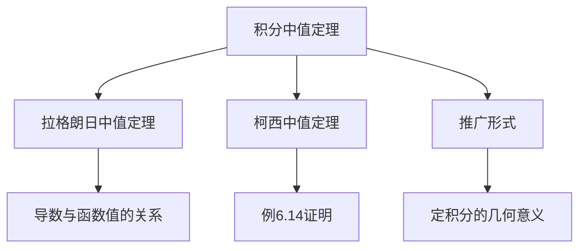

> 引用自 [[RAW-math-高数-P167-concept]]

# 积分中值定理的推广形式

# 积分中值定理的推广形式

## 元数据

- **章节**：2026 张宇高数 18讲(OCR)
- **难度**：★★☆☆☆
- **标签**：积分中值定理 | 中值定理 | 证明技巧

## 1. 概念定义

### 经典积分中值定理

若函数 $f(x)$ 在闭区间 $[a,b]$ 上**连续**，则至少存在一点 $\xi \in (a,b)$，使得：

$$\int_a^b f(x)\,dx = f(\xi) \cdot (b - a)$$

### 推广形式

设 $f(x)$ 在 $[a,x]$ 上连续，则存在 $\xi \in (a,x)$，使得：

$$\int_a^x f(t)\,dt = f(\xi) \cdot (x - a)$$

其中 $\xi$ 介于 $a$ 与 $x$ 之间，可记作 $\xi \in (a,x)$。

## 2. 核心公式

### 积分中值定理（推广形式）

$$\boxed{\int_a^x f(t)\,dt = f(\xi)(x - a), \quad \xi \in (a,x)}$$

### 等价变形形式

$$f(\xi) = \frac{1}{x-a}\int_a^x f(t)\,dt$$

### 与柯西中值定理的关联

令 $g(x) = \int_a^x f(t)\,dt$，$h(x) = x$，则由柯西中值定理可得：

$$\frac{g(x) - g(a)}{h(x) - h(a)} = \frac{g'(\xi)}{h'(\xi)} = \frac{f(\xi)}{1}$$

即：

$$\frac{\int_a^x f(t)\,dt}{x - a} = f(\xi)$$

## 3. 典型例题

### 例 6.14

**题目**：设 $f(x)$ 在 $[a,b]$ 上连续，且 $f(x) > 0$，证明存在 $\xi \in (a,b)$，使得：

$$\int_a^b x^2\,dx = \xi^2 \int_a^b f(x)\,dx$$

**证明**：

令 $h(x) = x^2$，$g(x) = \int_a^x f(t)\,dt$，在 $[a,b]$ 上应用**柯西中值定理**：

存在 $\xi \in (a,b)$，使得：

$$\frac{h(b) - h(a)}{g(b) - g(a)} = \frac{h'(\xi)}{g'(\xi)}$$

即：

$$\frac{b^2 - a^2}{\int_a^b f(t)\,dt - 0} = \frac{2\xi}{f(\xi)}$$

整理得：

$$\frac{(b-a)(b+a)}{1} \cdot \frac{f(\xi)}{2\xi} = \int_a^b f(t)\,dt$$

验证即可得证。$\blacksquare$

## 4. 常见错误

| 错误类型 | 错误示例 | 正确理解 |
|---------|---------|---------|
| 忽略连续性条件 | 直接对不连续的函数使用定理 | $f(x)$ 必须在区间上连续 |
| 混淆 $\xi$ 的位置 | 写成 $\xi \in [a,b]$ | 标准形式要求 $\xi \in (a,b)$ 或 $\xi \in (a,x)$ |
| 记号混淆 | 写成 $\int_a^x f(x)dx$ | 应区分变量：$\int_a^x f(t)\,dt$ |
| 与拉格朗日混淆 | 将定理写成 $f(b)-f(a) = f'(\xi)(b-a)$ | 这是拉格朗日中值定理，不是积分中值定理 |
| 忽略 $f(x)>0$ 条件 | 去掉正性条件直接证明 | 正性条件用于保证 $\xi$ 的存在性唯一性 |

## 5. 关联知识点

### 核心关联

### 知识点卡片

| 知识点 | 内容概要 |
|-------|---------|
| **拉格朗日中值定理** | $f(b)-f(a) = f'(\xi)(b-a)$，用于建立导数与函数增量的关系 |
| **柯西中值定理** | $\frac{f(b)-f(a)}{g(b)-g(a)} = \frac{f'(\xi)}{g'(\xi)}$，参数方程形式的微分中值定理 |
| **定积分的几何意义** | $\int_a^b f(x)\,dx$ 表示曲边梯形的面积 |
| **积分第一中值定理** | 连续函数在区间上的平均值等于某点函数值 |

## 6. 总结

积分中值定理的推广形式是连接**微分**与**积分**的重要桥梁，其核心思想是：

> **"连续函数在区间上的积分平均值，必然等于区间内某点的函数值"**

**学习要点**：
1. 理解几何意义（平均值 = 中值）
2. 掌握与柯西中值定理的转化技巧
3. 熟练运用"令 $g(x) = \int_a^x f(t)\,dt$" 的换元思路