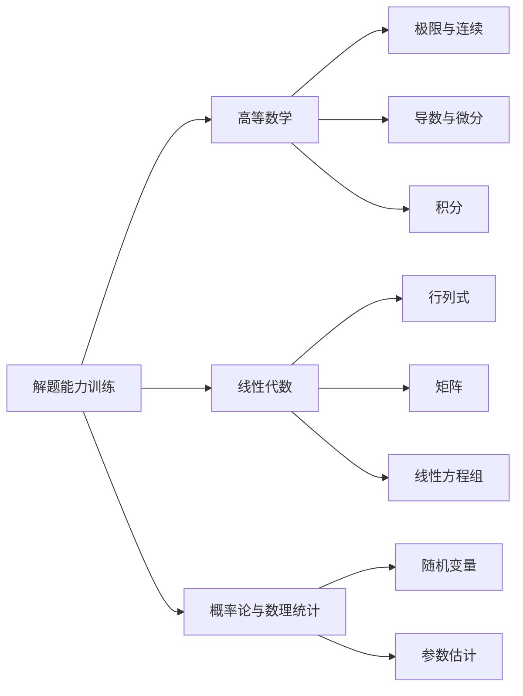

> 引用自 [[RAW-math-高数-P182-concept]]

# 解题能力训练

# 解题能力训练 — 三向解题法 (OPD)


## 📋 元数据

| 字段 | 内容 |
|------|------|
| **章节** | 2026 张宇高数 18讲 (OCR) |
| **难度** | ★★☆☆☆ |
| **关键词** | 三向解题法、OPD、Objects、Procedures、Details |


## 一、概念定义

### 1.1 问题背景

考研数学命题日益灵活，考生常面临 **"听得懂课，但不会做题"** 的困境。仅完成知识储备工作不足以带来成绩的实质性提高。

### 1.2 三向解题法 (OPD)

**三向解题法**（OPD, Object-Procedure-Details）是一种 **以目标、思路与细节为三个导向的解题方法**：

| 符号 | 含义 | 英文 | 作用 |
| **O** | 目标/任务 | Objects | 明确"要做什么" |
| **P** | 思路/程序 | Procedures | 规划"怎么做" |
| **D** | 细节 | Details | 落实"做得好" |

> **核心思想**：在掌握基本数学知识的前提下，专门研究如何解题，让知识在解题中「活起来、用得上」。


## 二、核心公式

### 2.1 OPD 框架

$$\text{解题过程} = O + P + D$$

### 2.2 解题流程图

```
┌─────────────────────────────────────────────────────┐
│                    OPD 三向解题法                    │
├─────────────────────────────────────────────────────┤
│                                                     │
│   O (Objects)          P (Procedures)      D (Details) │
│   ┌─────────┐         ┌─────────┐        ┌─────────┐ │
│   │ 明确目标 │ ──────▶ │ 设计思路 │ ──────▶ │ 完善细节 │ │
│   │ 分析条件 │         │ 确定方法 │        │ 规范书写 │ │
│   │ 识别题型 │         │ 建立联系 │        │ 检查验算 │ │
│   └─────────┘         └─────────┘        └─────────┘ │
│        │                   │                   │      │
│        ▼                   ▼                   ▼      │
│   ┌─────────────────────────────────────────────┐    │
│   │              完整解题方案                    │    │
│   └─────────────────────────────────────────────┘    │
│                                                     │
└─────────────────────────────────────────────────────┘
```

### 2.3 三阶段任务表

| 阶段 | 核心问题 | 产出 |
| **O 阶段** | 题目让我求什么？已知条件是什么？ | 问题的数学表达 |
| **P 阶段** | 用什么方法？思路是什么？ | 解题路径选择 |
| **D 阶段** | 每一步怎么写？要注意什么？ | 规范解答过程 |


## 三、典型例题

### 例题：OPD 法的实际应用

**题目**：求极限 $\displaystyle \lim_{x \to 0} \frac{e^x - e^{-x} - 2x}{x^3}$

### 🔍 O 阶段 — 明确目标

- **目标**：求 $\frac{0}{0}$ 型未定式的极限
- **已知**：分子、分母在 $x \to 0$ 时均趋于 0
- **识别**：可使用泰勒展开或洛必达法则

### 🛠️ P 阶段 — 设计思路

| 方法 | 思路 |
|------|------|
| 方法一 | 洛必达法则（分子、分母求导） |
| 方法二 | 泰勒展开（推荐，更快捷） |

### ✍️ D 阶段 — 完善细节

**解法（泰勒展开法）**：

$$e^x = 1 + x + \frac{x^2}{2} + \frac{x^3}{6} + o(x^3)$$

$$e^{-x} = 1 - x + \frac{x^2}{2} - \frac{x^3}{6} + o(x^3)$$

$$\therefore e^x - e^{-x} - 2x = 2 \cdot \frac{x^3}{6} + o(x^3) = \frac{x^3}{3} + o(x^3)$$

$$\lim_{x \to 0} \frac{e^x - e^{-x} - 2x}{x^3} = \lim_{x \to 0} \frac{\frac{x^3}{3} + o(x^3)}{x^3} = \frac{1}{3}$$


## 四、常见错误

| 错误类型 | 具体表现 | 纠正方法 |
|----------|----------|----------|
| **O 阶段缺失** | 盲目套公式，不分析题目条件 | 养成读题时标记条件的习惯 |
| **P 阶段混乱** | 思路不清，反复试错浪费时间 | 建立「题型 → 方法」的对应表 |
| **D 阶段粗糙** | 计算跳步、符号错误、书写不规范 | 每步检查，养成验算习惯 |
| **知识与解题脱节** | 背了很多定理，但不会用 | 通过 OPD 框架刻意练习 |
| **过度依赖听课** | 只听不做，眼高手低 | 增加独立解题训练时间 |


## 五、关联知识点

### 5.1 学科关联



### 5.2 方法论递进

| 层级 | 内容 | 阶段 |
| **基础层** | 知识储备（定义、定理、公式） | 基础阶段 |
| **应用层** | **OPD 解题法** | 强化阶段 |
| **拓展层** | 独立研究问题的能力 | 冲刺阶段 |


## 📚 参考文献

- 张宇，《2026 考研数学高等数学 18 讲》，前言及解题能力训练部分


> **学习建议**：将 OPD 框架应用于每一道习题练习，逐步形成「目标明确 → 思路清晰 → 细节完善」的解题习惯。