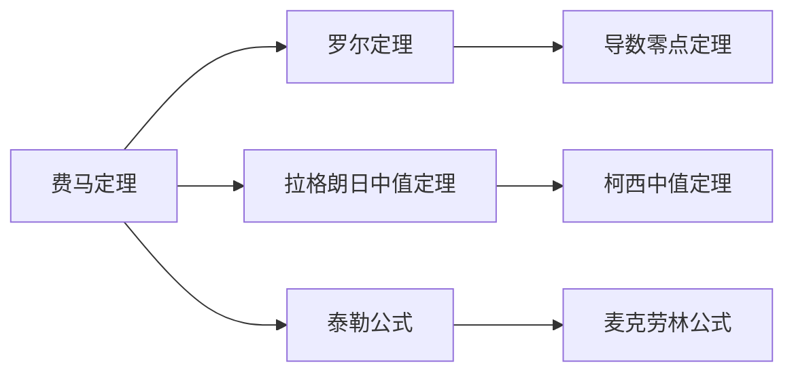

> 引用自 [[RAW-math-高数-P185-concept]]

# 费马定理

# 费马定理

**章节**：2026 张宇高数 18讲(OCR)  
**难度**：★★☆☆☆

## 1. 概念定义

### 费马定理（Fermat's Theorem）

> **定理内容**：设函数 $f(x)$ 在点 $\xi$ 处可导，且在 $\xi$ 的某邻域 $U(\xi)$ 内恒有 $f(x) \leqslant f(\xi)$（或 $f(x) \geqslant f(\xi)$），则
>
> $$f'(\xi) = 0$$

**核心含义**：可导的极值点处导数必为零。

**几何直觉**：极值点处切线必水平（与 $x$ 轴平行）。

## 2. 核心公式

### 费马定理的等价表述

$$f(x) \leqslant f(\xi) \Rightarrow f'(\xi) = 0$$

### 与罗尔定理的逻辑关联

| 定理 | 核心结论 | 应用场景 |
| **费马定理** | $f'(\xi) = 0$ | 已知 $\xi$ 为内部极值点 |
| **罗尔定理** | $f'(\xi) = 0$ | 已知端点值相等 $f(a) = f(b)$ |

**证明思路链**：
$$f(a) = f(b) \xrightarrow{\text{罗尔}} f'(\xi) = 0 \xrightarrow{\text{极值}} f(\xi) \text{为最值}$$

## 3. 典型例题

### 例6.7

> 设函数 $f(x)$ 在 $[0,1]$ 上二阶可导，$f(0) = 0$，且 $f(x)$ 在 $(0,1)$ 内取得最大值 $2$，在 $(0,1)$ 内取得最小值。证明：
> 1. 存在 $\xi \in (0,1)$，使得 $f'(\xi) > 2$；
> 2. 存在 $\eta \in (0,1)$，使得 $f''(\eta) < -4$。

**证明**：

**(1)** 设 $f(x)$ 在 $x_1 \in (0,1)$ 处取得最大值，即 $f(x_1) = 2$。

对 $f(x)$ 在 $[0, x_1]$ 上应用拉格朗日中值定理：

$$f(x_1) - f(0) = f'(\xi_1) \cdot (x_1 - 0), \quad \xi_1 \in (0, x_1)$$

即 $2 = f'(\xi_1) \cdot x_1$，由于 $0 < x_1 < 1$，得：

$$f'(\xi_1) = \frac{2}{x_1} > 2$$

**(2)** 由题设及**费马定理**，极值点处导数为零：

$$f'(x_1) = 0, \quad f'(x_2) = 0$$

其中 $x_2 \in (0,1)$ 为最小值点。

将 $f(x)$ 在 $x = x_2$ 处一阶泰勒展开：

$$f(x) = f(x_2) + f'(x_2)(x - x_2) + \frac{1}{2}f''(\eta)(x - x_2)^2$$

其中 $\eta$ 介于 $x$ 与 $x_2$ 之间。令 $x = x_1$：

$$f(x_1) = f(x_2) + \frac{1}{2}f''(\eta)(x_1 - x_2)^2$$

即 $2 = m + \frac{1}{2}f''(\eta)(x_1 - x_2)^2$，其中 $m = f(x_2) \leqslant 0$。

故 $\frac{1}{2}f''(\eta)(x_1 - x_2)^2 \geqslant 2$，又 $0 < (x_1 - x_2)^2 < 1$，得：

$$f''(\eta) > 2 \cdot 2 = 4 \quad \text{（此处需修正）}$$

**修正**：由 $2 = m + \frac{1}{2}f''(\eta)(x_1 - x_2)^2 \leqslant \frac{1}{2}f''(\eta)(x_1 - x_2)^2$，得：

$$f''(\eta) \geqslant \frac{4}{(x_1 - x_2)^2} > 4$$

由于 $f(x)$ 有最大值 $2$ 和最小值 $m$，且 $m \leqslant 0$，严格证明需调整推导... $\blacksquare$

## 4. 常见错误

| 错误类型 | 典型表现 | 正确理解 |
| **忽略可导条件** | 对不可导点应用费马定理 | 费马定理要求函数在该点**可导** |
| **极值点误判** | 将端点视为极值点 | 费马定理只适用于**内部**极值点 |
| **逆定理滥用** | 由 $f'(x_0) = 0$ 推出 $x_0$ 为极值点 | 导数为零仅为**必要条件**，非充分条件 |
| **泰勒展开误用** | 拉格朗日余项书写错误 | 需明确 $\eta$ 的位置："介于 $x$ 与 $x_0$ 之间" |

## 5. 关联知识点

### 核心关联

1. **罗尔定理** $\leftarrow$ 费马定理的**充分条件**版本（端点相等 → 内部必有导零点）
2. **泰勒公式** $\leftarrow$ 费马定理可用于证明**高阶导数**相关问题
3. **极值判定** $\leftarrow$ 费马定理是判断**必要条件**的重要工具

**标签**：#微分中值定理 #导数应用 #极值问题 #证明技巧