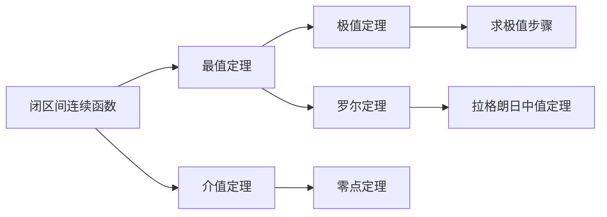

> 引用自 [[RAW-math-高数-P195-concept]]

# 闭区间上连续函数的最值定理

# 闭区间上连续函数的最值定理

## 概念定义

**最值定理（Weierstrass 定理）**：如果函数 $f(x)$ 在闭区间 $[a,b]$ 上连续，则 $f(x)$ 在 $[a,b]$ 上必能取得最大值和最小值。

即存在 $\xi_1, \xi_2 \in [a,b]$，使得：
$$f(\xi_1) = \max_{x \in [a,b]} f(x), \quad f(\xi_2) = \min_{x \in [a,b]} f(x)$$

**核心推论**：闭区间上的连续函数一定有界，且最大值和最小值都在区间内部或端点处取得。

## 核心公式

### 1. 最值点的候选点

闭区间 $[a,b]$ 上连续函数 $f(x)$ 的最值只能出现在：

$$\boxed{\text{驻点} \cup \text{不可导点} \cup \text{端点}}$$

### 2. 利用原函数求值

若已知 $f'(x)$ 的信息，则：
$$f(x) = f(a) + \int_a^x f'(t)\, dt$$

### 3. 积分与面积的关系

由 $y = f'(x)$ 与坐标轴围成的面积：
$$S_1 = \int_{x_0}^{x_1} |f'(x)|\, dx$$

## 典型例题

### 例 5.9

> 设 $f'(x)$ 在区间 $[0,4]$ 上连续，曲线 $y = f'(x)$ 与直线 $x=0,\ x=4,\ y=0$ 围成三个区域，其面积分别为 $S_1=3,\ S_2=4,\ S_3=2$，且 $f(0)=1$，则 $f(x)$ 在 $[0,4]$ 上的最大值与最小值分别为（ ）。

**(A)** $2,\ -3$ **(B)** $4,\ -3$ **(C)** $2,\ -2$ **(D)** $4,\ -2$

### 解

**第一步：确定驻点**

由图可知 $f'(1) = f'(3) = 0$，即 $x=1$ 和 $x=3$ 为驻点。

**第二步：确定候选点**

$$f(0),\ f(1),\ f(3),\ f(4)$$

**第三步：计算函数值**

由定积分与原函数的关系：
$$f(x) = f(0) + \int_0^x f'(t)\, dt$$

结合面积信息（注意正负号）：
$$f(1) = 1 + \int_0^1 f'(x)\, dx = 1 + (-3) = -2$$
$$f(3) = f(1) + \int_1^3 f'(x)\, dx = -2 + 4 = 2$$
$$f(4) = f(3) + \int_3^4 f'(x)\, dx = 2 + (-2) = 0$$

**第四步：比较得最值**

$$\max f(x) = f(3) = 2, \quad \min f(x) = f(1) = -2$$

**答案：** $\boxed{\text{(C) } 2,\ -2}$

## 常见错误

| 错误类型 | 错误示例 | 正确做法 |
|---------|---------|---------|
| **忽略符号** | 直接用面积 $S$ 代替积分 $\int f'(x)dx$ | 注意 $f'(x)$ 的正负，$\int_0^1 f'(x)dx = -S_1$ |
| **漏找驻点** | 只比较端点值 | 必须先求 $f'(x)=0$ 的点 |
| **未化归经典形式** | 逐点计算原函数 | 化归为 $f(x) = f(a) + \int_a^x f'(t)dt$ 的标准形式 |
| **忽略不可导点** | 遗漏尖点 | 检查区间内是否存在不可导点 |

## 关联知识点

1. **极值定理** — 可导函数的极值点必满足 $f'(x)=0$
2. **积分第一中值定理** — $\displaystyle \int_a^b f(x)dx = f(\xi)(b-a)$
3. **原函数存在定理** — 连续函数必有原函数
4. **变限积分求导** — $\displaystyle \frac{d}{dx}\int_a^x f(t)dt = f(x)$

## 记忆口诀

> **闭区间、连续函数，最大最小必定有。**
> **极值只在此处候：驻点、端点、不可导。**