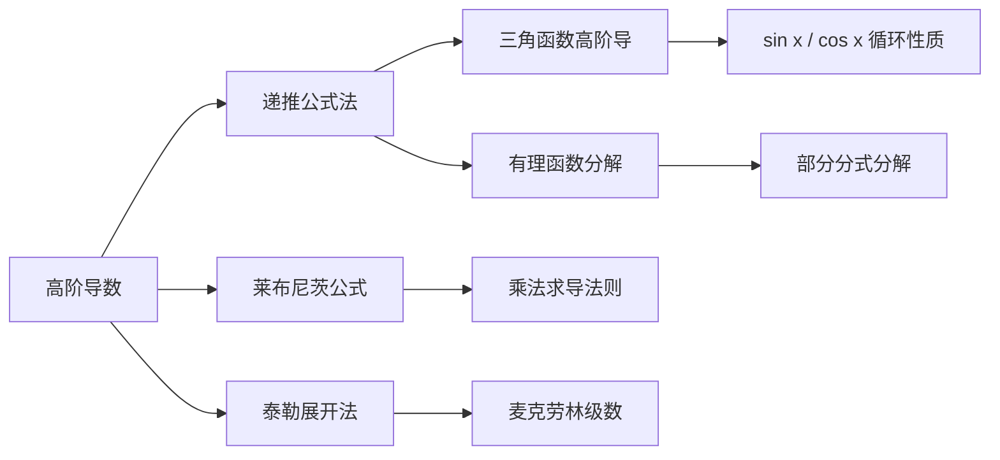

> 引用自 [[RAW-math-高数-P363-concept]]

# 高阶导数的递推公式法

# 高阶导数的递推公式法

## 1. 概念定义

**递推公式法**是求函数高阶导数的一种重要技巧，通过建立 $f^{(n)}(x)$ 与 $f^{(n-1)}(x)$ 等低阶导数之间的递推关系，利用数学归纳法或直接递推求出 $n$ 阶导数的通式。

> **核心思想**：利用函数结构特点（如乘法求导法则、除法求导法则），将高阶导数问题转化为递推关系。

## 2. 核心公式

### 2.1 幂函数的高阶导数

设 $f(x) = x^m$（$m$ 为正整数），则：

$$\boxed{f^{(n)}(x) = \frac{m!}{(m-n)!} \cdot x^{m-n} \quad (n \leq m)}$$

当 $n > m$ 时，$f^{(n)}(x) = 0$。

### 2.2 基本指数函数

$$(e^x)^{(n)} = e^x$$

$$(a^x)^{(n)} = a^x \cdot (\ln a)^n$$

### 2.3 正弦函数（递推型）

$$(\sin x)^{(n)} = \sin\left(x + \frac{n\pi}{2}\right)$$

$$(\cos x)^{(n)} = \cos\left(x + \frac{n\pi}{2}\right)$$

### 2.4 递推公式通式

对于形如 $f(x) = g(x) \cdot h(x)$ 的函数，利用莱布尼茨公式：

$$\boxed{(uv)^{(n)} = \sum_{k=0}^{n} \binom{n}{k} u^{(k)} v^{(n-k)}}$$

### 2.5 有理函数分解后的递推

对于 $f(x) = \frac{1}{x-a}$：

$$f^{(n)}(x) = \frac{(-1)^n \cdot n!}{(x-a)^{n+1}}$$

## 3. 典型例题

### 例题

设 $y = \dfrac{x}{(1-x)^2}$，求 $y^{(n)}$。

### 解

**第一步**：将函数改写

$$y = x \cdot (1-x)^{-2}$$

**第二步**：应用莱布尼茨公式

$$y^{(n)} = \sum_{k=0}^{n} \binom{n}{k} \frac{d^k x}{dx^k} \cdot \frac{d^{n-k}}{dx^{n-k}}(1-x)^{-2}$$

**第三步**：计算各项

- 当 $k=0$ 时：$x' = 1$，$(1-x)^{-2}$ 的 $n$ 阶导数为 $\dfrac{(-1)^n \cdot (n+1)!}{(1-x)^{n+2}}$
- 当 $k=1$ 时：$x' = 1$，$(1-x)^{-2}$ 的 $(n-1)$ 阶导数为 $\dfrac{(-1)^{n-1} \cdot n!}{(1-x)^{n+1}}$
- 当 $k \geq 2$ 时：$x^{(k)} = 0$

**第四步**：整理得

$$y^{(n)} = \frac{(-1)^n \cdot (n+1)!}{(1-x)^{n+2}} + \frac{(-1)^{n-1} \cdot n!}{(1-x)^{n+1}}$$

$$= \boxed{\frac{(-1)^n \cdot n!}{(1-x)^{n+2}} \left[(n+1) + (1-x)\right] = \frac{(-1)^n \cdot n! \cdot (n+2-x)}{(1-x)^{n+2}}}$$

**验证 $n=1$**：

$$y' = \frac{1+x}{(1-x)^3} \quad \checkmark$$

## 4. 常见错误

| 错误类型 | 错误示例 | 正确做法 |
|---------|---------|---------|
| 忽略递推中断条件 | 对 $x^m$ 直接套用 $n > m$ 时的公式 | 明确 $n \leq m$ 时公式才成立 |
| 莱布尼茨公式漏项 | 只计算前两项 | 需对所有 $k = 0, 1, \ldots, n$ 求和 |
| 符号错误 | $(\sin x)^{(n)} = \sin(x + n\pi)$ | 正确形式含 $\frac{\pi}{2}$ 相移：$\sin(x + \frac{n\pi}{2})$ |
| 阶乘系数混淆 | $(-2)^{n-1}n!$ 写成 $(-2)^n n!$ | 注意指数与阶乘的对应关系 |
| 分母幂次错误 | $(x-a)^{-1}$ 的 $n$ 阶导数写成 $\dfrac{(-1)^n}{(x-a)^n}$ | 正确为 $\dfrac{(-1)^n \cdot n!}{(x-a)^{n+1}}$ |

## 5. 关联知识点

### 相关知识点

1. **莱布尼茨公式**：乘积高阶导数的通式
2. **泰勒展开法**：从系数反推高阶导数（见第6讲）
3. **三角函数求导循环**：$\sin x \to \cos x \to -\sin x \to -\cos x \to \sin x$
4. **数学归纳法**：证明递推公式的通用手段

> **章节**：2026 张宇高数 18讲(OCR)  
> **难度**：★★☆☆☆  
> **第4讲 一元函数微分学的计算**