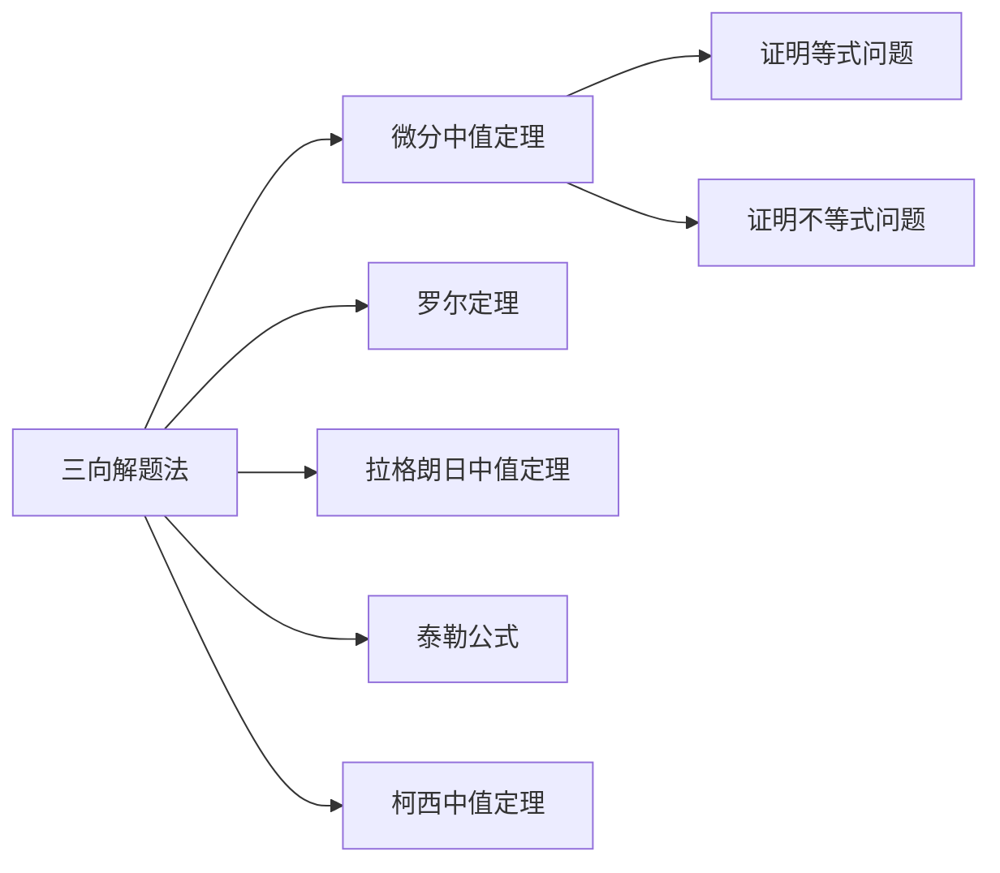

# 三向解题法

## 元数据

```
章节：2026 张宇高数 18讲(OCR)
难度：★★☆☆☆
知识点：三向解题法
内容：第6讲 · 二元函数微分学的应用(二)
```


## 1. 概念定义

**三向解题法**是处理微分中值定理证明题的核心方法论，其本质是**根据所给条件用"逆向"思维得出研究对象**。

该方法将解题思路分解为三个方向：

| 方向 | 符号 | 含义 |
| **盯住目标** | $O$ | 明确要证明的结论是什么 |
| **反向思路** | $P$ | 逆向思考，从结论反推条件 |
| **常规操作** | $D$ | 标准化解题步骤 |

> **核心思想**：点到为止，无须准备过度。


## 2. 核心公式

### 2.1 三向解题法框架

$$解题方向 = \begin{cases} O(\text{盯住目标}) \\ P(\text{反向思路}) \rightarrow P_1(\text{单向}) + P_2(\text{双向}) \\ D(\text{常规操作}) \rightarrow D_1(\text{标准操作}) + D_2(\text{化归经典形式}) \end{cases}$$

### 2.2 寻找原函数法

若要证明 $F'(x) = 0$，则：

$$\boxed{\text{找到原函数 } F(x) \Rightarrow F'(x) = 0 \Rightarrow \text{使用罗尔定理}}$$

### 2.3 泰勒公式（$n=1,2$）

$$f(x) = f(x_0) + f'(x_0)(x-x_0) + \frac{f''(\xi)}{2!}(x-x_0)^2$$


## 3. 典型例题

### 证明：$f'(x) = 0$ 在某区间内有根

> **题目**：设 $f(x)$ 在 $[a,b]$ 上连续，在 $(a,b)$ 内可导，且 $f(a) = f(b)$。证明：存在 $\xi \in (a,b)$，使得 $f'(\xi) = 0$。

**三向解题法分析：**

| 步骤 | 方向 | 操作 |
| ① | $O$ | **盯住目标**：证明 $f'(\xi) = 0$ |
| ② | $P$ | **反向思路**：$f'(\xi) = 0$ 说明 $\xi$ 是 $f(x)$ 的**极值点** |
| ③ | $D$ | **寻找原函数**：构造 $F(x) = f(x)$，直接使用条件 $f(a) = f(b)$ |

**证明：**

由 $f(a) = f(b)$，$f(x)$ 在 $[a,b]$ 上连续，在 $(a,b)$ 内可导。

由 **罗尔定理**：存在 $\xi \in (a,b)$，使得

$$f'(\xi) = 0 \quad \square$$


## 4. 常见错误

| 错误类型 | 错误示例 | 正确做法 |
| **① 方向迷失** | 盲目套用公式，不知从何下手 | 先用 $O$ 确定目标，再用 $P$ 反推 |
| **② 原函数构造错误** | 不知如何构造 $F(x)$ | 分析结论形式，若含 $f'$，考虑谁是原函数 |
| **③ 泰勒展开点选择不当** | 任意点展开 | 选择**题目给出的特殊点**或**中值点** |
| **④ 化归方向错误** | 不会将问题转化为经典形式 | 熟记常见证明模式（零点定理型、极值型等） |


## 5. 关联知识点



### 知识脉络

1. **罗尔定理** $\xrightarrow{\text{推广}}$ 拉格朗日中值定理 $\xrightarrow{\text{参数化}}$ 柯西中值定理
2. **泰勒公式** $\xrightarrow{\text{特例}}$ 麦克劳林公式 $\xrightarrow{n=1}$ 微分近似


## 参考文献

- 张宇，《2026 考研数学高等数学 18 讲》，第 6 讲
- 武忠祥，《考研数学复习全书》


> **学习提示**：三向解题法的精髓在于**目标导向 + 逆向思维**。建议先理解框架，再通过例题体会各方向的适用场景。