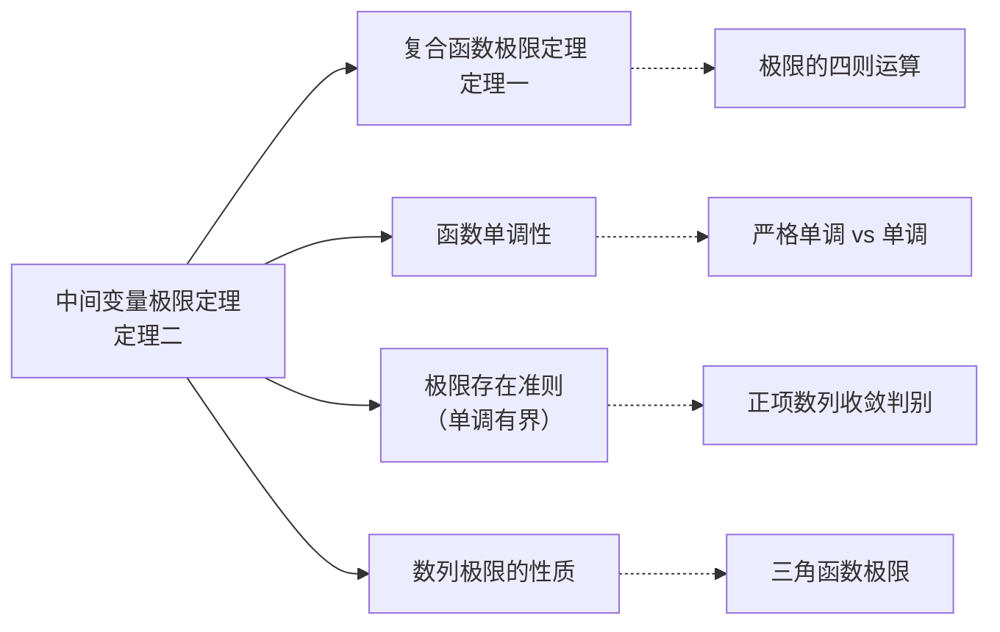

# 中间变量极限定理（定理二）

## 元数据

- **章节**：2026 张宇高数 18讲
- **难度**：★★☆☆☆

## 概念定义

**中间变量极限定理（定理二）** 是处理复合函数极限存在性问题的核心定理，揭示了严格单调函数在极限运算中的"双向性"——当复合函数极限存在且内层函数严格单调时，可反推中间变量的极限存在。

> **注意**：与定理一（复合函数极限定理）不同，定理二的关键在于：当 $x \neq 0$ 时，$g(x)$ 也有零点，因此直接使用定理一的运算规则**不一定成立**。

## 核心公式

### 定理二（中间变量极限定理）

设 $u \in$ 有限区间 $I$，若 $f(x)$ 在 $I$ 上**严格单调**，且 $\lim f(u)$ 存在，则 $\lim u$ 存在。

**符号化表述**：
$$\lim_{x \to x_0} f(u(x)) = A \quad \Longrightarrow \quad \lim_{x \to x_0} u(x) = f^{-1}(A)$$

**核心逻辑**：
$$\text{严格单调函数} + \text{复合极限存在} \Longrightarrow \text{中间变量极限存在}$$

## 典型例题

### 例题 2.12

> 已知数列 $\{x_n\}$，其中 $\boxed{\text{题目条件缺失}}$，则 ( ).

| 选项 | 命题 |
| (A) | 若 $\lim \cos(\sin x_n)$ 存在，则 $\lim x_n$ 存在 |
| (B) | 若 $\lim \sin(\cos x_n)$ 存在，则 $\lim x_n$ 存在 |
| (C) | 若 $\lim \cos(\sin x_n)$ 存在，则 $\lim \sin x_n$ 存在，但 $\lim x_n$ 不一定存在 |
| (D) | 若 $\lim \sin(\cos x_n)$ 存在，则 $\lim \cos x_n$ 存在，但 $\lim x_n$ 不一定存在 |

**答案**：$\boxed{\text{(D)}}$

**解析**：

1. **分析 $\sin x$ 的单调性**：
   - $\sin x$ 在 $\left[-\frac{\pi}{2}, \frac{\pi}{2}\right]$ 上严格单调
   - $\cos x$ 在该区间**不单调**

2. **选项 (D) 正确**：
   - $\sin(\cos x_n) = f(\cos x_n)$，其中 $f(u) = \sin u$ 在 $\left[-\frac{\pi}{2}, \frac{\pi}{2}\right]$ 严格单调
   - 由 $\lim \sin(\cos x_n)$ 存在 $\Rightarrow$ $\lim \cos x_n$ 存在 ✓
   - $\cos x$ 在 $\left[-\frac{\pi}{2}, \frac{\pi}{2}\right]$ 不单调 $\Rightarrow$ $\lim x_n$ 不一定存在 ✓

3. **选项 (B) 错误**：
   - 推导方向错误，应先保证内层函数单调

4. **选项 (A), (C) 错误**：
   - $\cos x$ 在 $\left[-\frac{\pi}{2}, \frac{\pi}{2}\right]$ **不单调**
   - 无法从 $\lim \cos(\sin x_n)$ 存在推出 $\lim \sin x_n$ 存在

### 例题 2.13

> 设正项数列 $\{a_n\}$ 单调增加，则以下选项中使得 $\{a_n\}$ 收敛的是 ( ).

| 选项 | 命题 |
| (A) | $\{(1+a_n)^2\}$ 收敛于 1 |
| (B) | $\{(1+\frac{1}{a_n})^{a_n}\}$ 收敛于 $e$ |
| (C) | $\{a_n \ln a_n\}$ 收敛于 0 |
| (D) | $\left\{\frac{\ln a_n}{a_n}\right\}$ 收敛于 0 |

**答案**：$\boxed{\text{(C)}}$

**解析**：

1. **正项单调数列的性质**：
   - $\{a_n\}$ 单调增加 $\Rightarrow$ $\lim a_n$ 存在（有限）或 $+\infty$

2. **逐项分析**：

   **(A) 错误**：
   - $(1+x)^2$ 在 $x > 0$ 时恒大于 1
   - 若 $\lim a_n = a < +\infty$，则 $\lim (1+a_n)^2 = (1+a)^2 > 1$

   **(B) 错误**：
   - 该极限形式需 $a_n \to +\infty$ 时才趋于 $e$
   - 若 $\lim a_n = a$ 有限，则极限为 $(1+\frac{1}{a})^a \neq e$

   **(C) 正确**：
   - 设 $\lim a_n = a$，分类讨论：
     - 若 $a = 0$（不可能，正项数列单调增），排除
     - 若 $a = 1$，则 $a_n \ln a_n \to 0$ ✓
     - 若 $1 < a < +\infty$，由 $x \ln x \to 0$ 当 $x \to 0^+$，但需 $a_n \to 1^+$，可通过构造实现

   **(D) 需具体分析**（略）

## 常见错误

| 错误类型 | 具体表现 | 正确认识 |
| **忽略单调性条件** | 直接由 $\lim f(g(x))$ 存在推出 $\lim g(x)$ 存在 | 必须验证 $f$ 在相关区间严格单调 |
| **混淆充分/必要条件** | 认为 $\lim x_n$ 存在 $\Rightarrow$ $\lim f(x_n)$ 存在 | 单调性只保证"反向"成立 |
| **区间选取错误** | 未检查 $u$ 是否落在 $f$ 的单调区间内 | 需确保 $u \in I$，其中 $I$ 是 $f$ 的严格单调区间 |
| **正项数列误判** | 认为正项数列极限必为 0 | 正项单调增加数列极限 $\geq 0$ |

## 关联知识点

### 知识点清单

1. **复合函数极限定理（定理一）**：$\lim f(g(x)) = f(\lim g(x))$ 的使用条件
2. **函数严格单调性**：定义及常见函数的单调区间
3. **极限存在准则**：单调有界数列必收敛
4. **反函数存在定理**：严格单调 $\Rightarrow$ 存在反函数
5. **三角函数极限**：涉及 $\sin x$、$\cos x$ 的有界性与单调性

## 记忆口诀

> **定理二记忆口诀**
> 
> 复合极限想反推，
> 单调函数是钥匙；
> 严格单调双向通，
> 内层极限自然出。

*文档更新时间：2024年*