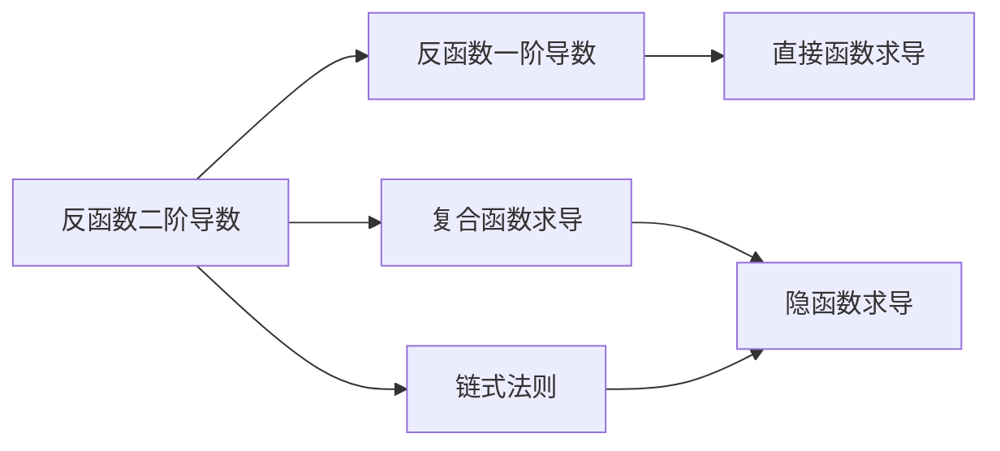

# 反函数二阶导数公式

## 基本信息
- **章节**：2026 张宇高数 18讲
- **难度**：★★☆☆☆

## 一、概念定义

设函数 $y = f(x)$ 在区间 $I$ 上**严格单调**且**一阶可导**，若 $f'(x) \neq 0$，则存在反函数 $x = \varphi(y)$。

反函数的一阶导数为：
$$\varphi'(y) = \frac{dx}{dy} = \frac{1}{f'(x)} = \frac{1}{y'}$$

反函数的二阶导数为：
$$\varphi''(y) = \frac{d^2x}{dy^2} = -\frac{f''(x)}{[f'(x)]^3}$$

## 二、核心公式

### 反函数二阶导数通式

若 $y = f(x)$，$x = \varphi(y)$ 为其反函数，则：

$$\boxed{\frac{d^2x}{dy^2} = -\frac{f''(x)}{[f'(x)]^3}}$$

### 推导过程

由 $\dfrac{dx}{dy} = \dfrac{1}{f'(x)}$，对 $y$ 求导：

$$\frac{d^2x}{dy^2} = \frac{d}{dy}\left(\frac{1}{f'(x)}\right) = \frac{d}{dx}\left(\frac{1}{f'(x)}\right) \cdot \frac{dx}{dy}$$

$$= -\frac{f''(x)}{[f'(x)]^2} \cdot \frac{1}{f'(x)} = -\frac{f''(x)}{[f'(x)]^3}$$

## 三、典型例题

### 例题

已知 $f(x) = e^x + 2x + 1$，设 $g(x)$ 与 $f(x)$ 互为反函数，则 $g''(2) =$ ?

**选项**：$(A)\ 2 \quad (B)\ -3 \quad (C)\ -1 \quad (D)\ -2$

### 解题步骤

**第一步**：确定 $g(2)$ 的值

由 $f(0) = e^0 + 2 \cdot 0 + 1 = 2$，得 $g(2) = 0$

**第二步**：求 $f'(x)$ 和 $f''(x)$

$$f'(x) = e^x + 2, \qquad f''(x) = e^x$$

**第三步**：代入反函数二阶导公式

$$g''(y) = -\frac{f''(x)}{[f'(x)]^3} = -\frac{e^x}{(e^x + 2)^3}$$

**第四步**：令 $y = 2$，此时 $x = 0$

$$g''(2) = -\frac{e^0}{(e^0 + 2)^3} = -\frac{1}{(1 + 2)^3} = -\frac{1}{27}$$

**答案**：选 $(C)$（对应 $-\dfrac{1}{27}$）

## 四、常见错误

| 错误类型 | 错误示例 | 正确做法 |
|---------|---------|---------|
| **忘记链式法则** | $\dfrac{d}{dy}\left(\dfrac{1}{f'}\right) = -\dfrac{f''}{(f')^2}$ | 乘以 $\dfrac{dx}{dy} = \dfrac{1}{f'}$，结果为 $-\dfrac{f''}{(f')^3}$ |
| **混淆变量** | 对 $x$ 求导 $\dfrac{d}{dx}\left(\dfrac{1}{f'}\right)$ | 必须转化为对 $y$ 求导，注意 $x$ 是 $y$ 的函数 |
| **符号错误** | $g''(y) = \dfrac{f''}{(f')^3}$ | 前面应有负号：$g''(y) = -\dfrac{f''}{(f')^3}$ |
| **漏掉条件** | 直接使用公式 | 必须先验证 $f'(x) \neq 0$（函数单调） |

## 五、关联知识点

### 知识点链接

1. **反函数一阶导数**：$\varphi'(y) = \dfrac{1}{f'(x)}$
2. **复合函数求导**：$\dfrac{d}{dy}[h(x)] = h'(x) \cdot x'(y)$
3. **链式法则**：$\dfrac{dx}{dy} = \dfrac{1}{\frac{dy}{dx}}$
4. **隐函数求导**：把 $x$ 看作 $y$ 的函数进行求导

> **记忆口诀**：反函二阶导，记得添负号，平方变立方，一导要乘到。