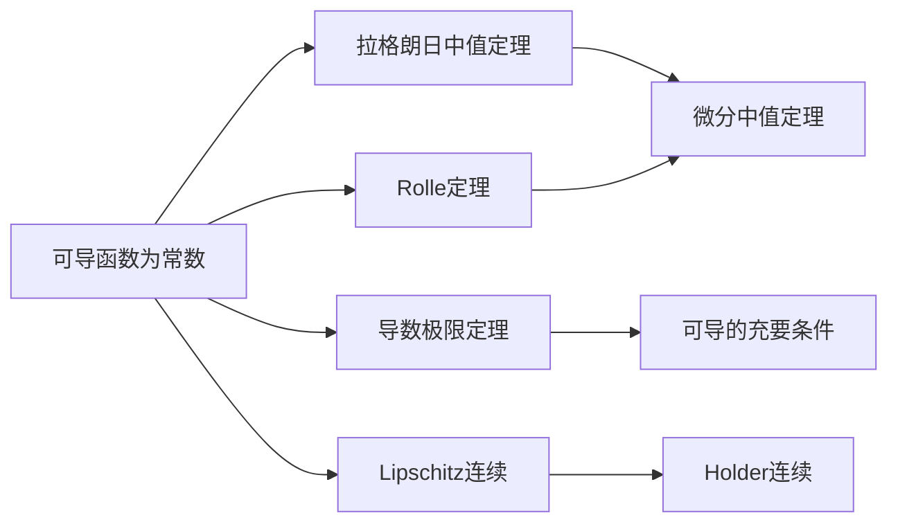

# 可导函数为常数的充要条件

**元数据**

- **章节**：2026 张宇高数 18讲 - 第六章 一元函数微分学的应用(二)——中值定理、微分等式与微分不等式
- **难度**：★★☆☆☆

## 1. 概念定义

### 可导函数为常数的充要条件

设函数 $f(x)$ 在区间 $(a,b)$ 内可导，则：

$$f(x) = C \quad (\text{常数}) \Longleftrightarrow f'(x) = 0 \quad (\forall x \in (a,b))$$

**核心思想**：利用导数研究函数的恒常性，将"函数恒为常数"的问题转化为"导数恒为零"的问题。

## 2. 核心公式

### 2.1 拉格朗日中值定理

> 设函数 $f(x)$ 满足：
> ① 在闭区间 $[a,b]$ 上连续；
> ② 在开区间 $(a,b)$ 内可导。
>
> 则存在 $\xi \in (a,b)$，使得：
>
> $$f'(\xi) = \frac{f(b) - f(a)}{b - a}$$

### 2.2 中值定理的等价形式

$$f(x) - f(a) = f'(\xi)(x - a), \quad \xi \in (a,x)$$

### 2.3 可导函数为常数的充要条件

$$\boxed{f(x) = C \iff f'(x) = 0}$$

## 3. 典型例题

### 例题 6.10（Lipschitz连续推常数）

**题目**：设函数 $f(x)$ 在区间 $[a,b]$ 上满足：对任意 $x,y \in [a,b]$，有

$$|f(x) - f(y)| \leq M|x - y|^\alpha$$

其中 $M > 0$，$\alpha > 1$ 是常数。证明：$f(x)$ 在 $[a,b]$ 上恒为常数。

**证明**：

对任意 $x_0 \in (a,b)$，由条件得

$$\left|\frac{f(x) - f(x_0)}{x - x_0}\right| \leq M|x - x_0|^{\alpha-1}$$

由于 $\alpha > 1$，故 $\alpha - 1 > 0$，于是

$$\lim_{x \to x_0} \left|\frac{f(x) - f(x_0)}{x - x_0}\right| \leq M \cdot \lim_{x \to x_0}|x - x_0|^{\alpha-1} = 0$$

即 $f'(x_0) = 0$。

由 $x_0$ 的任意性可知 $f'(x) = 0$（若 $x_0$ 在端点，则考虑单侧极限），故

$$f(x) = C, \quad x \in [a,b]$$

**证毕** $\square$

## 4. 常见错误

### ❌ 错误一：混淆可导与连续的条件

| 正确理解 | 常见错误 |
|---------|---------|
| 区间 $(a,b)$ 内 $f'(x) = 0$ 可推出 $f(x) = C$ | 认为 $f'(x_0) = 0$ 就能推出 $x_0$ 邻域内 $f(x)$ 为常数 |

### ❌ 错误二：忽略区间的开闭性

- 在开区间 $(a,b)$ 内 $f'(x) = 0$ 不能直接推出在 $[a,b]$ 上 $f(x)$ 为常数
- 需要额外的边界条件（如 $f(a)$ 或 $f(b)$ 的值）

### ❌ 错误三：例6.11中的错误推理

**错误做法**：认为 $\lim f'(x) = A > 0$ 能直接推出 $f(x) \to \infty$

**正确做法**：需要利用中值定理，将 $f(x)$ 与 $f'(x)$ 建立联系。

## 5. 关联知识点

### 知识网络

| 知识点 | 内容概要 |
|--------|----------|
| **Rolle定理** | $f(a) = f(b) \Rightarrow f'(\xi) = 0$ |
| **拉格朗日中值定理** | $f(b) - f(a) = f'(\xi)(b - a)$ |
| **柯西中值定理** | $\frac{f(b)-f(a)}{g(b)-g(a)} = \frac{f'(\xi)}{g'(\xi)}$ |
| **导数极限定理** | 导数存在 $\Leftrightarrow$ 导函数连续 |
| **Lipschitz连续** | $|f(x)-f(y)| \leq M|x-y|$ |

## 6. 补充说明

### 方法论总结

处理"可导函数恒为常数"问题的两种途径：

1. **直接法**：证明 $f'(x) = 0$（如例6.10）
2. **间接法**：利用拉格朗日中值定理的推论

$$\text{若 } f'(x) = 0, \forall x \in (a,b) \Rightarrow f(x) = f(a), \forall x \in [a,b]$$

**参考来源**：2026 张宇高数 18讲 第六章 例6.10-6.12