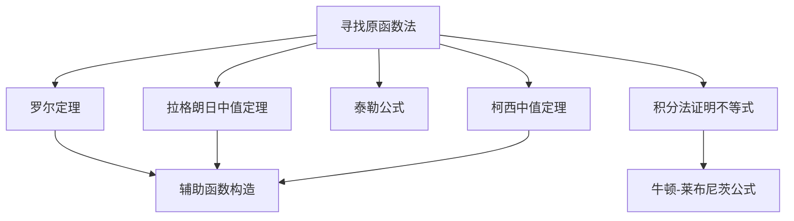

# 寻找原函数法

**章节**：2026 张宇高数 18讲(OCR)  
**难度**：★★☆☆☆  
**位置**：第6讲 · 二元函数微分学的应用(二) · 用微分中值定理作证明

## 一、概念定义

**寻找原函数法**是微分中值定理证明题中的一种**逆向思维方法**，其核心思想是：

> 根据欲证结论 $[F(x)]' = 0$，逆向寻找满足 $F'(x) = f(x)$ 的原函数 $F(x)$，从而将原问题转化为研究 $F(x)$ 的性态。

### 适用题型

| 目标形式 | 转化方向 |
|---------|---------|
| 证明 $f'(\xi) = 0$ | 寻找原函数 $F(x)$，使 $F'(\xi) = 0$ |
| 证明含 $f''(\xi)$ 的等式 | 寻找原函数 $F(x)$，使 $F''(\xi) = f''(\xi)$ |
| 证明 $f^{(n)}(\xi) = 0$ | 逐次积分，构造 $n$ 阶原函数 |

## 二、核心公式

### 1. 原函数构造基本形式

$$F(x) = f(x) \cdot g(x) - \int f'(x) \cdot g(x) \, dx$$

其中 $g(x)$ 为辅助函数。

### 2. 常见原函数模型

| 欲证形式 | 构造的原函数 $F(x)$ |
|---------|-------------------|
| $f'(\xi) = 0$ | $F(x) = f(x)$ |
| $f'(\xi) = f(\xi)$ | $F(x) = f(x) e^{-x}$，则 $F'(x) = e^{-x}[f'(x) - f(x)]$ |
| $f'(\xi) = k f(\xi)$ | $F(x) = f(x) e^{-kx}$ |
| $f(\xi) = \dfrac{1}{2}f''(\xi)$ | $F(x) = f(x) - \dfrac{1}{2}f''(x)$ |

### 3. 罗尔定理应用框架

$$\boxed{F'(x) = 0 \xrightarrow{\text{罗尔定理}} F(a) = F(b)}$$

## 三、典型例题

### 证明：若 $f(x)$ 在 $[0,1]$ 上连续，在 $(0,1)$ 内二阶可导，且 $f(0) = f(1) = 0$，$f\left(\frac{1}{2}\right) = 1$，则存在 $\xi \in (0,1)$ 使 $f''(\xi) = -4$。

**解析**：

**第一步：逆向思考，确定目标形式**

由待证 $f''(\xi) = -4$，联想到构造二阶原函数 $F(x)$，使其满足：
$$F''(x) = f''(x) + 4$$

**第二步：寻找原函数**

对常数 $4$ 求二阶原函数：
$$\iint 4 \, dx\,dx = 2x^2 + C_1 x + C_2$$

**第三步：构造辅助函数**

令 $F(x) = f(x) + 2x^2$，则 $F''(x) = f''(x) + 4$

则待证结论转化为：$\exists\, \xi \in (0,1)$，使 $F''(\xi) = 0$

**第四步：对 $F'(x)$ 应用罗尔定理**

- $F'(x) = f'(x) + 4x$
- $F'(0) = f'(0)$（未知）
- $F'(1) = f'(1) + 4$（未知）

需要找到 $F'(x)$ 的两个等值点，故对 $F(x)$ 应用两次拉格朗日中值定理：

取 $x_1 = \frac{1}{2}$，$x_2 = 1$：
$$F(1) - F\left(\frac{1}{2}\right) = F'(\eta_1) \cdot \frac{1}{2}, \quad \eta_1 \in \left(\frac{1}{2}, 1\right)$$

取 $x_3 = 0$，$x_4 = \frac{1}{2}$：
$$F\left(\frac{1}{2}\right) - F(0) = F'(\eta_2) \cdot \frac{1}{2}, \quad \eta_2 \in \left(0, \frac{1}{2}\right)$$

由条件 $F(0) = f(0) + 0 = 0$，$F(1) = f(1) + 2 = 2$，$F\left(\frac{1}{2}\right) = f\left(\frac{1}{2}\right) + \frac{1}{2} = \frac{3}{2}$：

$$F'(\eta_1) = 2\left[2 - \frac{3}{2}\right] = 1$$
$$F'(\eta_2) = 2\left[\frac{3}{2} - 0\right] = 3$$

**第五步：对 $F'(x)$ 在 $[\eta_2, \eta_1]$ 上应用罗尔定理**

$F'(\eta_2) = 3,\quad F'(\eta_1) = 1$，不满足 $F'(\eta_2) = F'(\eta_1)$，需调整构造。

**修正构造**：令 $G(x) = f(x) + 2x^2 - 3x$，则：
$$G''(x) = f''(x) + 4$$
$$G(0) = 0,\quad G(1) = f(1) + 2 - 3 = -1,\quad G\left(\frac{1}{2}\right) = 1 + \frac{1}{2} - \frac{3}{2} = 0$$

验证 $G(0) = G\left(\frac{1}{2}\right) = 0$，在 $[0, \frac{1}{2}]$ 上对 $G(x)$ 用罗尔定理：$\exists\, \eta \in (0, \frac{1}{2})$ 使 $G'(\eta) = 0$

再对 $G'(x)$ 在 $[\eta, \frac{1}{2}]$ 上用罗尔定理：$\exists\, \xi \in (\eta, \frac{1}{2}) \subset (0,1)$ 使 $G''(\xi) = 0$

即 $f''(\xi) + 4 = 0$，故 $f''(\xi) = -4$。$\square$

## 四、常见错误

| 错误类型 | 具体表现 | 正确做法 |
|---------|---------|---------|
| **原函数构造错误** | 直接令 $F(x) = f(x)$，忘记待证形式中还有常数项 | 分离待证结论中的非零项，对该项求原函数 |
| **忽略端点条件** | 构造 $F(x)$ 后未验证 $F(a) = F(b)$ | 先验证端点值或通过调整常数项使端点相等 |
| **导数计算错误** | 求 $F'(x)$ 时漏项或符号错误 | 严格按照求导法则逐项计算 |
| **罗尔定理条件不满足** | 未验证 $F(x)$ 的连续性或可导性 | 确认原函数在闭区间连续、开区间可导 |
| **阶数混淆** | 证明 $f''(\xi) = 0$ 时构造了一阶原函数 | 几阶导数就需要几阶原函数 |

## 五、关联知识点

### 知识脉络

1. **基础**：原函数与不定积分的概念
2. **核心**：罗尔定理（$F(a) = F(b) \Rightarrow F'(\xi) = 0$）
3. **进阶**：泰勒公式的余项研究
4. **综合**：与积分不等式、方程根的存在性结合

### 推荐阅读

- 拉格朗日中值定理的几何意义
- 泰勒公式在微分中值定理证明中的应用
- 辅助函数构造的常用技巧

> **方法论总结**：寻找原函数法的精髓在于"逆行"——从结论出发，倒推需要什么样的原函数，再验证该原函数满足罗尔定理的使用条件。训练时多做"双向翻译"：从 $F'(x)$ 到 $f(x)$（正向），从 $f(x)$ 到 $F(x)$（逆向）。