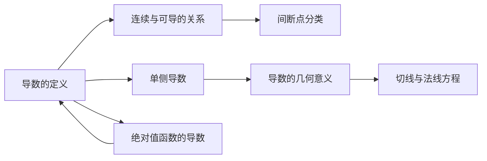

# 导数的定义

## 元数据

| 字段 | 内容 |
|------|------|
| 章节 | 2026 张宇高数 18讲(OCR) |
| 难度 | ★★☆☆☆ |

## 1. 概念定义

**导数**是描述函数在某一点处变化率的极限。设函数 $f(x)$ 在点 $x_0$ 的某邻域内有定义，若极限

$$\lim_{\Delta x \to 0} \frac{f(x_0 + \Delta x) - f(x_0)}{\Delta x}$$

**存在且唯一**，则称 $f(x)$ 在 $x_0$ 处**可导**，该极限值称为 $f(x)$ 在 $x_0$ 处的导数，记作 $f'(x_0)$。

> **关键点**：可导要求分子分母的变化速度满足一定条件——
> - 若分子变化速度比分母快，则导数趋于无穷
> - 若同阶变化，则导数为有限非零常数

## 2. 核心公式

### 基本定义式

$$f'(x_0) = \lim_{x \to x_0} \frac{f(x) - f(x_0)}{x - x_0} = \lim_{\Delta x \to 0} \frac{f(x_0 + \Delta x) - f(x_0)}{\Delta x}$$

### 常用等价形式

| 形式 | 表达式 |
|------|--------|
| 右导数 | $f'_+(x_0) = \lim_{x \to x_0^+} \frac{f(x) - f(x_0)}{x - x_0}$ |
| 左导数 | $f'_-(x_0) = \lim_{x \to x_0^-} \frac{f(x) - f(x_0)}{x - x_0}$ |
| 可导充要条件 | $f'_+(x_0) = f'_-(x_0)$ 存在 |

### 绝对值函数的可导性

$$|f(x)| \text{ 在 } x_0 \text{ 处可导} \iff f(x_0) \neq 0 \text{ 或 } f(x_0) = 0 \text{ 且 } f'(x_0) = 0$$

## 3. 典型例题

### 例题 3.3

> 设函数 $f(x)$ 连续，给出下列 4 个条件：
> 
> ① $\displaystyle\lim_{x \to 0} \frac{f(x)}{x}$ 存在  
> ② $\displaystyle\lim_{x \to 0} \frac{f(x) - f(0)}{x}$ 存在  
> ③ $\displaystyle\lim_{x \to 0} \frac{f(x)}{|x|}$ 存在  
> ④ $\displaystyle\lim_{x \to 0} \frac{f(x) - f(0)}{|x|}$ 存在  
> 
> 其中可得到 "$f(x)$ 在 $x = 0$ 处可导" 的条件个数为（ ）
> 
> (A) 1 (B) 2 (C) 3 (D) 4

### 【解】

**应选 (D)，即全部 4 个条件均可推出可导。**

**分析条件③：**

设 $\displaystyle\lim_{x \to 0} \frac{f(x)}{|x|} = a$，则：
- $x \to 0^+$ 时，$a \geq 0$
- $x \to 0^-$ 时，$a \leq 0$

故 $a = 0$，即 $\displaystyle\lim_{x \to 0} f(x) = 0$。

由于 $f(x)$ 连续，有 $f(0) = \lim_{x \to 0} f(x) = 0$。

由极限定义：对任意 $\varepsilon > 0$，存在 $x = 0$ 的某邻域，当 $x \neq 0$ 时：

$$\left|\frac{f(x) - f(0)}{|x|} - 0\right| < \varepsilon$$

即 $f(0) = 0$，且 $\displaystyle\lim_{x \to 0} \frac{f(x) - f(0)}{x}$ 存在。

**结论：** 条件①②③④均能推出 $f(x)$ 在 $x = 0$ 处可导，答案为 **(D) 4**。

## 4. 常见错误

| 错误类型 | 说明 | 正确理解 |
|----------|------|----------|
| **混淆连续与可导** | 认为连续必可导 | 连续是可导的必要条件，但不充分（如 $y = |x|$ 在 $x = 0$ 处连续但不可导） |
| **忽略绝对值的导数** | 忽略 $|f(x)|$ 在 $f(x_0) = 0$ 时的特殊情况 | 当 $f(x_0) \neq 0$ 时，$\|f(x)\|$ 与 $f(x)$ 在 $x_0$ 处可导性相同 |
| **正负号判断错误** | 在 $f(x_0) < 0$ 附近，认为 $f(x)$ 符号不确定 | 若 $f(x_0) < 0$ 且连续，则存在邻域使 $f(x) < 0$（考研常用技巧） |
| **极限存在误判** | 认为左右极限相等则导数存在 | 需满足分子变化速度不超过分母（分母趋于 0 的速度） |

### 重要结论

> **若 $f(x)$ 在 $x_0$ 处可导且 $f(x_0) \neq 0$，则 $|f(x)|$ 在 $x_0$ 处必可导。**

## 5. 关联知识点

### 相关知识点

1. **连续与可导的关系**  
   可导 $\Rightarrow$ 连续，但连续 $\nRightarrow$ 可导

2. **单侧导数**  
   $f'(x_0)$ 存在 $\iff f'_+(x_0) = f'_-(x_0)$

3. **绝对值函数的可导性判别**  
   - $f(x_0) \neq 0 \Rightarrow |f(x)|$ 与 $f(x)$ 可导性一致
   - $f(x_0) = 0$ 且 $f'(x_0) = 0 \Rightarrow |f(x)|$ 在 $x_0$ 处可导

4. **导数的几何意义**  
   $f'(x_0)$ 表示曲线 $y = f(x)$ 在点 $(x_0, f(x_0))$ 处切线的斜率

## 📚 参考文献

- 张宇，《2026 考研数学高等数学 18 讲》，第 3 讲：一元函数微分学的概念