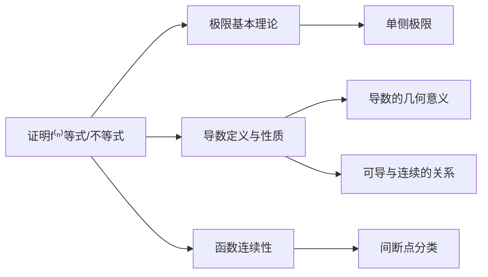

# 证明含 $f^{(n)}(x)$ 的等式或不等式在 $\xi$ 点成立

- **章节**：2026 张宇高数 18讲(OCR)
- **难度**：★★☆☆☆
- **标签**：极限 #导数 #函数性态 #连续性

## 1. 概念定义

证明含 $f^{(n)}(x)\ (n=1,2,\dots)$ 的等式或不等式在 $\xi$ 点成立的核心方法体系：

| 操作类型 | 符号 | 说明 |
|---------|------|------|
| 常规操作 | $D_1$ | 直接运用导数定义和基本性质 |
| 转换等价表述 | $D_2$ | 将待证命题转化为等价的数学表述 |
| 化归经典形式 | $D_3$ | 归约为已知的经典结论或标准形式 |

**研究函数局部性态的三问**：
1. **什么位置？** → 关注 $\xi$ 点的邻域
2. **什么条件？** → 题设给出的连续、可导条件
3. **什么工具？** → 极限、导数的定义与性质

## 2. 核心公式

### 基本关系

$$f \text{ 在 } x_0 \text{ 连续} \Longleftrightarrow \lim_{x \to x_0} f(x) = f(x_0)$$

### 导数存在与极限的关系

对于 $x \in (x_0, x_0 + \delta)$：

$$\text{若 } \lim_{x \to x_0^+} f(x) = A \text{ 且 } f \text{ 在 } (x_0, x_0+\delta) \text{ 可导，则 } f(x_0) = A$$

### 右导数定义

$$f_+'(x_0) = \lim_{\Delta x \to 0^+} \frac{f(x_0 + \Delta x) - f(x_0)}{\Delta x}$$

## 3. 典型例题

### 例6.9

> **题目**：已知函数 $f(x)$ 在 $[x_0, x_0+\delta)$ 上连续，在 $(x_0, x_0+\delta)$ 内可导，$\delta > 0$。证明：若 $\lim\limits_{x \to x_0^+} f(x) = A$，则 $f(x_0) = A$。

**证明思路**：由 $D_2$ 转换为**等价表述**，由 $D_3$ 化归为**经典形式**（连续性的定义）

$$\lim_{x \to x_0^+} f(x) = A \xlongequal{D_2} \lim_{x \to x_0^+} [f(x) - A] = 0 \xlongequal{D_3} g(x) = f(x) - A \text{ 在 } x_0 \text{ 处右连续}$$

设 $g(x) = f(x) - A$，则 $g(x)$ 在 $[x_0, x_0+\delta)$ 连续，且 $\lim\limits_{x \to x_0^+} g(x) = 0$。

由**连续性定义**：

$$g(x_0) = \lim_{x \to x_0^+} g(x) = 0$$

因此：

$$f(x_0) = g(x_0) + A = A \quad \blacksquare$$

## 4. 常见错误

| 错误类型 | 错误示例 | 正确认识 |
|---------|---------|---------|
| **混淆极限与导数** | 由 $\lim f'(x) = L$ 直接推出 $f'(x_0) = L$ | $\lim f'(x) \neq f'(x_0)$，导数极限与导数本身是不同概念 |
| **忽视定义域** | 讨论 $f'(0)$ 时未检查 $f(x)$ 在 $x=0$ 是否有定义 | 先明确定义域，再讨论可导性 |
| **跳跃使用条件** | 缺少"连续"条件就用极限值等于函数值 | 必须先建立 $\lim f(x) = f(x_0)$ 才可使用 |
| **$|x|$ 的误区** | 认为 $\lim |x| = |0| = 0$ 故 $f'(0)$ 存在 | $|x|$ 在 $0$ 处不可导，仅连续 |

## 5. 关联知识点

| 关联知识点 | 内容概要 |
|-----------|---------|
| **导数定义** | $f'(x_0) = \lim\limits_{\Delta x \to 0} \dfrac{f(x_0 + \Delta x) - f(x_0)}{\Delta x}$ |
| **连续与可导** | 可导 $\Rightarrow$ 连续，但连续 $\not\Rightarrow$ 可导 |
| **拉格朗日中值定理** | 化归经典形式的重要工具 |
| **洛必达法则** | 处理 $\dfrac{0}{0}$、$\dfrac{\infty}{\infty}$ 型极限 |

## 6. 练习巩固

> 讨论 $f(x) = x^3 \sin\dfrac{1}{x}\ (x \neq 0)$ 且 $f(0) = 0$ 时，$\lim\limits_{x \to 0} f'(x)$ 与 $f'(0)$ 的关系。

**答案**：

$$f'(0) = \lim_{x \to 0} \frac{x^3 \sin\frac{1}{x}}{x} = \lim_{x \to 0} x^2 \sin\frac{1}{x} = 0$$

$$f'(x) = 3x^2 \sin\frac{1}{x} - x\cos\frac{1}{x} \quad (x \neq 0)$$

$$\lim_{x \to 0} f'(x) \text{ 不存在（振荡）}$$

故 $\lim\limits_{x \to 0} f'(x) \neq f'(0)$，导函数极限与导数值可以不同。