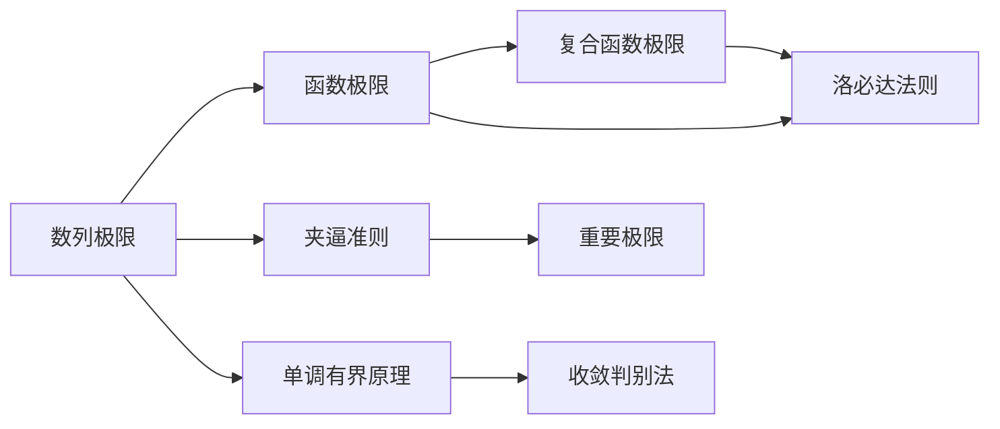

# 数列极限

## 基本信息

| 项目 | 内容 |
|------|------|
| 章节 | 2026 张宇高数 18讲 - 第2讲 数列极限 |
| 难度 | ★★☆☆☆ |
| 关键词 | 数列极限、收敛、正项数列 |

## 一、概念定义

### 数列极限

设 $\{a_n\}$ 为一个数列，若存在常数 $a$，对任意 $\varepsilon > 0$，总存在正整数 $N$，使得当 $n > N$ 时，恒有：

$$|a_n - a| < \varepsilon$$

则称数列 $\{a_n\}$ **收敛于** $a$，记作：

$$\lim_{n \to \infty} a_n = a$$

### 收敛数列的性质

- **唯一性**：收敛数列的极限值唯一
- **有界性**：收敛数列必有界
- **保号性**：若 $\lim a_n = a > 0$，则存在 $N$，当 $n > N$ 时 $a_n > 0$

## 二、核心公式

### 1. 数列极限定义

### 2. 复合函数极限定理（因变量极限定理）

设 $y = f[g(x)]$，其中 $u = g(x)$，$y = f(u)$。

**定理**：若 $\lim_{x \to x_0} g(x) = u_0$，且 $\lim_{u \to u_0} f(u) = a$，则：

$$\lim_{x \to x_0} f[g(x)] = a$$

**注意**：当 $f(u)$ 在 $u_0$ 处连续时，定理条件可简化为只需 $\lim g(x)$ 存在。

### 3. 常用等价关系

$$e = \lim_{n \to \infty}\left(1 + \frac{1}{n}\right)^n = \lim_{x \to \infty}\left(1 + \frac{1}{x}\right)^x$$

## 三、典型例题

### 例2.11（复合函数极限）

**题目**：设

$$g(x) = \begin{cases} x^2 - x, & x \text{ 为有理数} \\ 0, & x \text{ 为无理数} \end{cases}$$

$$f(u) = \begin{cases} 1, & u > 0 \\ 0, & u \leqslant 0 \end{cases}$$

则 $\lim_{x \to 0} f[g(x)]$ 的值为（  ）

$$\text{(A) 等于 0} \quad \text{(B) 等于 1} \quad \text{(C) 等于 } x \quad \text{(D) 不存在}$$

**解析**：

**第一步**：求内层极限
$$\lim_{x \to 0} g(x) = 0$$

**第二步**：分析外层函数
$$f(u) = \begin{cases} 1, & u > 0 \\ 0, & u \leqslant 0 \end{cases}$$

且 $\lim_{u \to 0^+} f(u) = 1$，$\lim_{u \to 0^-} f(u) = 0$

**第三步**：分析 $f[g(x)]$

- 当 $x$ 为有理数且 $x \neq 0$ 时：$g(x) = x^2 - x = x(x-1)$
  - $x \in (0,1)$ 时，$g(x) < 0 \Rightarrow f[g(x)] = 0$
  - $x < 0$ 时，$g(x) > 0 \Rightarrow f[g(x)] = 1$

- 当 $x$ 为无理数或 $x = 0$ 时：$g(x) = 0 \Rightarrow f[g(x)] = 0$

**第四步**：取极限路径

取 $x_n = \frac{1}{n+1}$（有理数，$n$ 足够大时 $x_n \in (0,1)$）：
$$\lim_{n \to \infty} f[g(x_n)] = 0$$

取 $y_n = -\frac{1}{n}$（有理数，$y_n < 0$）：
$$\lim_{n \to \infty} f[g(y_n)] = 1$$

两条路径极限不同，故极限不存在。

**答案**：$\boxed{\text{(D) 不存在}}$

## 四、常见错误

| 错误类型 | 错误示例 | 正确理解 |
|----------|----------|----------|
| **忽略连续性条件** | 直接套用复合函数极限定理，未验证 $f$ 的连续性 | 使用定理前需确认 $f(u)$ 在 $u_0$ 处连续 |
| **混淆有界与收敛** | 认为"有界数列必收敛" | 有界只是收敛的必要条件，非充分条件 |
| **忽略左右极限** | 忽略 $u \to u_0$ 时的方向性 | 需注意 $u_0^+$ 和 $u_0^-$ 两侧的极限 |
| **路径选择不当** | 只取一种特殊路径就判断极限存在 | 需验证**所有**可能路径的极限均相同 |

## 五、关联知识点

### 推荐关联阅读

1. **函数极限** - 极限概念的延展
2. **夹逼准则** - 处理复杂数列极限的重要工具
3. **单调有界原理** - 判断数列收敛的常用方法
4. **两个重要极限** - $\lim_{x \to 0}\frac{\sin x}{x} = 1$ 和 $\lim_{x \to \infty}(1+\frac{1}{x})^x = e$
5. **无穷小量比较** - 高阶、低阶、同阶、等价无穷小

## 六、补充说明

### 例2.10 相关结论

当正项数列 $\{a_n\}$ 收敛于 $0$，且满足 $\frac{a_{n+1}}{a_n} \to 1$ 时，可结合如下公式：

$$\lim_{n \to \infty} \sqrt[n]{a_n} = \lim_{n \to \infty} \frac{a_{n+1}}{a_n}$$

此为求解某些特殊数列极限的重要工具。