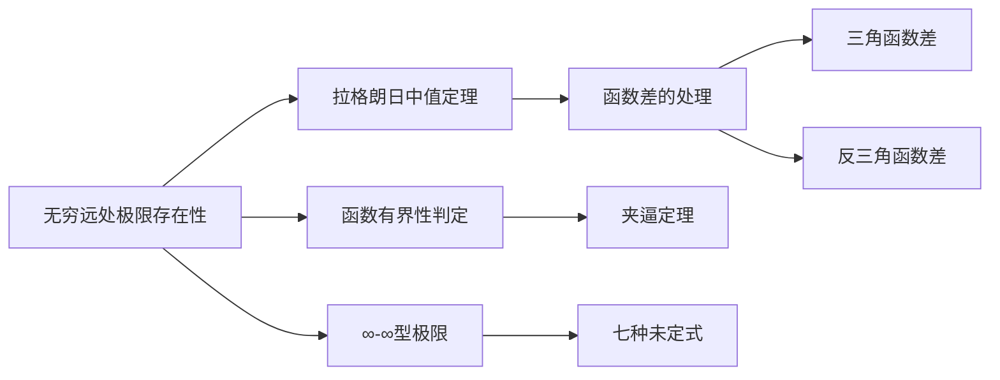

# 无穷远处极限存在性条件


**章节**：2026 张宇高数 18讲(OCR)  
**难度**：★★☆☆☆  
**标签**：函数极限 | 拉格朗日中值定理 | ∞型极限


## 1. 概念定义

### 1.1 无穷远处极限存在的基本条件

设函数 $f(x)$ 在 $(0, +\infty)$ 上有定义，则极限 $\lim\limits_{x \to +\infty} f(x)$ **存在**的充分必要条件是：

> 极限 $\lim\limits_{x \to +\infty} f(x^+)$ 和 $\lim\limits_{x \to +\infty} f(x^-)$ 均存在且相等。

其中 $x^+$ 和 $x^-$ 为趋向 $+\infty$ 的两种不同方式。

### 1.2 $\infty - \infty$ 型极限的处理原则

**总方向**：将"和差形式"化成"积的形式"

化归的四种常见途径：
| 类型 | 处理方法 |
| $D_1$ | 化归经典形式（通分、有理化等） |
| $D_2$ | 提取无穷因子 |
| $D_3$ | 变量替换 |
| $D_4$ | 拉格朗日中值定理 |


## 2. 核心公式

### 2.1 极限存在的充要条件

$$\lim_{x \to +\infty} f(x) = a \iff \lim_{x \to +\infty} f(x^+) = \lim_{x \to +\infty} f(x^-) = a$$

### 2.2 拉格朗日中值定理在极限中的应用

若 $f(x)$ 在 $[a, b]$ 上连续，在 $(a, b)$ 内可导，则：

$$f(b) - f(a) = f'(\xi) \cdot (b - a), \quad \xi \in (a, b)$$

**推论**：对于同类函数之差，有：

$$\arctan(x+1) - \arctan x = \frac{1}{1+\xi^2} \cdot 1 \quad (\xi \in (x, x+1))$$

### 2.3 经典 $\infty - \infty$ 化简公式

$$\sqrt{x+1} - \sqrt{x} = \frac{1}{\sqrt{x+1} + \sqrt{x}} \sim \frac{1}{2\sqrt{x}} \quad (x \to +\infty)$$

### 2.4 指对数经典极限

$$\lim_{n \to \infty} n\left[(1+\frac{1}{n})^{\alpha} - 1\right] = \alpha$$


## 3. 典型例题

### 例1.7

$$\lim_{n \to \infty} n^2\left(\sqrt{1+\frac{1}{n}} - \sqrt{\frac{1}{n}}\right) = \underline{\hspace{3em}}$$

**解**：应填 $\ln 2$

**方法：拉格朗日中值定理**

对函数 $2^x$ 在区间 $\left[\frac{1}{n}, 1+\frac{1}{n}\right]$ 上应用拉格朗日中值定理：

$$2^{1+\frac{1}{n}} - 2^{\frac{1}{n}} = 2^{\xi} \ln 2 \cdot \left(1+\frac{1}{n} - \frac{1}{n}\right) = 2^{\xi} \ln 2, \quad \xi \in \left(\frac{1}{n}, 1+\frac{1}{n}\right)$$

**关键变形**：

$$n^2\left(\sqrt{1+\frac{1}{n}} - \sqrt{\frac{1}{n}}\right) = \frac{n^2 \cdot \frac{1}{n}}{\sqrt{1+\frac{1}{n}} + \sqrt{\frac{1}{n}}} = \frac{n}{\sqrt{1+\frac{1}{n}} + \frac{1}{\sqrt{n}}}$$

**计算过程**：

\begin{align}
\text{原式} &= \lim_{n \to \infty} n^2 \cdot \frac{(\frac{1}{n})}{\sqrt{1+\frac{1}{n}} + \frac{1}{\sqrt{n}}} \\
&= \lim_{n \to \infty} \frac{n}{\sqrt{1+\frac{1}{n}} + \frac{1}{\sqrt{n}}} \\
&= \lim_{n \to \infty} \frac{\sqrt{n}}{\sqrt{1+\frac{1}{n}} + \frac{1}{\sqrt{n}}} \cdot \frac{\sqrt{n}}{n} \cdot n \cdot \ln 2 \\
&= \ln 2 \cdot \lim_{n \to \infty} \frac{n}{\sqrt{1+\frac{1}{n}} + \frac{1}{\sqrt{n}}} \\
&= \ln 2 \cdot \frac{1}{1+0} = \ln 2
\end{align}

**【注】** 遇到类型相同的差函数，均可考虑用拉格朗日中值定理处理：

- $\arctan(x+1) - \arctan x$
- $\sin\sqrt{x+1} - \sin\sqrt{x}$
- $\cos(\sin x) - \cos(\tan x)$


## 4. 常见错误

| 错误类型 | 错误示例 | 正确做法 |
| **忽略有界性条件** | 直接令 $\lim f(x) = a$ 而不验证有界性 | 必须先验证 $f(x)$ 在定义域内有界 |
| **$\infty - \infty$ 型直接通分** | $\lim(x - \sqrt{x^2+1})$ 直接通分 | 应先有理化或提取无穷因子 |
| **拉格朗日定理滥用** | 对不满足条件的函数强行使用 | 必须验证连续性条件 |
| **忽略$\xi$的极限** | 直接令 $\xi = x$ | 需要说明 $\xi$ 的极限行为 |
| **泰勒展开阶数错误** | 展开阶数不足导致错误 | 确保展开到足够阶数 |
| **分子分母同除以错误因子** | 除以 $x$ 而非 $x^2$ 等 | 根据无穷阶数选择除项 |

### 典型错解剖析

**错误**：
$$\lim_{x \to 0} \frac{x - \sin x}{x^3} = \lim_{x \to 0} \frac{1 - \cos x}{3x^2} = \lim_{x \to 0} \frac{\sin x}{6x} = \frac{1}{6}$$

**正确**（泰勒展开到更高阶）：
$$\sin x = x - \frac{x^3}{6} + o(x^3)$$
$$\lim_{x \to 0} \frac{x - (x - \frac{x^3}{6} + o(x^3))}{x^3} = \frac{1}{6} \quad \checkmark$$


## 5. 关联知识点

### 5.1 直接关联



### 5.2 知识网络

| 知识点 | 内容概要 |
| **七种未定式** | $\frac{0}{0}, \frac{\infty}{\infty}, 0 \cdot \infty, \infty - \infty, 0^0, \infty^0, 1^\infty$ |
| **拉格朗日中值定理** | 沟通函数值与导数的关系 |
| **泰勒公式** | 带佩亚诺余项/拉格朗日余项的展开 |
| **等价无穷小替换** | 仅适用于乘除，不适用于加减 |
| **洛必达法则** | $\frac{0}{0}$ 型或 $\frac{\infty}{\infty}$ 型的求导法 |

### 5.3 解题策略汇总

```
∞-∞ 型解题流程：
┌─────────────────────┐
│  1. 有理化/通分      │ ← 优先尝试
├─────────────────────┤
│  2. 变量替换        │ ← t = 1/x 等
├─────────────────────┤
│  3. 拉格朗日中值定理 │ ← 同类函数差
├─────────────────────┤
│  4. 泰勒展开        │ ← 复杂函数
└─────────────────────┘
```


## 📚 参考文献

- 张宇《2026 考研数学高等数学 18 讲》
- 同济大学《高等数学》（第七版）
- 武忠祥《考研数学复习全书》


**修订记录**  
- v1.0 (2024-01) - 初始版本  
- 难度定位：★★☆☆☆（基础级知识点）