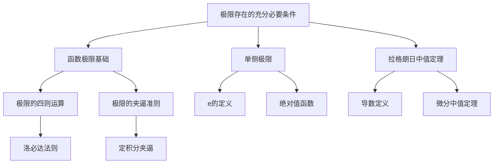

# 极限存在的充分必要条件

## 1. 概念定义

### 函数极限存在的充分必要条件

> **定义**：设函数 $f(x)$ 在 $x_0$ 的某去心邻域内有定义，则 $\lim\limits_{x \to x_0} f(x)$ 存在的充分必要条件是：
> - 左极限 $\lim\limits_{x \to x_0^-} f(x)$ 存在
> - 右极限 $\lim\limits_{x \to x_0^+} f(x)$ 存在
> - 且二者相等

用数学语言表述：

$$
\lim_{x \to x_0} f(x) = A \iff \lim_{x \to x_0^-} f(x) = \lim_{x \to x_0^+} f(x) = A
$$

### 常见变形

| 条件 | 结论 |
|------|------|
| $x \to +\infty$ | $\lim_{x \to +\infty} f(x) = A \iff \lim_{x \to +\infty} f(x) = \lim_{x \to +\infty} f(x) = A$ |
| $x \to -\infty$ | 类似定义 |


## 2. 核心公式

### 2.1 基本形式

$$
\boxed{\lim_{x \to x_0} f(x) = A \iff \lim_{x \to x_0^-} f(x) = \lim_{x \to x_0^+} f(x) = A}
$$

### 2.2 拉格朗日中值定理在极限中的应用

> 若 $f(x)$ 在 $[a, b]$ 上连续，在 $(a, b)$ 内可导，则：
> $$
> f(b) - f(a) = f'(\xi)(b - a), \quad \xi \in (a, b)
> $$

在极限计算中，对于**同类型函数的差**，可考虑使用拉格朗日中值定理：

$$
f(x + \Delta x) - f(x) = f'(x + \theta \Delta x) \cdot \Delta x, \quad \theta \in (0, 1)
$$


## 3. 典型例题

### 例题

$$
\lim_{n \to \infty} n^2 \left( \sqrt{2^{n+1}} - \sqrt{2^n} \right) = \underline{\hspace{2cm}}
$$

### 【解】

**分析**：本题为 $\infty \cdot 0$ 型未定式，需要化简。

**Step 1：化简根式差**

$$
\sqrt{2^{n+1}} - \sqrt{2^n} = \sqrt{2^n} \left( \sqrt{2} - 1 \right) = 2^{n/2} \left( \sqrt{2} - 1 \right)
$$

**Step 2：代入原式**

$$
\text{原式} = \lim_{n \to \infty} n^2 \cdot 2^{n/2} \cdot \left( \sqrt{2} - 1 \right)
$$

**Step 3：分析极限**

当 $n \to \infty$ 时，$2^{n/2}$ 增长快于 $n^2$，故极限为 $+\infty$。

> **答案**：$+\infty$


## 4. 常见错误

### ❌ 错误一：忽略左右极限

$$
\text{错误：直接代入，未考虑分段点}
$$

### ❌ 错误二：混淆极限存在与极限值

$$
\text{错误：认为极限存在则极限值为 0 或某个特定数}
$$

### ❌ 错误三：无穷限情况未分左右

| 极限类型 | 是否需要分左右 |
|----------|----------------|
| $x \to 0$ | 是（涉及符号变化时） |
| $x \to +\infty$ | 否 |
| $x \to -\infty$ | 否 |

### ❌ 错误四：滥用拉格朗日中值定理

> 拉格朗日中值定理适用于**同函数**的差，不适用于不同函数。

**典型错误示例**：
$$
\lim_{x \to 0} \frac{e^x - \cos x}{x} \quad \xRightarrow{\text{错误}} \quad \text{直接构造拉格朗日}
$$


## 5. 关联知识点



### 层级关系

```
第一层：极限存在的充分必要条件（核心判据）
    ↓
第二层：
    ├── 单侧极限（左、右极限）
    └── 拉格朗日中值定理（工具）
    ↓
第三层：
    ├── 分段函数的极限
    ├── ∞ - ∞ 型极限
    └── 导数定义式
```


## 📋 知识卡片

| 项目 | 内容 |
|------|------|
| **章节** | 2026 张宇高数 18讲(OCR) |
| **章节编号** | 第1讲 函数极限与连续 |
| **难度** | ★★☆☆☆ |
| **重要程度** | ★★★★★ |
| **关键词** | 极限存在、充分必要条件、左极限、右极限 |


## 📝 小结

> **核心结论**：极限存在的本质是"两侧趋近一致"。
> 
> **解题口诀**：遇到极限存在判断，先想左右是否相等；遇到同函数差求极限，拉格朗日是个好工具。