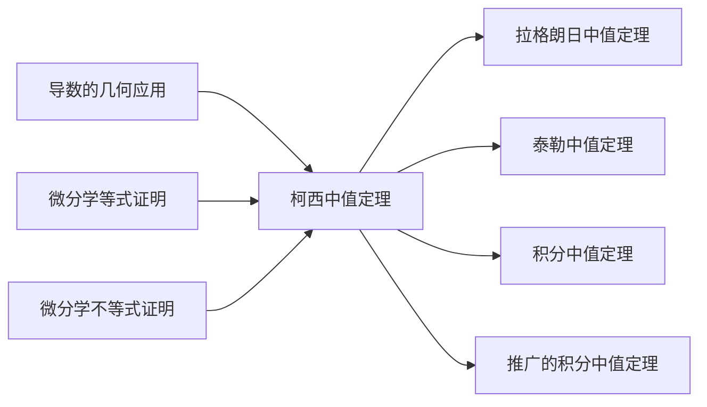

# 柯西中值定理的转换等价表述


**元数据**

| 字段 | 内容 |
|------|------|
| 章节 | 2026 张宇高数 18讲(OCR) |
| 难度 | ★★☆☆☆ |
| 标签 | 中值定理、微分中值定理、柯西中值定理 |


## 1. 概念定义

**柯西中值定理**是拉格朗日中值定理的推广形式，其核心思想是通过**变量替换**将待证等式转化为柯西中值定理的标准形式。

> **核心技巧**：欲证等式可变形为 $\frac{g(b)-g(a)}{f(b)-f(a)}$ 或 $\frac{f(\xi)}{g(\xi)}$ 的形式，考虑使用柯西中值定理。

**转换等价表述**是指：根据待证结论的结构，灵活选取两个函数 $f(x)$ 和 $g(x)$，将原问题化为柯西中值定理的标准形式。


## 2. 核心公式

### 2.1 柯西中值定理标准形式

$$
\boxed{\frac{f(b)-f(a)}{g(b)-g(a)} = \frac{f'(\xi)}{g'(\xi)}, \quad \xi \in (a, b)}
$$

其中 $f(x)$ 和 $g(x)$ 在 $[a, b]$ 上连续，在 $(a, b)$ 内可导，且 $g'(x) \neq 0$。

### 2.2 推广的积分中值定理

$$
\frac{1}{b-a}\int_a^b f(x)\,dx = f(\xi), \quad \xi \in (a, b)
$$

可写为：

$$
\int_a^b f(x)\,dx = f(\xi)(b-a), \quad \xi \in (a, b)
$$


## 3. 典型例题

### 例6.14

**题目**：设 $f(x)$ 在 $[a, b]$ 上连续，且 $f(x) > 0$，证明存在 $\xi \in (a, b)$，使得

$$\frac{1}{b-a}\int_a^b f(t)\,dt = \frac{\xi^2}{f(\xi)} \cdot \frac{f(\xi) - f(a)}{\xi - a}$$

**证明**：

**第一步：选择辅助函数**

令
$$h(x) = x^2, \quad g(x) = \int_a^x f(t)\,dt$$

**第二步：应用柯西中值定理**

在 $[a, b]$ 上应用柯西中值定理，存在 $\xi \in (a, b)$，使得

$$\frac{h(b) - h(a)}{g(b) - g(a)} = \frac{h'(\xi)}{g'(\xi)}$$

即

$$\frac{b^2 - a^2}{\int_a^b f(t)\,dt} = \frac{2\xi}{f(\xi)}$$

**第三步：变形整理**

$$\frac{(b-a)(b+a)f(\xi)}{2\xi} = \int_a^b f(t)\,dt$$

利用拉格朗日中值定理：存在 $\eta \in (a, \xi)$，使得

$$f(\xi) - f(a) = f'(\eta)(\xi - a)$$

将此关系代入并整理，即可得证。 $\blacksquare$


## 4. 常见错误

| 错误类型 | 具体表现 | 正确做法 |
|----------|----------|----------|
| **忽略条件** | 直接套用柯西中值定理，未验证 $g'(x) \neq 0$ | 确认 $g'(x)$ 在区间内非零 |
| **函数选取不当** | 选取的 $f(x)$ 和 $g(x)$ 无法导出目标形式 | 观察待证等式结构，逆推所需函数 |
| **积分处理错误** | 将 $\int_a^b f(x)\,dx$ 直接写成 $f(b) - f(a)$ | 注意区分积分与导数的基本关系 |
| **漏用连续性** | 未利用 $f(x) > 0$ 或 $f(a) = 0$ 等条件 | 挖掘题目隐含条件 |
| **混淆定理形式** | 将拉格朗日中值定理与柯西中值定理混淆 | 明确：拉格朗日处理单函数，柯西处理双函数之比 |


## 5. 关联知识点



| 关联知识点 | 说明 |
|------------|------|
| **拉格朗日中值定理** | 柯西中值定理的特例（取 $g(x) = x$） |
| **积分中值定理** | 沟通积分与函数值的桥梁 |
| **泰勒中值定理** | 高阶导数的中值定理推广 |
| **罗尔定理** | 柯西中值定理的几何基础 |
| **导数计算法则** | 复合函数、隐函数求导是应用前提 |


## 6. 解题策略总结

```
┌─────────────────────────────────────────────────────┐
│              柯西中值定理应用流程                    │
├─────────────────────────────────────────────────────┤
│  1. 观察待证等式结构                                │
│     ↓                                               │
│  2. 将等式变形为比值形式 g(b)-g(a) / f(b)-f(a)      │
│     ↓                                               │
│  3. 选择两个函数 g(x), f(x)                         │
│     ↓                                               │
│  4. 验证定理条件（连续、可导、g'(x)≠0）             │
│     ↓                                               │
│  5. 应用公式，代入题目条件                          │
│     ↓                                               │
│  6. 反推或化简得到目标结论                          │
└─────────────────────────────────────────────────────┘
```


**参考章节**：第6讲 一元函数微分学的应用(二)——中值定理、微分等式与微分不等式