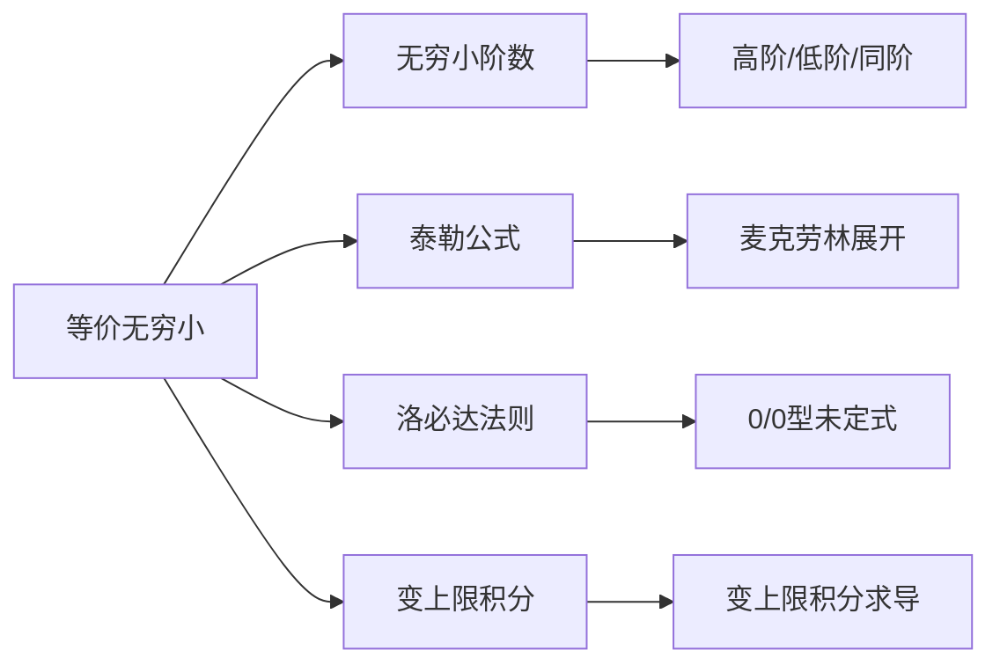

# 等价无穷小的定义

## 基础信息

| 属性 | 内容 |
|------|------|
| 章节 | 2026 张宇高数 18讲 - 第1讲 函数极限与连续 |
| 难度 | ★★☆☆☆ |

## 1. 概念定义

**等价无穷小**是同阶无穷小的特殊情形。

> 若当 $x \to x_0$（或 $x \to \infty$）时，两个无穷小量 $\alpha(x)$ 和 $\beta(x)$ 满足：
> $$\lim_{x \to x_0} \frac{\alpha(x)}{\beta(x)} = 1$$
> 则称 $\alpha(x)$ 与 $\beta(x)$ 为**等价无穷小**，记作 $\alpha(x) \sim \beta(x)$。

**核心思想**：两个无穷小量之比的极限为 1，说明它们趋向于 0 的"速度"相同。

## 2. 核心公式

### 2.1 基本等价无穷小（当 $x \to 0$ 时）

$$\boxed{\begin{aligned}
&\sin x \sim x \\
&\tan x \sim x \\
&\arcsin x \sim x \\
&\arctan x \sim x \\
&e^x - 1 \sim x \\
&\ln(1+x) \sim x \\
&a^x - 1 \sim x \ln a \quad (a > 0, a \neq 1) \\
&(1+x)^\alpha - 1 \sim \alpha x \quad (\alpha \in \mathbb{R}) \\
&1 - \cos x \sim \frac{x^2}{2} \\
&x - \sin x \sim \frac{x^3}{6} \\
&\tan x - x \sim \frac{x^3}{3} \\
&\arcsin x - x \sim \frac{x^3}{6} \\
&x - \arctan x \sim \frac{x^3}{3}
\end{aligned}}$$

### 2.2 变上限积分型

#### 类型一：$f(x) \sim ax^m$（$a \neq 0$，$m > 0$ 为正整数）

$$\boxed{\int_0^x f(t)\,dt \sim \frac{a}{m+1}x^{m+1}}$$

> **注**：若 $m$ 为正实数，则要求 $x \to 0^+$，命题依然成立。

#### 类型二：$\lim f(x) = A \neq 0$，$\lim h(x) = 0$

若 $\displaystyle \lim_{x \to 0} \frac{f(x)}{h(x)} = A \neq 0$，则：

$$\boxed{\int_0^x f(t)\,dt \sim A \cdot x}$$

### 2.3 复合函数与变上限积分

若 $f(x) \sim ax^m$，$g(x) \sim bx^n$（$a,b \neq 0$，$m,n$ 为正整数），则：

$$\boxed{\int_0^{g(x)} f(t)\,dt \sim \frac{a}{m+1} \cdot b^{m+1} \cdot x^{n(m+1)}}$$

## 3. 典型例题

### 例题

**题目**：当 $x \to 0$ 时，求 $\displaystyle \frac{\int_0^x \sin(t^2)\,dt}{x^3}$ 的极限。

**解析**：

1. **分析被积函数**：当 $x \to 0$ 时，$\sin(t^2) \sim t^2$（因为 $t^2 \to 0$）

2. **应用变上限积分型公式**：
   $$\int_0^x \sin(t^2)\,dt \sim \int_0^x t^2\,dt = \frac{x^3}{3}$$

3. **求极限**：
   $$\lim_{x \to 0} \frac{\int_0^x \sin(t^2)\,dt}{x^3} = \lim_{x \to 0} \frac{\frac{x^3}{3}}{x^3} = \frac{1}{3}$$

**答案**：$\dfrac{1}{3}$

## 4. 常见错误

| 错误类型 | 错误示例 | 正确理解 |
|----------|----------|----------|
| **滥用等价替换** | $\sin x \sim x$，直接令 $x = \frac{\pi}{2}$ | 等价无穷小只在 **趋于 0** 时使用 |
| **分子分母分别替换** | $\frac{\sin x - x}{x^3}$ 中，$\sin x \sim x$，得 $\frac{0}{x^3}$ | 必须整体考虑，此处需用更高阶展开 |
| **忽略条件** | 对 $x \to \infty$ 使用 $e^x - 1 \sim x$ | 基本等价公式要求 $x \to 0$ |
| **阶数判断错误** | 认为 $\int_0^x \sin t\,dt \sim x$ | $\int_0^x \sin t\,dt = 1 - \cos x \sim \frac{x^2}{2}$ |
| **变上限积分公式张冠李戴** | 对 $\int_0^x e^{t^2}\,dt$ 使用 $\int_0^x f(t)\,dt \sim Ax$ | 需确定 $f(0)$ 是否存在且非零 |

## 5. 关联知识点

### 推荐学习路径

1. **前置知识** → [无穷小的概念与性质](../第一章/01_无穷小的概念.md)
2. **延伸内容** → [泰勒公式展开](../第三章/03_泰勒公式.md)
3. **应用场景** → [求极限的综合方法](../第二章/02_洛必达与等价替换.md)

## 📚 参考资料

- 张宇《高等数学 18讲》（2026版）第1讲
- 同济大学《高等数学》第七版 第一章

> **记忆口诀**：等价替换很简单，趋零才能直接换；加减切莫单独用，乘除整体才安全。