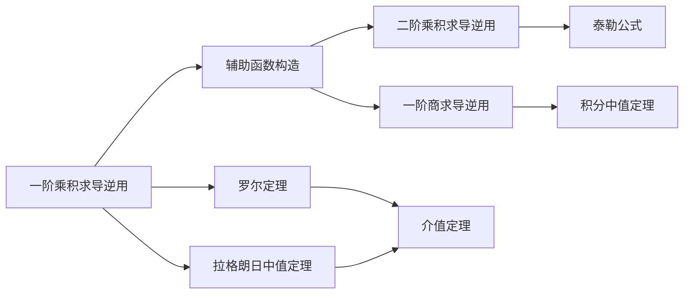

> 引用自 [[RAW-math-高数-P034-concept]]

# 一阶乘积求导法则的逆用

# 一阶乘积求导法则的逆用

## 基本信息

| 属性 | 内容 |
|:---|:---|
| 章节 | 2026 张宇高数 18讲(OCR) |
| 难度 | ★★☆☆☆ |
| 标签 | 高数 · 求导法则 · 中值定理 · 辅助函数构造 |

## 1. 概念定义

**一阶乘积求导法则的逆用**是指通过分析目标结论的形式，逆向构造乘积函数 $F(x) = f(x) \cdot g(x)$，使得其导数恰好包含目标表达式中的项。

> **核心思想**：将复杂的导数关系化归为经典求导形式，通过构造辅助函数应用中值定理。

### 适用场景

- 证明存在 $\xi \in (a,b)$ 使得某等式成立
- 已知 $f(0) = f(1)$ 等端点条件，需构造 $F(a) = F(b)$
- 目标结论呈现 $f'(\xi) + P(\xi) \cdot f(\xi) = 0$ 形式

## 2. 核心公式

### 基本形式

$$
(uv)' = u'v + uv'
$$

### 逆用模式速查表

| 目标导数形式 | 构造辅助函数 | 推导结果 |
| $f'(x) + f(x)$ | $F(x) = f(x)e^x$ | $F'(x) = e^x[f'(x) + f(x)]$ |
| $f'(x) + nf(x)$ | $F(x) = f(x)e^{nx}$ | $F'(x) = e^{nx}[f'(x) + nf(x)]$ |
| $f'(x) + x^{n-1}f(x)$ | $F(x) = f(x)e^{x^n}$ | $F'(x) = e^{x^n}[f'(x) + nx^{n-1}f(x)]$ |
| $f'(x) + f(x)\varphi'(x)$ | $F(x) = f(x)e^{\varphi(x)}$ | $F'(x) = e^{\varphi(x)}[f'(x) + f(x)\varphi'(x)]$ |
| $f'(x) + f^2(x)$ | $F(x) = f(x)e^{\int f(x)dx}$ | $F'(x) = e^{\int f(x)dx}[f'(x) + f^2(x)]$ |
| $f'(x)g(x) + f(x)g'(x)$ | $F(x) = f(x)g(x)$ | $F'(x) = f'(x)g(x) + f(x)g'(x)$ |
| $f'(x)\sin x + f(x)\cos x$ | $F(x) = f(x)\sin x$ | $F'(x) = f'(x)\sin x + f(x)\cos x$ |
| $f'(x)\arctan x + \dfrac{f(x)}{1+x^2}$ | $F(x) = f(x)\arctan x$ | $F'(x) = f'(x)\arctan x + \dfrac{f(x)}{1+x^2}$ |

## 3. 典型例题

### 例 6.1（罗尔定理应用）

**题目**  
设函数 $f(x)$ 在 $[0,1]$ 上连续，在 $(0,1)$ 内可导，且满足：

$$f(0) = f(1), \quad \int_0^1 f(x)\,dx = 0$$

证明：存在 $\xi \in (0,1)$，使得

$$f'(\xi) + f^2(\xi) = 0$$

**证明思路分析**

观察目标结论 $f'(\xi) + f^2(\xi) = 0$，我们需要构造辅助函数 $F(x)$ 使得 $F'(x)$ 包含此项。

注意到：

$$F'(x) = f(x)e^{\int f(x)dx} \cdot [f'(x) + f^2(x)]$$

因此取 $F(x) = f(x) \cdot e^{\int_0^x f(t)\,dt}$，则：

$$F'(x) = e^{\int_0^x f(t)\,dt} \cdot [f'(x) + f^2(x)]$$

**完整证明**

**第一步**：构造辅助函数

令
$$F(x) = f(x) \cdot e^{\int_0^x f(t)\,dt}$$

**第二步**：验证端点条件

由于 $\int_0^1 f(x)\,dx = 0$，有：
$$F(0) = f(0) \cdot e^0 = f(0)$$
$$F(1) = f(1) \cdot e^{\int_0^1 f(t)\,dt} = f(1) \cdot e^0 = f(1)$$

又已知 $f(0) = f(1)$，故 $F(0) = F(1)$。

**第三步**：求导并应用罗尔定理

$$F'(x) = e^{\int_0^x f(t)\,dt} \cdot [f'(x) + f(x) \cdot f(x)] = e^{\int_0^x f(t)\,dt} \cdot [f'(x) + f^2(x)]$$

由罗尔定理，存在 $\xi \in (0,1)$，使得 $F'(\xi) = 0$，即：

$$e^{\int_0^\xi f(t)\,dt} \cdot [f'(\xi) + f^2(\xi)] = 0$$

由于指数函数恒正，得：

$$f'(\xi) + f^2(\xi) = 0$$

**证毕** $\square$

## 4. 常见错误

| 错误类型 | 错误示例 | 正确做法 |
| **指数函数构造错误** | 看到 $f' + f$ 就写 $F = fe^{x^2}$ | 应为 $F = fe^x$，因为 $(fe^x)' = e^x(f' + f)$ |
| **漏乘指数因子** | 只令 $F(x) = f(x)$，但 $F'(x) \neq 0$ | 检查 $F'$ 是否真的包含目标项 |
| **忘记验证条件** | 直接用罗尔定理，未验证 $F(0) = F(1)$ | 必须先利用已知条件化简 |
| **混淆公式形式** | 对 $f' + x^{n-1}f$ 用 $e^{nx}$ | 应用 $e^{x^n}$，因为 $(e^{x^n})' = nx^{n-1}e^{x^n}$ |
| **忘记指数非零** | 认为 $e^{\int f} = 0$ | 指数函数恒正，提取时注意 |

## 5. 关联知识点

### 知识点索引

| 序号 | 关联内容 | 关联说明 |
| 1 | **二阶乘积求导法则逆用** | $(uv)'' = u''v + 2u'v' + uv''$，用于更高阶导数问题 |
| 2 | **一阶商求导法则逆用** | $\left(\dfrac{u}{v}\right)' = \dfrac{u'v - uv'}{v^2}$ |
| 3 | **罗尔定理** | 核心工具：$F(a) = F(b) \Rightarrow F'(\xi) = 0$ |
| 4 | **拉格朗日中值定理** | 变形：$F(b) - F(a) = F'(\xi)(b-a)$ |
| 5 | **柯西中值定理** | 参数方程形式的中值定理 |

## 6. 总结口诀

> **逆用先看目标式，指数函数来配匹**
> **$f' + f$ 用 $e^x$，$f' + nf$ 用 $e^{nx}$**
> **罗尔定理三步走：构造→验证→求导**

*最后更新：2024*