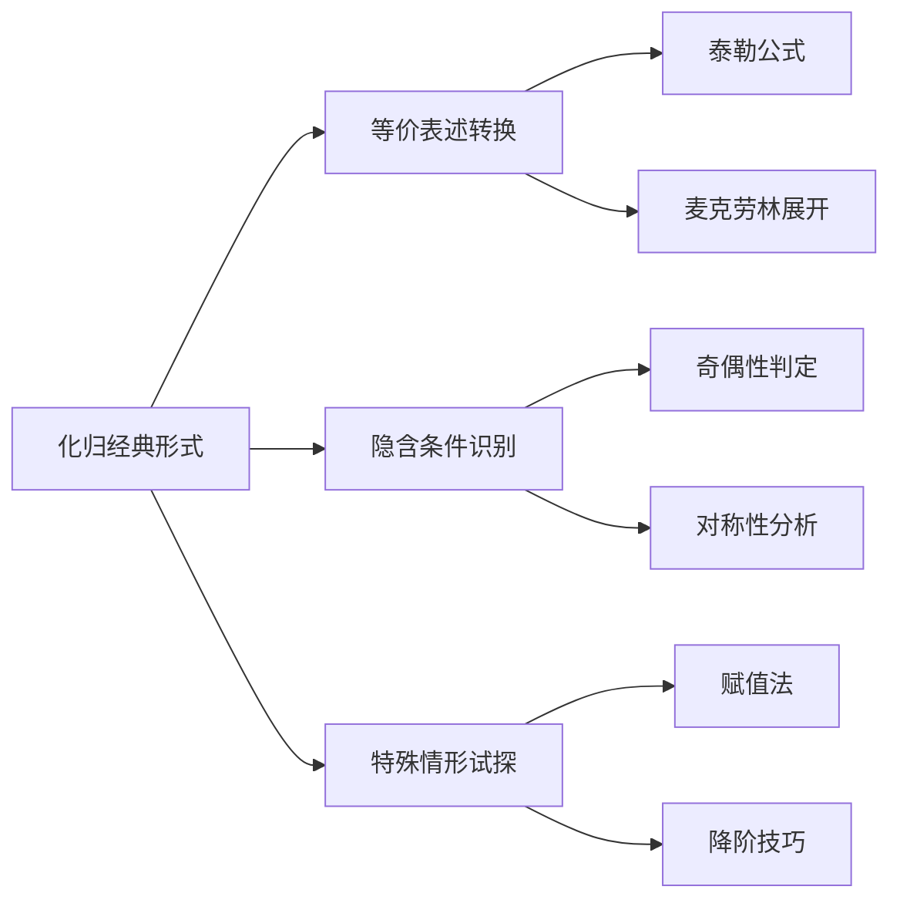

> 引用自 [[RAW-math-高数-P071-concept]]

# 化归经典形式逆运算还原

# 化归经典形式，逆运算还原

## 1. 概念定义

**化归经典形式**是一种重要的解题策略，指将陌生、复杂的数学式子通过**逆运算**逐步还原为经典公式、经典定理或经典结论的形式，从而将复杂问题转化为已知的经典问题。

> 核心思想：把"被子"一层层掀开，让熟悉的经典形式浮出水面。

## 2. 核心公式

### 2.1 逆运算还原的通用框架

对于任意复杂表达式 $f(x)$：

$$
f(x) \xrightarrow{\text{逆运算}_1} f_1(x) \xrightarrow{\text{逆运算}_2} f_2(x) \xrightarrow{\cdots} \text{经典形式} \quad \checkmark
$$

### 2.2 常见逆运算操作

| 操作类型 | 逆运算 | 还原目标 |
|---------|--------|---------|
| 求导 | 积分 | 基本积分公式 |
| 幂函数 | 对数 | 对数运算公式 |
| 复合函数 | 换元 | 常见函数形式 |
| 高次 | 因式分解 | 降次处理 |

### 2.3 经典形式识别标志

**经典公式类：**
- $e^x$ 系列：$\int e^x dx = e^x + C$
- 三角函数系列：$\sin^2 x + \cos^2 x = 1$
- 常用不等式：$a^2 + b^2 \geq 2ab$

**经典定理类：**
- 罗尔定理、拉格朗日中值定理
- 泰勒展开式
- 牛顿-莱布尼茨公式

## 3. 典型例题

### 例题：求极限

**题目：** 计算 $\lim\limits_{x \to 0} \frac{e^x - 1 - x}{x^2}$

**解题步骤：**

**第一步：识别形式**
观察分子 $e^x - 1 - x$，看似复杂，但实际上是 $e^x$ 的**泰勒展开**的前几项！

**第二步：逆运算还原（化归经典形式）**

$$
e^x = 1 + x + \frac{x^2}{2!} + o(x^2)
$$

所以：

$$
e^x - 1 - x = \frac{x^2}{2!} + o(x^2)
$$

**第三步：代回原式**

$$
\lim_{x \to 0} \frac{e^x - 1 - x}{x^2} = \lim_{x \to 0} \frac{\frac{x^2}{2} + o(x^2)}{x^2} = \frac{1}{2}
$$

**核心要点：** 将 $e^x$ 的展开式"掀开被子"，露出经典泰勒形式，问题瞬间解决。

## 4. 常见错误

### ❌ 错误一：跳过化归步骤

| 错误做法 | 正确做法 |
|---------|---------|
| 直接洛必达 | 先尝试化归为经典形式 |
| 盲目求导三次 | 一次或两次逆运算通常足够 |

### ❌ 错误二：化归方向错误

**例：** 对于 $\ln(1+x)$，错误的化归是：

$$
\ln(1+x) \neq e^x - 1 \quad \text{（这不是等价形式）}
$$

**正确化归：**

$$
\ln(1+x) = \int_0^x \frac{1}{1+t} dt \quad \text{（积分还原）}
$$

### ❌ 错误三：忽视隐含信息

**例：** 看到 $\frac{1}{x+1} - \frac{1}{x}$，应立即识别为：

$$
\frac{1}{x+1} - \frac{1}{x} = -\frac{1}{x(x+1)} \quad \text{（经典部分分式形式）}
$$

## 5. 关联知识点

### 配套知识点

| 知识点 | 说明 |
|-------|------|
| **等价表述转换** | 同一考点的不同说法 |
| **隐含条件识别** | 奇偶性、定义域等隐藏信息 |
| **特殊情形试探** | 取简单值验证思路 |
| **泰勒公式** | 最重要的经典形式之一 |
| **基本积分表** | 积分化归的终点 |

## 6. 方法论总结

> **化归三部曲：**
> 1. 👀 **看**：观察研究对象的特征
> 2. 🔄 **翻**：通过逆运算掀开"被子"
> 3. ✅ **认**：识别经典形式，利用已知结论

**练习建议：** 遇到复杂题目时，先问自己：
- 这像哪个经典形式？
- 需要做什么逆运算？
- 能一步还原还是需要多步？

**元数据：**
- 章节：2026 张宇高数 18讲(OCR)
- 难度：★★☆☆☆