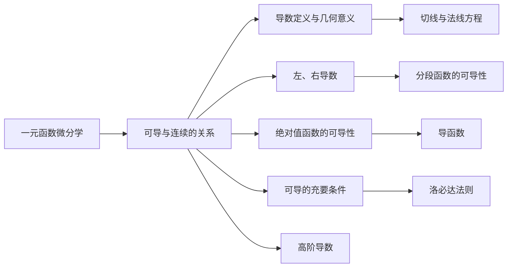

> 引用自 [[RAW-math-高数-P086-concept]]

# 可导与连续的关系

# 可导与连续的关系


**章节**：2026 张宇高数 18讲(OCR)  
**难度**：★★☆☆☆  
**标签**：微分学基础 | 连续与可导


## 1. 概念定义

### 连续

> 函数 $f(x)$ 在点 $x_0$ 处连续，当且仅当 $\displaystyle\lim_{x \to x_0} f(x) = f(x_0)$

### 可导

> 函数 $f(x)$ 在点 $x_0$ 处**可导**，当且仅当导数定义式存在且唯一：
> $$f'(x_0) = \lim_{\Delta x \to 0} \frac{f(x_0 + \Delta x) - f(x_0)}{\Delta x}$$
> 即左、右导数均存在且相等

### 核心关系

$$\boxed{\text{可导} \Rightarrow \text{连续} \quad \text{（可导是连续的充分条件）}}$$

> **连续是可导的必要条件，但非充分条件。**
> 
> 可导要求函数不仅"相依相偎"（连续），而且变化速度（导数）必须存在且唯一。


## 2. 核心公式

### 2.1 可导的等价定义

$$f'(x_0) = \lim_{x \to x_0} \frac{f(x) - f(x_0)}{x - x_0}$$

### 2.2 左、右导数

$$f'_-(x_0) = \lim_{x \to x_0^-} \frac{f(x) - f(x_0)}{x - x_0}, \quad f'_+(x_0) = \lim_{x \to x_0^+} \frac{f(x) - f(x_0)}{x - x_0}$$

**可导的充要条件**：
$$f'(x_0) \text{ 存在} \iff f'_-(x_0) = f'_+(x_0)$$

### 2.3 绝对值函数的可导性判定

| 条件 | 结论 |
|------|------|
| $f(x)$ 在 $x_0$ 可导，$f(x_0) \neq 0$ | $|f(x)|$ 在 $x_0$ **必可导** |
| $f(x)$ 在 $x_0$ 可导，$f(x_0) = 0$，$f'(x_0) \neq 0$ | $|f(x)|$ 在 $x_0$ **不可导** |
| $f(x)$ 在 $x_0$ 可导，$f(x_0) = 0$，$f'(x_0) = 0$ | $|f(x)|$ 在 $x_0$ **可能可导** |

### 2.4 常用结论

> 若 $f(x)$ 在 $x_0$ 连续，且 $f(x_0) < 0$，则存在 $x_0$ 的某邻域，使得 $f(x) < 0$ 对该邻域内所有 $x$ 成立。


## 3. 典型例题

### 例 3.3（来源：2026 张宇高数18讲）

**题目**  
设函数 $f(x)$ 连续，给出下列4个条件：

① $\displaystyle\lim_{x \to 0} \frac{f(x)}{x}$ 存在；  
② $\displaystyle\lim_{x \to 0} \frac{f(x) - f(0)}{x}$ 存在；  
③ $\displaystyle\lim_{x \to 0} f(x) \cdot \frac{x}{f(x)}$ 存在；  
④ $\displaystyle\lim_{x \to 0} \frac{f(x) - f(-x)}{x}$ 存在。

其中可得到 "$f(x)$ 在 $x=0$ 处可导" 的条件个数为（  ）。

**(A) 1    (B) 2    (C) 3    (D) 4**


**解答**

**应选 (D)，即4个条件均可以推出可导。**

**逐一分析：**


**条件①** $\displaystyle\lim_{x \to 0} \frac{f(x)}{x}$ 存在

记 $\displaystyle\lim_{x \to 0} \frac{f(x)}{x} = a$

由 $f(x)$ 连续，$\displaystyle\lim_{x \to 0} f(x) = f(0)$，而
$$\lim_{x \to 0} f(x) = \lim_{x \to 0} \frac{f(x)}{x} \cdot x = a \cdot 0 = 0$$
故 $f(0) = 0$。

由极限定义，对任意 $\varepsilon > 0$，存在 $\delta > 0$，当 $0 < |x| < \delta$ 时：
$$\left|\frac{f(x)}{x} - a\right| < \varepsilon$$
即
$$\left|\frac{f(x) - ax}{x}\right| < \varepsilon$$
得 $|f(x) - ax| < \varepsilon |x|$。

令 $x \to 0$，由夹逼定理得 $f(0) = 0$，且
$$f'(0) = \lim_{x \to 0} \frac{f(x) - f(0)}{x} = \lim_{x \to 0} \frac{f(x)}{x} = a \quad \checkmark$$


**条件②** $\displaystyle\lim_{x \to 0} \frac{f(x) - f(0)}{x}$ 存在

此式即为 $f'(0)$ 的定义，故显然可导。 $\checkmark$


**条件③** $\displaystyle\lim_{x \to 0} f(x) \cdot \frac{x}{f(x)}$ 存在

记该极限为 $L$。

**分析**：由于 $f(x)$ 连续，$f(0) = \lim_{x \to 0} f(x)$。

当 $f(0) \neq 0$ 时，$f(x) \cdot \frac{x}{f(x)} = x \to 0$，故 $L = 0$。

当 $f(0) = 0$ 时，设 $\lim_{x \to 0} f(x) = 0$，则
$$f(x) \cdot \frac{x}{f(x)} = \frac{x}{\frac{f(x)}{x}}$$

若 $\lim_{x \to 0} \frac{f(x)}{x}$ 存在且非零，则该极限存在。

**关键步骤**：由极限存在可得 $f(0) = 0$，且
$$\lim_{x \to 0} \frac{f(x)}{x} = \lim_{x \to 0} \frac{1}{\frac{x}{f(x)}} = \frac{1}{L}$$
（$L \neq 0$ 时；若 $L = 0$，则 $\lim_{x \to 0} \frac{f(x)}{x} = \infty$，矛盾）

故 $f'(0) = \lim_{x \to 0} \frac{f(x)}{x}$ 存在。 $\checkmark$


**条件④** $\displaystyle\lim_{x \to 0} \frac{f(x) - f(-x)}{x}$ 存在

该极限可变形为：
$$\lim_{x \to 0} \frac{f(x) - f(0)}{x} + \lim_{x \to 0} \frac{f(0) - f(-x)}{x}$$

令 $u = -x$，则第二项：
$$\lim_{x \to 0} \frac{f(0) - f(-x)}{x} = \lim_{u \to 0} \frac{f(u) - f(0)}{u}$$

故原极限 $= f'_+(0) + f'_-(0) = f'(0) + f'(0) = 2f'(0)$

由极限存在可得 $2f'(0)$ 存在，故 $f'(0)$ 存在。 $\checkmark$


**结论**：4个条件均可推出 $f(x)$ 在 $x=0$ 处可导，选 **(D) 4**。


## 4. 常见错误

| 错误类型 | 典型表现 | 正确理解 |
|----------|----------|----------|
| ❌ 混淆充分与必要 | 认为"连续 ⟺ 可导" | 连续是可导的**必要条件**，而非充分条件 |
| ❌ 绝对值可导误判 | 认为 $\|f(x)\|$ 总与 $f(x)$ 可导性相同 | 仅当 $f(x_0) \neq 0$ 时可导性一致 |
| ❌ 忽略 $f'(x_0) \neq 0$ 的情况 | 认为 $f(x_0) = 0$ 时 $\|f(x)\|$ 一定不可导 | 若 $f(x_0) = 0$ 且 $f'(x_0) = 0$，则可能可导（如 $f(x) = x^2$） |
| ❌ 左、右导数混淆 | 计算导数时忘记检验左、右极限是否相等 | 可导必须左右导数存在且相等 |
| ❌ 极限存在误用 | 由 $\lim f(x)g(x)$ 存在直接推断 $\lim f(x)$ 存在 | 需要独立分析每个因子的极限 |


## 5. 关联知识点



### 纵向关联

| 前置知识 | → | 本节 | → | 后续知识 |
|----------|---|------|---|----------|
| 函数极限 | → | 可导与连续的关系 | → | 导数计算法则 |
| 函数连续 | → | 可导与连续的关系 | → | 微分中值定理 |
| 左、右极限 | → | 可导与连续的关系 | → | 导数的应用 |


## 6. 思维导图

```
可导与连续的关系
├── 一、连续 ⇒ 可导（必要条件）
│   ├── 连续：lim f(x) = f(x₀)
│   └── 可导：lim [f(x)-f(x₀)]/(x-x₀) 存在
│
├── 二、可导的判定
│   ├── 左导数 f'_-(x₀) 存在
│   ├── 右导数 f'_+(x₀) 存在
│   └── f'_-(x₀) = f'_+(x₀)
│
├── 三、绝对值函数 |f(x)| 的可导性
│   ├── f(x₀) ≠ 0 ⟹ 可导性相同
│   ├── f(x₀) = 0, f'(x₀) ≠ 0 ⟹ 不可导
│   └── f(x₀) = 0, f'(x₀) = 0 ⟹ 需单独判断
│
└── 四、常用结论
    ├── f 连续且 f(x₀) < 0 ⟹ 邻域内 f(x) < 0
    └── f 连续且 f(x₀) > 0 ⟹ 邻域内 f(x) > 0
```


**参考文献**：2026 张宇高等数学18讲·第3讲 一元函数微分学的概念