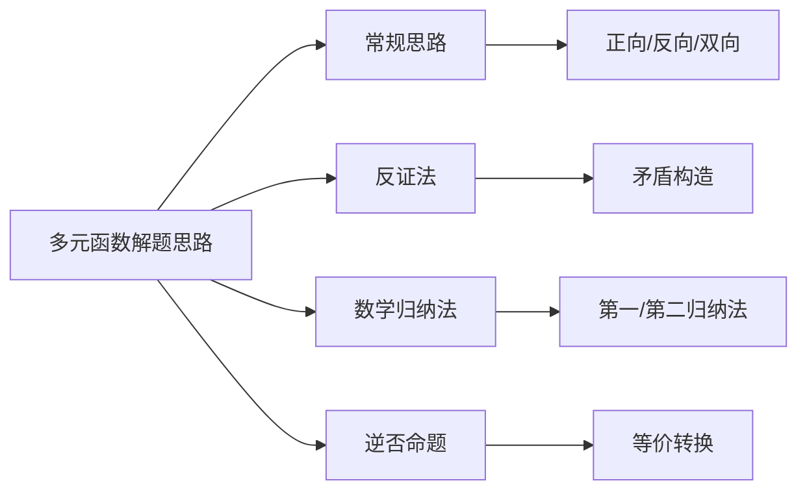

> 引用自 [[RAW-math-高数-P095-concept]]

# 多元函数在一点的性质

# 多元函数解题思路与方法

> **元数据**
> - **章节**：2026 张宇高数 18讲(OCR)
> - **难度**：★★☆☆☆
> - **标签**：解题方法 | 思维策略

## 一、概念定义

本文档系统总结**多元函数问题**的通用解题思路与方法论，适用于数学一考生研究多元函数在一点的性质及相关积分计算问题。

### 研究范畴（数学一）

| 题型 | 考查内容 |
| 三重积分 | 计算立体区域上的三重积分 |
| 第一型曲线积分 | 空间曲线的质量计算 |
| 第一型曲面积分 | 曲面的质量计算 |
| 第二型曲线积分 | 做功、流量问题 |
| 第二型曲面积分 | 通量问题 |

## 二、核心公式与思维框架

### 2.1 思维方法体系

$$\boxed{\text{解题} = \text{思路检索}(P) + \text{细节处理}(D)}$$

### 2.2 常规思路三剑客

| 思路类型 | 核心特征 | 适用场景 |
| **正向思路** $P_1$ | 从已知 $\Rightarrow$ 结论 | 条件充分、方向明确 |
| **反向思路** $P_2$ | 从结论 $\Leftarrow$ 已知 | 结论清晰、路径模糊 |
| **双向思路** $P_3$ | 双向夹逼、寻找衔接 | 两端明确、中间困难 |

### 2.3 四大思维法则

$$
\begin{cases}
\text{法则二：检索思路}(P) \\
\quad \begin{cases}
\end{cases} \\[8pt]
\text{法则三：细节处理}(D) \\
\quad \text{逐字逐句、每个符号都要抠}
\end{cases}
$$

### 2.4 逆否命题等价性

$$A \Rightarrow B \quad \Longleftrightarrow \quad \neg B \Rightarrow \neg A$$

## 三、典型例题

### 【例题】证明：当 $x > 0$ 时，$\sin x < x$

**解题思路**：综合运用**双向思路**与**逆否思路**

**证法一（常规正向思路）**

构造函数 $f(x) = x - \sin x$，求导：

$$f'(x) = 1 - \cos x \geqslant 0$$

当 $x > 0$ 时，$f(x)$ 单调递增，且 $f(0) = 0$，

$$\therefore f(x) > 0 \Rightarrow \sin x < x \quad \blacksquare$$

**证法二（反证思路）**

假设 $\sin x \geqslant x$ 对某 $x > 0$ 成立，

由 $\sin x \leqslant x$（基本不等式）知：

$$\sin x = x \Rightarrow \cos x = 1 \Rightarrow x = 2k\pi$$

但 $x > 0$ 时，$x = 2k\pi$ 与 $\sin x = x$ 矛盾！

$$\therefore \sin x < x \quad \blacksquare$$

## 四、常见错误

| 序号 | 错误类型 | 典型表现 | 正确做法 |
| 1 | **思路僵化** | 只用正向思路，不会反向思考 | 根据题目特点灵活选择 $P_1/P_2/P_3$ |
| 2 | **逆否混淆** | 误将逆命题当逆否命题 | 牢记：逆否等价，逆命题不一定等价 |
| 3 | **归纳跳步** | 假设成立直接写结论 | 必须完整写出 $n=k \Rightarrow n=k+1$ 的推导 |
| 4 | **细节遗漏** | 忽略题目中的隐含条件 | 按 $D$ 法则逐字审题 |
| 5 | **双向断档** | 两边推导后无法衔接 | 检查中间桥梁条件是否成立 |

## 五、关联知识点

### 延伸学习

| 关联章节 | 内容说明 |
| 一元函数微分 | 单调性、极值的基础方法 |
| 极限存在性证明 | 反证法的经典应用场景 |
| 行列式计算 | 数学归纳法的另一主战场 |
| 格林公式/高斯公式 | 第二型积分的综合应用 |

## 六、方法论总结

> **核心口诀**
> 
> - **思路检索心中有**：正向反向双向走，反证归纳逆否候
> - **细节处理不能丢**：一个符号一回头，步步为营步步牛

*文档版本：2026 张宇高数 18讲 Wiki v1.0*