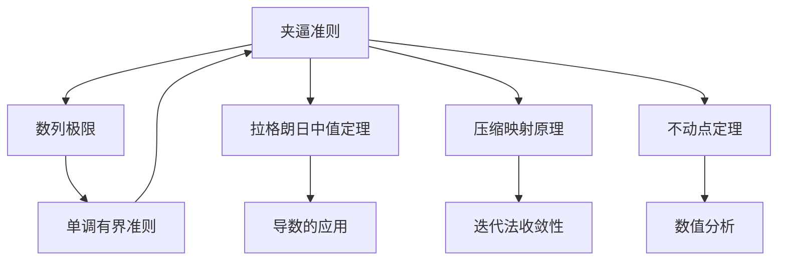

> 引用自 [[RAW-math-高数-P096-concept]]

# 夹逼准则

# 夹逼准则

## 元数据

| 字段 | 内容 |
|------|------|
| 章节 | 2026 张宇高数 18讲(OCR) |
| 难度 | ★★☆☆☆ |
| 标签 | 数列极限、压缩映射、收敛性证明 |

## 1 概念定义

**夹逼准则**（Squeeze Theorem）是判断数列或函数收敛性的重要方法，通过将目标数列"夹在"两个已知极限的数列之间，从而推导出目标数列的极限。

### 原理一：压缩映射原理（基础形式）

设数列 $\{x_n\}$，若存在常数 $k$（$0 < k < 1$），使得：
$$|x_{n+1} - a| \leq k|x_n - a|, \quad n = 1, 2, \cdots$$

则 $\{x_n\}$ 收敛于 $a$。

**证明思路**：反复迭代不等式得
$$|x_n - a| \leq k^n |x_1 - a|$$
由于 $0 < k < 1$，故 $\lim\limits_{n \to \infty} k^n = 0$，从而 $\lim\limits_{n \to \infty} |x_n - a| = 0$。

### 原理二：函数迭代形式

设数列 $\{x_n\}$ 满足 $x_{n+1} = f(x_n)$，$n = 1, 2, \cdots$，其中 $f(x)$ 可导。

若：
1. $a$ 是 $f(x) = x$ 的唯一解
2. $|f'(x)| \leq k < 1$（对任意 $x \in \mathbb{R}$）

则 $\{x_n\}$ 收敛于 $a$。

**证明思路**：由拉格朗日中值定理
$$|x_{n+1} - a| = |f(x_n) - f(a)| = |f'(\xi)||x_n - a| \leq k|x_n - a|$$
其中 $\xi$ 介于 $x_n$ 与 $a$ 之间，转化为原理一的形式。

## 2 核心公式

### 压缩映射不等式

$$|x_n - a| \leq k^n |x_1 - a|$$

### 迭代误差估计

$$|x_n - a| \leq \frac{k^n}{1-k}|x_1 - x_0| \quad \text{（更精确的估计）}$$

### 导数条件形式

$$\boxed{|f(x) - f(y)| \leq k|x - y| \quad \Longrightarrow \quad |x_n - a| \leq k^n |x_0 - a|}$$

## 3 典型例题

### 例题：迭代数列的收敛性证明

> 设 $x_1 = 1$，$x_{n+1} = \sqrt{4 + 3x_n}$（$n = 1, 2, \cdots$），证明数列 $\{x_n\}$ 收敛，并求 $\lim\limits_{n \to \infty} x_n$。

**【证明步骤】**

**第一步**：化归经典形式，令 $f(x) = \sqrt{4 + 3x}$（$x > 0$）

**第二步**：验证压缩条件
$$f'(x) = \frac{3}{2\sqrt{4+3x}}$$

**第三步**：计算导数上界
$$|f'(x)| = \frac{3}{2\sqrt{4+3x}} \leq \frac{3}{2\sqrt{4}} = \frac{3}{4} < 1$$

**第四步**：求不动点
$$f(a) = a \Rightarrow \sqrt{4+3a} = a \Rightarrow a = 4$$

**第五步**：应用拉格朗日中值定理
$$|x_{n+1} - 4| = |f(x_n) - f(4)| = |f'(\xi)||x_n - 4| \leq \frac{3}{4}|x_n - 4|$$

其中 $\xi$ 介于 $x_n$ 与 $4$ 之间。

**第六步**：递推得
$$0 < |x_n - 4| \leq \left(\frac{3}{4}\right)^{n-1}|x_1 - 4| = \frac{3^{n-1}}{4^{n-1}} \cdot 3$$

**第七步**：两端趋于零，由夹逼准则
$$\lim_{n \to \infty} |x_n - 4| = 0 \Rightarrow \lim_{n \to \infty} x_n = 4$$

## 4 常见错误

| 错误类型 | 说明 | 正确做法 |
|----------|------|----------|
| **忽略证明过程** | 直接写出结论，未证明收敛性 | 必须写出完整的压缩映射证明 |
| **导数条件遗漏** | 使用原理二时未验证 $|f'(x)| \leq k < 1$ | 明确计算并给出 $k$ 值 |
| **唯一性未说明** | 未证明不动点唯一 | 先证明 $f(x) = x$ 的唯一性 |
| **区间选择错误** | 导数上界估计过大 | 需在定义域内取最小上界 |
| **初始值不满足** | 未验证 $x_1$ 在定义域内 | 确认 $x_1$ 使 $f(x_1)$ 有意义 |

## 5 关联知识点

### 知识点列表

1. **拉格朗日中值定理** — 原理二证明的核心工具
2. **单调有界准则** — 另一种证明数列收敛的方法
3. **不动点迭代** — 数值计算中的实际应用
4. **导数的连续性** — 验证 $|f'(x)| \leq k$ 的基础

## 6 附录：重要不等式变形

对于 $f(x) = \sqrt{a + bx}$ 类型的函数，其导数满足：
$$|f'(x)| = \left|\frac{b}{2\sqrt{a+bx}}\right| \leq \frac{b}{2\sqrt{a}}$$

当 $b < 2\sqrt{a}$ 时，有 $|f'(x)| < 1$，可使用夹逼准则证明收敛。

> **记忆口诀**：压缩映射要牢记，导数小于一可证；迭代递推写清楚，极限就是不动点。