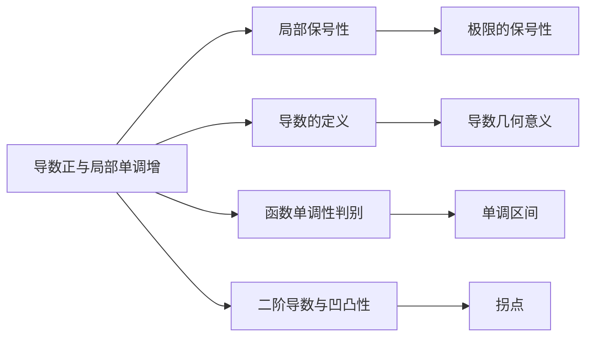

> 引用自 [[RAW-math-高数-P112-concept]]

# 导数正与局部单调增的关系

# 导数正与局部单调增的关系

## 基本信息

| 项目 | 内容 |
|------|------|
| 章节 | 2026 张宇高数 18讲(OCR) |
| 难度 | ★★☆☆☆ |
| 标签 | 导数应用、微分学、单调性 |

## 一、概念定义

### 1.1 局部单调增的充分条件

> **定理**：若函数 $f(x)$ 在点 $x_0$ 处可导且 $f'(x_0) > 0$，则存在 $\delta > 0$，使得当 $x \in U(x_0, \delta)$ 时，$f(x)$ **单调增加**。

### 1.2 重要说明

- **充分不必要条件**：$f'(x_0) > 0$ 能推出局部单调增
- **逆命题不成立**：局部单调增不能推出 $f'(x_0) > 0$（可能 $f'(x_0) = 0$）

## 二、核心公式

### 2.1 局部保号性定理

若 $\displaystyle\lim_{x \to x_0} f'(x) = f'(x_0) > 0$，则存在 $\delta > 0$，使得：

$$x \in U(x_0, \delta) \implies f'(x) > 0$$

### 2.2 局部单调增的逻辑关系

$$\boxed{f'(x_0) > 0 \implies f(x) \text{ 在 } x_0 \text{ 的某邻域内单调增加}}$$

## 三、典型例题

### 例题

> 设 $f(x)$ 在 $x = x_0$ 处二阶可导，则下列命题正确的是（ ）
> 
> (A) 若 $f(x)$ 在 $x_0$ 的某邻域内单调增加，则 $f'(x_0) > 0$
> 
> (B) 若 $f'(x_0) > 0$，则 $f(x)$ 在 $x_0$ 的某邻域内单调增加
> 
> (C) 若曲线在 $x_0$ 的某邻域内是凹的，则 $f''(x_0) > 0$
> 
> (D) 若 $f''(x_0) > 0$，则曲线在 $x_0$ 的某邻域内是凹的

**答案**：$\text{(B)}$

**解析**：

**(A) 错误**：单调增加不能推出导数大于零。

反例：$f(x) = x^3$，在 $x = 0$ 处单调增加，但 $f'(0) = 0$。

**(B) 正确**：由于 $f(x)$ 在 $x_0$ 处二阶可导，故 $f'(x)$ 在 $x_0$ 处连续。

由 $\displaystyle\lim_{x \to x_0} f'(x) = f'(x_0) > 0$，根据**局部保号性**，存在 $\delta > 0$，当 $x \in U(x_0, \delta)$ 时，$f'(x) > 0$，因此 $f(x)$ 在该邻域内单调增加。

**(C) 错误**：与 (A) 类似。

反例：$f(x) = x^4$，曲线在 $x = 0$ 处是凹的，但 $f''(0) = 0$。

**(D) 错误**：一点的凹凸性不能由该点二阶导数的正负确定，除非 $f''(x)$ 在该点连续。

## 四、常见错误

| 错误类型 | 具体表现 | 正确理解 |
|----------|----------|----------|
| 混淆充分条件和必要条件 | 认为"单调增 $\Rightarrow f'(x_0) > 0$" | 单调增只能推出 $f'(x_0) \geq 0$，可能等于零 |
| 忽视导数连续性 | 直接由 $f'(x_0) > 0$ 推断邻域内性质 | 需要 $f'(x)$ 在 $x_0$ 处连续（由二阶可导保证） |
| 忽视高阶导数的局限 | 认为 $f''(x_0) > 0$ 就能判断凹凸 | 需 $f''(x)$ 在 $x_0$ 附近有确定符号 |
| 错误类比 | 将"导数正"和"单调增"视为等价关系 | 二者是单向推出关系，不是充要条件 |

## 五、关联知识点

### 推荐复习路径

1. **前置知识**：极限的保号性 → 局部保号性
2. **本章内容**：导数正与局部单调增的关系
3. **延伸拓展**：
   - 二阶导数与凹凸性
   - 极值点判别
   - 拐点判别

## 六、要点总结

> **核心结论**：$f'(x_0) > 0$ 是 $f(x)$ 在 $x_0$ 处**局部单调增加**的**充分条件**，但不是必要条件。

**记忆口诀**：
> 导数正 → 局部增
> 局部增 ↛ 导数正
> 反例记住 $x^3$