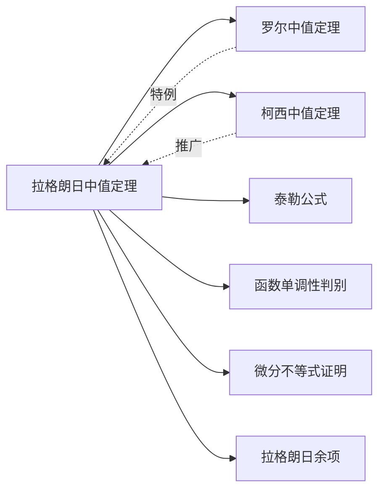

> 引用自 [[RAW-math-高数-P129-concept]]

# 拉格朗日公式的微分形式

# 拉格朗日公式的微分形式

**元数据**

| 字段 | 内容 |
|------|------|
| 章节 | 2026 张宇高数 18讲(OCR) |
| 标签 | 第六章 一元函数微分学的应用(二)——中值定理、微分等式与微分不等式 |
| 难度 | ★★☆☆☆ |

## 1. 概念定义

**拉格朗日中值定理（微分形式）**

设函数 $f(x)$ 满足：
1. 在闭区间 $[a, b]$ 上**连续**
2. 在开区间 $(a, b)$ 内**可导**

则存在 $\xi \in (a, b)$，使得：

$$f(b) - f(a) = f'(\xi)(b - a)$$

**微分形式**：将 $b$ 替换为任意 $x \in (a, b]$，可写作：

$$f(x) - f(a) = f'(\xi)(x - a), \quad \xi \in (a, x)$$

## 2. 核心公式

### 基本形式

$$f(x) - f(a) = f'(\xi)(x - a), \quad a < \xi < x$$

### 变形形式

| 形式 | 公式 | 适用场景 |
|------|------|----------|
| 标准形式 | $f(b) - f(a) = f'(\xi)(b - a)$ | 一般证明题 |
| 微分形式 | $f(x) - f(a) = f'(\xi)(x - a)$ | 出现 $f(x) - f(a)$ 或 $f(x) - f(0)$ |
| 比值形式 | $\dfrac{f(b) - f(a)}{b - a} = f'(\xi)$ | 涉及差商的问题 |

### 重要推论

> **可导 + 导数为零**：设 $f(x)$ 在区间 $(a, b)$ 内可导，则
> $$f'(x) \equiv 0 \Longleftrightarrow f(x) \equiv C \text{（常数）}$$

## 3. 典型例题

### 例6.11（导数极限 → 函数极限）

**题目**：已知函数 $f(x)$ 在 $(-\infty, 0)$ 上可导，且 $\displaystyle\lim_{x \to -\infty} f'(x) = A > 0$，证明 $\displaystyle\lim_{x \to -\infty} f(x) = -\infty$。

**证明**：

由 $\displaystyle\lim_{x \to -\infty} f'(x) = A > 0$，根据极限保号性：

$\exists X_0 < 0$，使得当 $x < X_0$ 时，有 $f'(x) > \dfrac{A}{2} > 0$。

对任意 $x < X_0$，取固定 $X_0$，由拉格朗日中值定理的微分形式：

$$f(x) - f(X_0) = f'(\xi)(x - X_0), \quad x < \xi < X_0$$

由于 $f'(\xi) > \dfrac{A}{2}$ 且 $x - X_0 < 0$，故：

$$f(x) = f(X_0) + f'(\xi)(x - X_0) < f(X_0) + \frac{A}{2}(x - X_0)$$

当 $x \to -\infty$ 时，$\dfrac{A}{2}(x - X_0) \to -\infty$，

故 $f(x) \to -\infty$。$\quad\blacksquare$

## 4. 常见错误

### ❌ 错误一：忽视定理条件

| 错误表现 | 正确理解 |
|----------|----------|
| 直接对不可导点使用定理 | 必须满足区间内**每一点**都可导 |
| 在开区间端点处强行使用 | 应使用单侧极限处理端点 |

### ❌ 错误二：混淆中值点位置

$$\text{错误：} \quad f(x) - f(a) = f'(x)(x - a)$$

$$\text{正确：} \quad f(x) - f(a) = f'(\xi)(x - a), \quad \xi \in (a, x)$$

> **注意**：中值点 $\xi$ 是存在但未知的，不能用 $x$ 本身代替。

### ❌ 错误三：导数极限与函数极限混淆

若 $\displaystyle\lim_{x \to x_0} f'(x)$ 不存在，**不能**推出 $f'(x_0)$ 存在。

**反例**：$f(x) = x^2 \sin\dfrac{1}{x}$（$x \neq 0$），$f(0) = 0$
- $f'(0) = 0$
- $\displaystyle\lim_{x \to 0} f'(x)$ 不存在

## 5. 关联知识点

### 纵向关联

| 层级 | 知识点 |
|------|--------|
| 基础 | 函数连续性、可导性 |
| 本体 | 拉格朗日中值定理 |
| 等价 | 罗尔定理（$f(a) = f(b)$ 的特例） |
| 推广 | 柯西中值定理（参数形式） |
| 应用 | 泰勒公式、函数不等式 |

### 典型问题类型

1. **证明恒为常数**：$f'(x) \equiv 0 \Rightarrow f(x) \equiv C$
2. **证明不等式**：利用 $f(b) - f(a) = f'(\xi)(b-a)$ 估计函数值
3. **求极限**：将差商转化为导数在某点的值

**参考页码**：张宇高数18讲 第六章 例6.10—例6.12