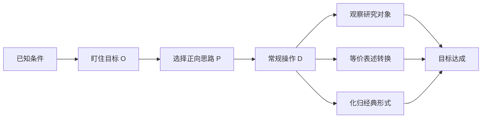

> 引用自 [[RAW-math-高数-P152-concept]]

# 正向思路

# 正向思路

## 元数据

```yaml
章节: 2026 张宇高数 18讲(OCR)
难度: ★★☆☆☆
标签: 解题方法论 | 思路分析
```


## 1. 概念定义

**正向思路**是三向解题法（正向思路、反向思路、双向思路）之一，指从**已知条件（出发）**出发，通过一系列**常规操作（D）**，逐步推导直至**目标（O）**的解题策略。

### 核心框架

$$
\boxed{\text{已知条件} \xrightarrow{\text{操作 } D} \cdots \xrightarrow{\text{操作 } D} \text{目标 } O}
$$

其中：
- **P**（Perspective）代表思路方向
- **D**（Doing）代表具体操作
- **O**（Objective）代表解题目标


## 2. 核心操作体系

### 2.1 基本操作列表

| 操作类型 | 具体方法 | 说明 |
| **D₁₁** | 观察研究对象 | 要建立**隐含条件体系块** |
| **D₁₂** | 转换等价表述 | 要建立**等价表述体系块** |
| **D₁₃** | 化归经典形式 | 要建立**形式化归体系块** |
| **D₂₁** | 移花接木 | 按题目指令连接D与D |
| **D₃₁** | 试取特殊情形 | 简化问题 |
| **D₃₂** | 引入符号 | 形式化表示 |
| **D₃₃** | 数形结合 | 几何直观辅助 |
| **D₃₄** | 善于发现对称 | 利用对称性简化 |


## 3. 法则一：盯住目标（O）

### 核心原则

> **无论问题如何表述，首先要做的是寻找目标、锁定目标、盯住目标！**

### 操作要点

1. **去掉细节表述**：表述冗长的问题，先去掉细节，节省精力，只看目标
2. **确定目标数量**：
   - **单个目标** $O_1$：直接盯住
   - **多个目标** $O_1, O_2, O_3, \cdots$：逐一盯住

3. **完整审题**：
   - **选择题**：题干 + 选项一起看
   - **填空题**：题干 + 所填内容一起看
   - **解答题**：题干 + 每一问一起看

### 高等数学常见目标汇总

| 目标类型 | 具体目标 |
| $O_1$ | 判定类型，做好计算 |
| $O_2$ | 研究 $\displaystyle\lim_{x \to ?} f(x)$ |
| $O_3$ | 判定连续与间断 |
| $O_4$ | 研究 $x \to ?$ 时 $f(x)$ 的微观性态 |
| $O_5$ | 判断 $\{x_n\}$ 是否收敛（$\lim x_n$ 是否存在） |


## 4. 典型例题

### 例题：求极限

> **题目**：求 $\displaystyle\lim_{x \to 0} \frac{e^x - e^{\sin x}}{x - \sin x}$

### 正向思路解析

**第一步：盯住目标** $O_2$：求极限

**第二步：观察研究对象（D₁₁）**

分子：$e^x - e^{\sin x} = e^{\sin x}(e^{x-\sin x} - 1)$

分母：$x - \sin x$

**第三步：化归经典形式（D₁₃）**

当 $t \to 0$ 时，$e^t - 1 \sim t$

**第四步：操作实施**

$$
\begin{aligned}
\lim_{x \to 0} \frac{e^x - e^{\sin x}}{x - \sin x} 
&= \lim_{x \to 0} \frac{e^{\sin x}(e^{x-\sin x} - 1)}{x - \sin x} \\
&= \lim_{x \to 0} e^{\sin x} \cdot \lim_{x \to 0} \frac{e^{x-\sin x} - 1}{x - \sin x} \\
&= 1 \cdot \lim_{t \to 0} \frac{e^t - 1}{t} \quad (t = x - \sin x) \\
&= 1 \cdot 1 = 1
\end{aligned}
$$

**答案**：$\boxed{1}$


## 5. 常见错误

| 错误类型 | 具体表现 | 正确做法 |
| **目标迷失** | 盲目计算，不明确求什么 | 先锁定目标 $O$ |
| **操作混乱** | 不知该用哪个 $D$ | 按操作列表逐一尝试 |
| **忽略隐含条件** | 未建立隐含条件体系块 | 观察研究对象，挖掘隐含信息 |
| **等价转化不当** | 替换后范围变化未检查 | 明确等价表述的适用范围 |
| **特殊情形滥用** | 用特殊值证明一般结论 | 特殊情形仅用于探索方向 |


## 6. 关联知识点

| 关联方向 | 知识点 |
| **并列** | 反向思路 |
| **并列** | 双向思路 |
| **基础** | 极限计算 |
| **基础** | 连续与间断 |
| **基础** | 数列收敛 |
| **应用** | 三向解题法综合运用 |


## 7. 方法论小结



> **核心口诀**：一盯目标，二选思路，三用操作，四达彼岸。