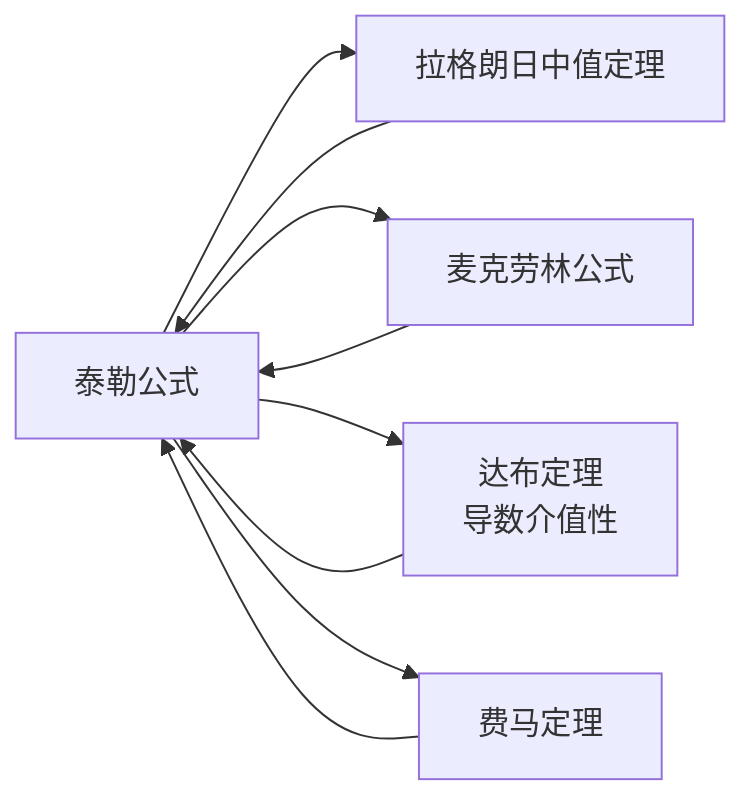

> 引用自 [[RAW-math-高数-P161-concept]]

# 泰勒公式

# 泰勒公式

**章节**：2026 张宇高数 18讲(OCR)  
**难度**：★★☆☆☆  
**标签**：微分学 | 中值定理 | 高阶导数

## 1. 概念定义

**泰勒公式**是将一个光滑函数在某点附近用多项式无限逼近的重要工具。若函数 $f(x)$ 在点 $x_0$ 的某邻域内具有 $n+1$ 阶导数，则对该邻域内任意 $x$，有：

$$f(x) = f(x_0) + f'(x_0)(x-x_0) + \frac{f''(x_0)}{2!}(x-x_0)^2 + \cdots + \frac{f^{(n)}(x_0)}{n!}(x-x_0)^n + R_n(x)$$

其中 **拉格朗日余项**为：

$$R_n(x) = \frac{f^{(n+1)}(\xi)}{(n+1)!}(x-x_0)^{n+1}, \quad \xi \in (x_0, x)$$

当 $n=0$ 时，泰勒公式退化为 **拉格朗日中值定理**。

## 2. 核心公式

### 2.1 带拉格朗日余项的 $n$ 阶泰勒公式

$$\boxed{f(x) = \sum_{k=0}^{n} \frac{f^{(k)}(x_0)}{k!}(x-x_0)^k + \frac{f^{(n+1)}(\xi)}{(n+1)!}(x-x_0)^{n+1}}$$

### 2.2 带佩亚诺余项的 $n$ 阶泰勒公式（$x \to x_0$）

$$f(x) = f(x_0) + f'(x_0)(x-x_0) + \cdots + \frac{f^{(n)}(x_0)}{n!}(x-x_0)^n + o\big((x-x_0)^n\big)$$

### 2.3 常用麦克劳林公式

$$e^x = 1 + x + \frac{x^2}{2!} + \cdots + \frac{x^n}{n!} + \frac{e^{\xi}}{(n+1)!}x^{n+1}$$

$$\sin x = x - \frac{x^3}{3!} + \frac{x^5}{5!} - \cdots + (-1)^n\frac{x^{2n+1}}{(2n+1)!} + R_{2n+1}$$

$$\cos x = 1 - \frac{x^2}{2!} + \frac{x^4}{4!} - \cdots + (-1)^n\frac{x^{2n}}{(2n)!} + R_{2n}$$

## 3. 典型例题

### 例题：泰勒公式在二阶导数中值问题中的应用

> **题目**：设 $f(x)$ 在 $[0,2]$ 上具有二阶导数，证明：存在 $\xi \in (0,2)$，使得
> $$f(0) + f(2) - 2f(1) = f''(\xi)$$

**证明**：分别在 $x_0 = 1$ 处对 $x = 0$ 和 $x = 2$ 展开二阶泰勒公式：

$$f(0) = f(1) + f'(1)(0-1) + \frac{f''(\xi_1)}{2!}(0-1)^2 = f(1) - f'(1) + \frac{f''(\xi_1)}{2}, \quad \xi_1 \in (0,1)$$

$$f(2) = f(1) + f'(1)(2-1) + \frac{f''(\xi_2)}{2!}(2-1)^2 = f(1) + f'(1) + \frac{f''(\xi_2)}{2}, \quad \xi_2 \in (1,2)$$

两式相加得：

$$f(0) + f(2) = 2f(1) + \frac{f''(\xi_1) + f''(\xi_2)}{2}$$

整理得：

$$f(0) + f(2) - 2f(1) = \frac{f''(\xi_1) + f''(\xi_2)}{2}$$

令 $\mu = \dfrac{f''(\xi_1) + f''(\xi_2)}{2}$，由 **二阶导函数的介值性**（达布定理），存在 $\xi \in (0,2)$，使得 $f''(\xi) = \mu$。

即：

$$\boxed{f(0) + f(2) - 2f(1) = f''(\xi)}$$

**证毕** $\square$

## 4. 常见错误

| 错误类型 | 典型表现 | 正确理解 |
|---------|---------|---------|
| 余项点混淆 | 令 $f''(\xi_1) = f''(\xi_2)$ | $\xi_1, \xi_2$ 是不同的点，不能直接相等 |
| 介值性遗漏 | 直接令 $f''(\xi) = \dfrac{f''(\xi_1) + f''(\xi_2)}{2}$ | 必须利用 **达布定理**：二阶导数具有介值性 |
| 泰勒展开点选择不当 | 在非极值点展开 | 应选择使计算简化的展开点（如例题中的 $x_0=1$） |
| 皮亚诺余项误用 | 在需要精确等式证明时使用 $o((x-x_0)^n)$ | 等式证明必须用 **拉格朗日余项** |

## 5. 关联知识点

- **拉格朗日中值定理**：泰勒公式 $n=0$ 时的特例
- **麦克劳林公式**：在 $x_0 = 0$ 处的泰勒展开
- **达布定理**：$f'(x)$ 具有介值性（第一问的理论依据）
- **费马定理**：极值点处导数为零（第一问证明的关键步骤）
- **极值与最值**：泰勒公式可用于判断函数极值
- **无穷小阶的比较**：泰勒公式是确定等价无穷小的有力工具

## 📚 参考文献

- 张宇《高等数学 18 讲》（2026 版）第 6 讲
- 同济大学《高等数学》（第七版）第三章

> **提示**：使用泰勒公式的关键在于——**选好展开点** $x_0$ 和**展开阶数** $n$，使得余项形式简洁且便于后续证明。