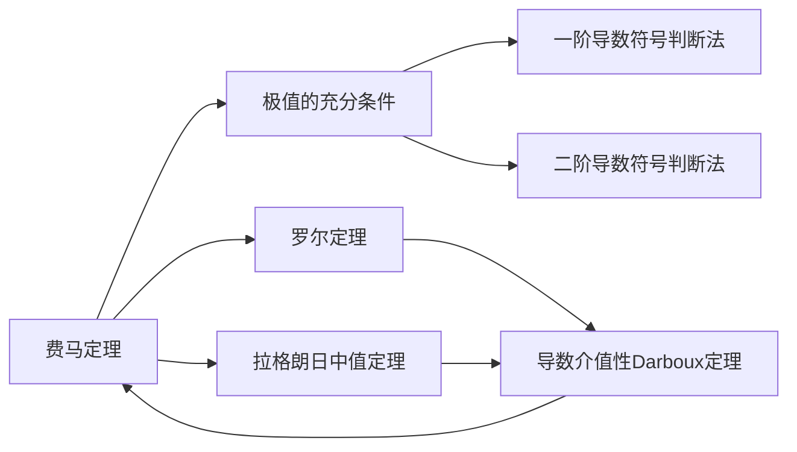

> 引用自 [[RAW-math-高数-P186-concept]]

# 费马定理极值的必要条件

# 费马定理（Fermat's Theorem）

> 极值的必要条件

## 📋 元数据

| 字段 | 内容 |
|------|------|
| 章节 | 2026 张宇高数 18讲(OCR) |
| 难度 | ★★☆☆☆ |
| 位置 | 第6讲 一元函数微分学的应用(二) |

## 一、概念定义

**费马定理（Fermat's Theorem）**

设函数 $f(x)$ 在点 $x_0$ 的某邻域 $U(x_0)$ 内有定义，且在 $x_0$ 处**可导**。若 $f(x_0)$ 为**局部极值**（极大值或极小值），则

$$f'(x_0) = 0$$

> **几何意义**：可导极值点处，切线必为水平线（斜率为零）。

## 二、核心公式

$$f'(x_0) = 0 \quad \Longleftrightarrow \quad x_0 \text{ 为 } f(x) \text{ 的可导极值点}$$

**等价表述**：
- 极值点 $\Rightarrow$ 导数为零（**必要条件**）
- 导数为零 $\nRightarrow$ 极值点（**不充分**）

## 三、典型例题

### 例题：利用费马定理证明导数的介值性

> **题目**：设 $f(x)$ 在 $[a,b]$ 上可导，且 $f'(a) \neq f'(b)$。证明：对于任意的介于 $f'(a)$ 与 $f'(b)$ 之间的 $\mu$，存在 $\xi \in (a,b)$，使得 $f'(\xi) = \mu$。

**证明**：

1. **构造辅助函数**：设 $F(x) = f(x) - \mu x$

2. **分析导数符号**：不妨设 $f'(a) < f'(b)$
   $$F'(a) = f'(a) - \mu < 0, \quad F'(b) = f'(b) - \mu > 0$$

3. **由导数符号判断函数值关系**（极限保号性）：
   - 在 $x=a$ 的某右邻域：$F(x) < F(a)$
   - 在 $x=b$ 的某左邻域：$F(x) < F(b)$

4. **确定最小值位置**：
   - $F(a)$ 和 $F(b)$ 均**不是**最小值
   - $F(x)$ 在 $[a,b]$ 上连续，必有最小值点 $\xi \in (a,b)$

5. **应用费马定理**：
   $$F'(\xi) = 0 \Longrightarrow f'(\xi) - \mu = 0 \Longrightarrow f'(\xi) = \mu \quad \blacksquare$$

## 四、常见错误

| 错误类型 | 说明 |
|----------|------|
| ❌ 忽略可导条件 | 费马定理要求函数在极值点处**可导**，不可导点也可能是极值点 |
| ❌ 混淆充分与必要 | $f'(x_0)=0$ 是极值的**必要条件**，非充分条件（如 $y=x^3$ 在 $x=0$ 处） |
| ❌ 极值点遗漏边界 | 费马定理只适用于**内部**极值点，边界极值需单独讨论 |
| ❌ 误用逆命题 | 不能由导数存在零点直接推出极值，需验证该点邻域内函数值关系 |

## 五、关联知识点

| 序号 | 关联知识点 | 关系 |
|------|-----------|------|
| 1 | 罗尔定理 | 费马定理的推论，$f(a)=f(b)$ 时 $f'(\xi)=0$ |
| 2 | 极值的充分条件 | 费马定理的逆应用 |
| 3 | 导数的介值性（Darboux 定理） | 例题的结论，依赖费马定理证明 |
| 4 | 泰勒公式 | 展开至二阶，可推导二阶导数介值性 |

> **记忆口诀**：极值可导，导数为零；导数为o，极值未必。