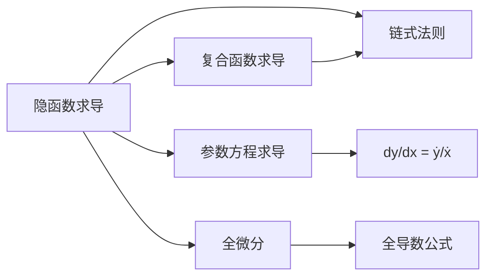

> 引用自 [[RAW-math-高数-P196-concept]]

# 隐函数求导的基本步骤Fxyx0两边对x求导

# 隐函数求导的基本步骤

**元数据**

- **章节**：2026 张宇高数 18讲 - 第4讲 一元函数微分的计算
- **难度**：★★☆☆☆

## 1. 概念定义

隐函数求导是针对由方程 $F[x, y(x)] = 0$ 确定的隐函数 $y = y(x)$ 的求导方法。

**核心思想**：将方程两边同时对 $x$ 求导，利用链式法则处理 $y$ 对 $x$ 的依赖关系。

## 2. 核心公式

### 一阶导数公式

由 $F[x, y(x)] = 0$ 两边对 $x$ 求导：

$$
\frac{\partial F}{\partial x} + \frac{\partial F}{\partial y} \cdot \frac{dy}{dx} = 0
$$

因此：

$$
\boxed{y' = \frac{dy}{dx} = -\frac{F_x}{F_y}}
$$

### 二阶导数步骤

1. **第一步**：对 $F[x, y(x)] = 0$ 两边对 $x$ 求导，得 $G[x, y(x), y'(x)] = 0$
2. **第二步**：从 $G = 0$ 解出 $y'(x)$
3. **第三步**：再对 $G[x, y(x), y'(x)] = 0$ 关于 $x$ 求导，得 $y''(x)$

## 3. 典型例题

### 例题

> 已知可导函数 $y = y(x)$ 满足 $e^x + y^2 + y - \ln(1+x)\cos y + b = 0$，且 $y(0) = 0$，$y'(0) = 0$。
> 
> (1) 求 $a, b$ 的值；
> (2) 判断 $x = 0$ 是否为 $y(x)$ 的极值点。

### 【解答】

**(1) 求 $a, b$**

由 $y(0) = 0$ 代入原方程：

$$e^0 + 0 + 0 - \ln(1)\cos 0 + b = 0 \implies 1 + b = 0 \implies b = -1$$

对原方程 $e^x + y^2 + y - \ln(1+x)\cos y + b = 0$ 两边关于 $x$ 求导：

$$
e^x + 2yy' + y' - \frac{1}{1+x}\cos y + \ln(1+x)\cdot y'\sin y = 0
$$

将 $x = 0$，$y(0) = 0$，$y'(0) = 0$ 代入：

$$
1 + 0 + 0 - 1 \cdot 1 + 0 = 0 \implies a = 1
$$

**(2) 判断极值点**

将 $a = 1$ 代入，对一阶导数方程再关于 $x$ 求导：

$$
e^x + 2(y')^2 + 2yy'' + y'' + \frac{1}{(1+x)^2}\cos y - \frac{2y'\sin y}{1+x} + (y')^2\sin y + \ln(1+x)\cdot(y'')\sin y + \ln(1+x)\cdot(y')^2\cos y = 0
$$

将 $x = 0$，$y(0) = 0$，$y'(0) = 0$ 代入：

$$
1 + 0 + 0 + y''(0) + 1 + 0 + 0 + 0 + 0 = 0
$$

$$y''(0) + 2 = 0 \implies y''(0) = -2 < 0$$

**结论**：因为 $y'(0) = 0$ 且 $y''(0) < 0$，所以 $x = 0$ 为 $y(x)$ 的**极大值点**。

## 4. 常见错误

| 序号 | 错误类型 | 正确做法 |
| 1 | **漏乘链式法则** | 对 $y$ 求导时，必须乘以 $y'$ |
| 2 | **忘记 $\ln(1+x)$ 复合求导** | $\frac{d}{dx}[\ln(1+x)] = \frac{1}{1+x}$ |
| 3 | **$\cos y$ 求导错误** | $\frac{d}{dx}(\cos y) = -\sin y \cdot y'$ |
| 4 | **二阶导数遗漏项** | 求二阶导时，一阶导中的所有项都要再次求导 |
| 5 | **条件代入遗漏** | 每一阶求导后都要代入已知初始条件 |

## 5. 关联知识点

1. **复合函数求导** — 隐函数求导本质是链式法则的应用
2. **参数方程求导** — $\dfrac{dy}{dx} = \dfrac{dy/dt}{dx/dt}$，$\dfrac{d^2y}{dx^2} = \dfrac{d}{dt}\left(\dfrac{dy}{dx}\right) \bigg/ \dfrac{dx}{dt}$
3. **全微分与偏导数** — $dy = f_x dx + f_y dy$ 的关系
4. **极值判定** — $f'(x_0) = 0$ 且 $f''(x_0) < 0$ 时为极大值点

> **记忆口诀**：隐函数求导，方程两边先对 $x$，$y$ 当复合，$y'$ 不要忘。