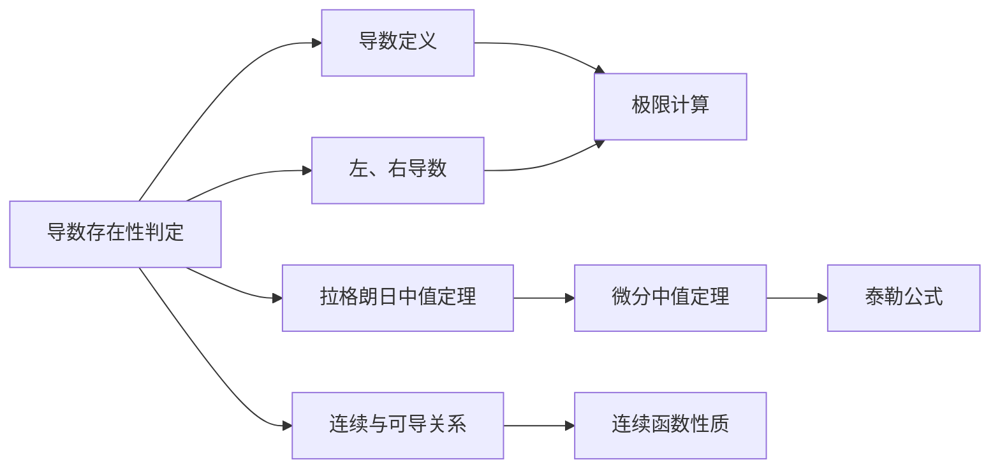

> 引用自 [[RAW-math-高数-P109-method]]

# 导数存在性的判定方法

来源: 

# 导数存在性的判定方法

## 元数据

- **章节**：2026 张宇高数 18讲(OCR)
- **难度**：★★☆☆☆

## 1. 概念定义

**导数存在性**是指判断函数在某一点的导数是否存在的条件与方法。

### 核心要点

- 导数存在的**充要条件**：左导数和右导数都存在且相等
- **定义法**：$f'(x_0) = \lim_{\Delta x \to 0} \frac{f(x_0 + \Delta x) - f(x_0)}{\Delta x}$
- **等价形式**：$f'(x_0) = \lim_{x \to x_0} \frac{f(x) - f(x_0)}{x - x_0}$

### $f'(x_0)$ 与 $f'(x)$ 的区别

| 符号 | 含义 |
|------|------|
| $f'(x_0)$ | 函数在 $x_0$ 点处的导数（一个数值） |
| $f'(x)$ | 导函数（表达式），是求导法则得到的结果 |

> **注意**：当 $f'(x)$ 的表达式在 $x_0$ 处无定义时，不代表 $f'(x_0)$ 不存在，需用定义法重新计算。

## 2. 核心公式

### 导数定义式

$$
f'(x_0) = \lim_{\Delta x \to 0} \frac{f(x_0 + \Delta x) - f(x_0)}{\Delta x}
$$

### 左、右导数

$$
f'_-(x_0) = \lim_{\Delta x \to 0^-} \frac{f(x_0 + \Delta x) - f(x_0)}{\Delta x}
$$

$$
f'_+(x_0) = \lim_{\Delta x \to 0^+} \frac{f(x_0 + \Delta x) - f(x_0)}{\Delta x}
$$

### 导数存在充要条件

$$
f'(x_0) \text{ 存在} \Leftrightarrow f'_-(x_0) = f'_+(x_0)
$$

## 3. 典型例题

### 判断正确结论的个数

下列关于导数存在性的结论中，正确的个数为（ ）

> ① 若 $f(0)$ 存在，则 $f'(0)$ 存在  
> ② 若 $\lim_{x \to 0} f(x)$ 存在，则 $f'(0)$ 存在  
> ③ 若 $f'_-(0)$ 和 $f'_+(0)$ 都存在，则 $f'(0)$ 存在  
> ④ 若 $\lim_{x \to 0} f'(x)$ 存在，则 $f'(0)$ 存在

**选项**：(A)1  (B)2  (C)3  (D)4

### 【解答】

**答案：选 (A)，只有④正确。**

**详细分析：**

**对于①**：`f(0)` 存在 ≠ `f'(0)` 存在

取反例：$f(x) = |x|$，则 $f(0) = 0$ 存在，但
$$f'_-(0) = -1,\quad f'_+(0) = 1$$
左、右导数不相等，故 $f'(0)$ **不存在**。

**对于②**：$\lim_{x \to 0} f(x)$ 存在 ≠ $f'(0)$ 存在

取反例：$f(x) = \begin{cases} x^2 \sin\frac{1}{x}, & x \neq 0 \\ 0, & x = 0 \end{cases}$

- $\lim_{x \to 0} f(x) = 0$（存在）
- 但 $f'(x) = 2x\sin\frac{1}{x} - \cos\frac{1}{x}$（在 $x \to 0$ 时不存在）
- 实际上 $f'(0) = \lim_{x \to 0} \frac{x^2 \sin\frac{1}{x} - 0}{x} = \lim_{x \to 0} x\sin\frac{1}{x} = 0$（存在）

> 这个例子反而说明②**不一定错误**。需要更合适的反例。

**重新取反例**：$f(x) = |x|$，则：
- $\lim_{x \to 0} f(x) = 0$（存在）
- $f'_-(0) = -1,\quad f'_+(0) = 1$ 不相等
- 故 $f'(0)$ **不存在**。

**对于③**：$f'_-(0)$ 和 $f'_+(0)$ **都存在且相等** → $f'(0)$ 存在

取反例：$f(x) = |x|$，则 $f'_-(0) = -1$，$f'_+(0) = 1$，**不相等**，故 $f'(0)$ **不存在**。

> 注意：结论③缺少"相等"条件！若改为"都存在且相等"则正确。

**对于④**：若 $\lim_{x \to 0} f'(x) = a$ 存在，则 $f'(0)$ 存在且等于 $a$ ✓

**证明**：
1. 已知 $\lim_{x \to x_0} f'(x) = a$
2. 根据导数定义：
$$f'(x_0) = \lim_{x \to x_0} \frac{f(x) - f(x_0)}{x - x_0}$$
3. 由拉格朗日中值定理，当 $x \neq x_0$ 时：
$$\frac{f(x) - f(x_0)}{x - x_0} = f'(\xi), \quad \xi \text{ 在 } x \text{ 与 } x_0 \text{ 之间}$$
4. 当 $x \to x_0$ 时，$\xi \to x_0$，故：
$$f'(x_0) = \lim_{x \to x_0} \frac{f(x) - f(x_0)}{x - x_0} = \lim_{\xi \to x_0} f'(\xi) = a$$

**结论**：只有**④**正确，正确个数为 **1**。

## 4. 常见错误

| 错误类型 | 错误描述 | 正确认识 |
|----------|----------|----------|
| 混淆极限与导数 | 认为 $\lim_{x \to x_0} f(x)$ 存在就能推出 $f'(x_0)$ 存在 | 函数极限存在与导数存在是不同概念 |
| 忽略左右导数 | 认为 $f'_-(x_0)$ 和 $f'_+(x_0)$ 都存在就一定有导数 | 必须**同时满足存在且相等** |
| 混淆记号 | 混淆 $f'(x_0)$（点导数）与 $f'(x)$（导函数） | 求导法则得到的是 $f'(x)$，需验证 $x_0$ 处是否适用 |
| 忽略定义域 | 直接使用求导公式，忽略定义域边界 | 当表达式在 $x_0$ 处无意义时，需用定义法 |

### 常见思维定式

1. **"可导必连续"** ✓ 正确
2. **"连续必可导"** ✗ 错误（如 $f(x) = |x|$ 在 $x = 0$ 处）
3. **"导函数有极限则原函数可导"** ✗ 错误（需额外条件）
4. **"导函数连续则原函数可导"** ✓ 正确

## 5. 关联知识点

### 层级关系

- **前置知识**：极限存在准则、连续性概念
- **核心知识**：导数定义、可导与连续的关系
- **延伸知识**：微分中值定理、高阶导数

### 推荐学习路径

1. 熟练掌握导数的 $\epsilon$-$\delta$ 定义
2. 牢记可导的充要条件（左、右导数存在且相等）
3. 区分 $f'(x_0)$ 与 $f'(x)$ 的使用场景
4. 掌握利用导数极限求导数的技巧（结论④的应用）

## 参考文献

- 张宇高等数学18讲（2026版）
- 同济大学《高等数学》第七版

**标签**：导数 #可导性判定 #微分学基础 #考研数学
